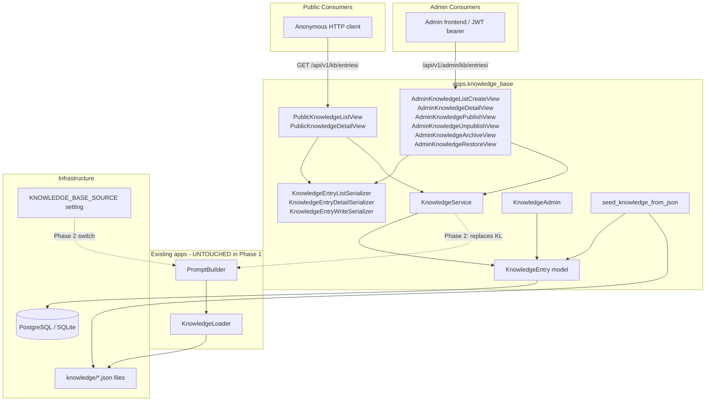
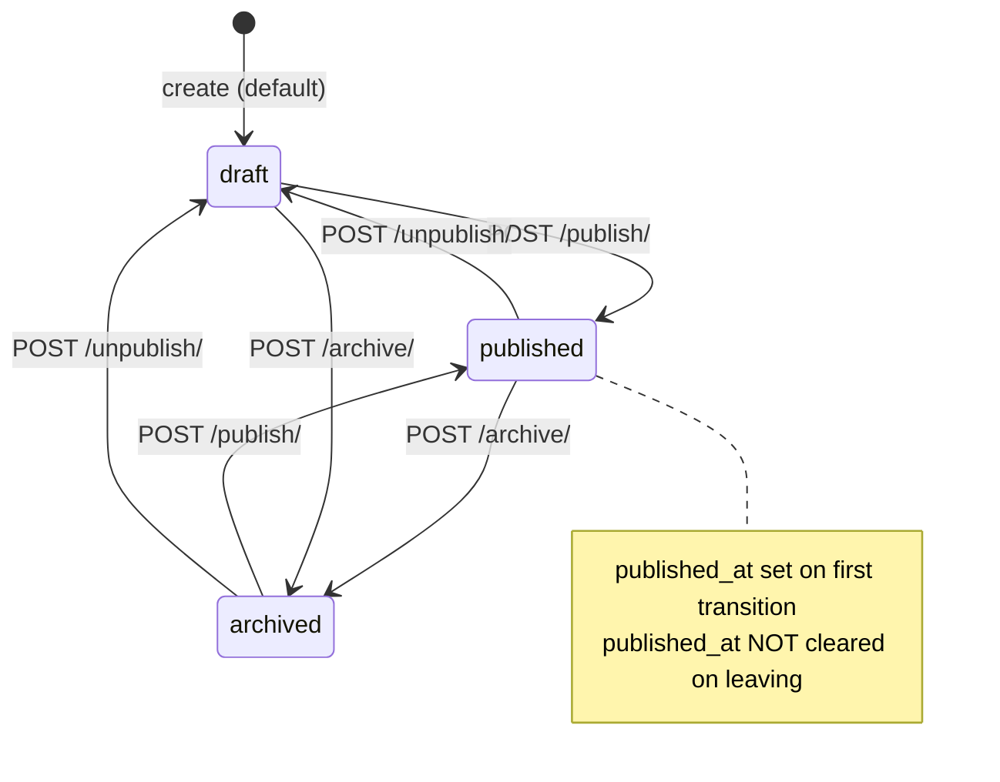
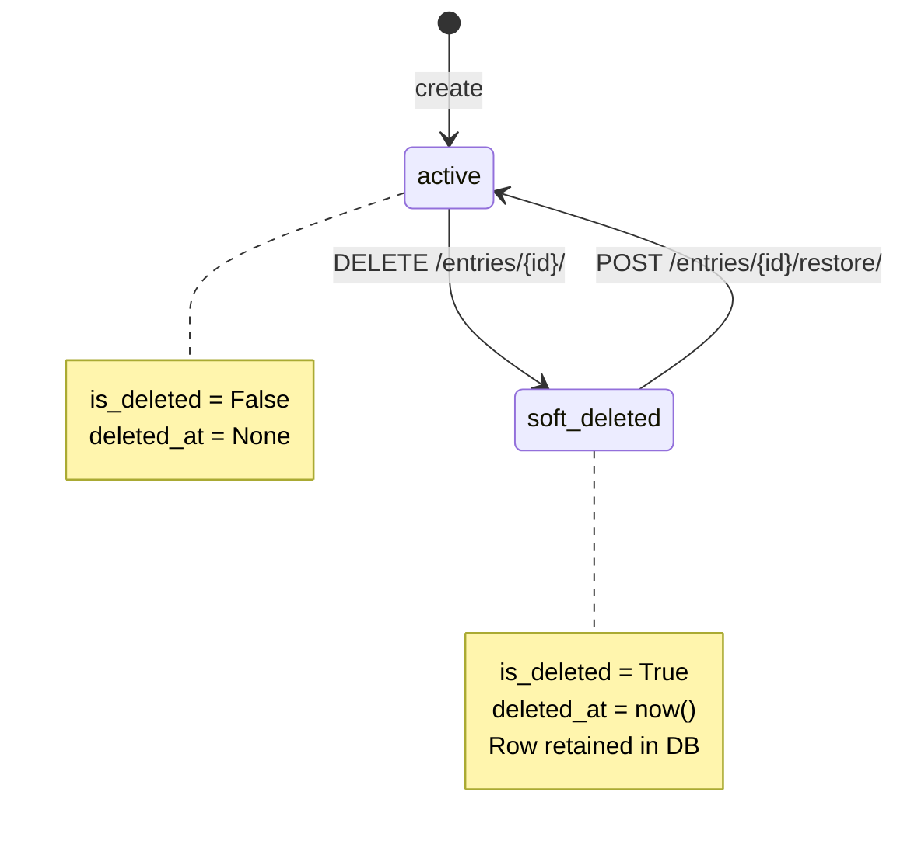

# Design Document: Knowledge Base Module

## Overview

The Knowledge Base (KB) module is a new, self-contained Django application (`apps.knowledge_base`) that introduces a database-backed store for all knowledge content currently served from JSON files. The module is designed to be **additive and non-destructive**: the existing chatbot `KnowledgeLoader` and `PromptBuilder` are untouched in Phase 1, and the JSON source remains the active chatbot data source.

The module provides:

- A single polymorphic-style `KnowledgeEntry` model covering all knowledge categories.
- A three-state content lifecycle: `draft → published → archived`.
- Soft-delete with recovery via a dedicated restore endpoint.
- Full CRUD management endpoints for Admin users.
- Public read-only endpoints for anonymous consumers.
- A `KnowledgeService` whose `get_scoped_knowledge_as_text` output is **format-identical** to `KnowledgeLoader.get_scoped_knowledge_as_text`, enabling a drop-in switchover in Phase 2 via the `KNOWLEDGE_BASE_SOURCE` feature flag.
- A management command (`seed_knowledge_from_json`) to populate the DB from the existing JSON files.

### Phase Strategy

| Phase | Active Source | `KNOWLEDGE_BASE_SOURCE` | Changes Required |
|-------|--------------|-------------------------|-----------------|
| 1 (current) | JSON files | `'json'` | KB app created; chatbot unchanged |
| 2 (future)  | DB          | `'database'`            | `PromptBuilder` updated to branch on setting |


---

## Architecture

### Component Diagram



### Key Design Decisions

1. **Single `KnowledgeEntry` table, discriminated by `category`** — avoids join complexity and keeps migrations additive. New categories require only a migration to extend the choices list.
2. **`APIView` subclasses over `ViewSet`** — consistent with chatbot and CRM apps; each endpoint group is its own class for maximum clarity.
3. **Service layer (`KnowledgeService`)** — all business logic isolated from views; views only coordinate HTTP in/out.
4. **Format-identical `get_scoped_knowledge_as_text`** — the service method mirrors `KnowledgeLoader.get_scoped_knowledge_as_text` exactly, including section labels, JSON formatting with `indent=2`, and omitting empty categories, so Phase 2 switchover requires zero format negotiation.
5. **`source` field for traceability** — distinguishes seed-imported entries from manually created ones, enabling safe re-runs of the seed command without overwriting manual edits.


---

## Components and Interfaces

### Module File Map

```
backend/apps/knowledge_base/
├── __init__.py
├── apps.py                          # AppConfig
├── models.py                        # KnowledgeEntry
├── serializers.py                   # List / Detail / Write serializers
├── views.py                         # All API views
├── urls.py                          # URL routing (public + admin)
├── admin.py                         # KnowledgeAdmin
├── tests.py                         # Full test suite
├── services/
│   ├── __init__.py
│   └── knowledge_service.py         # KnowledgeService
└── migrations/
    ├── __init__.py
    └── 0001_initial.py              # Additive migration
    management/
    ├── __init__.py
    └── commands/
        ├── __init__.py
        └── seed_knowledge_from_json.py
```

### AppConfig (`apps.py`)

```python
class KnowledgeBaseConfig(AppConfig):
    name = 'apps.knowledge_base'
    default_auto_field = 'django.db.models.BigAutoField'
    verbose_name = 'Knowledge Base'
```

### URL Routing (`urls.py`)

The single `urls.py` exports all patterns. `core/urls.py` mounts it twice:

```python
# core/urls.py additions (Phase 1)
path('api/v1/kb/',       include('apps.knowledge_base.urls')),
path('api/v1/admin/kb/', include('apps.knowledge_base.urls')),
```

Views use `request.auth` / permission classes to distinguish public vs admin context — but the two mounts use the same URL file because each view class enforces its own permission independently (public views have no auth, admin views require `IsAdminUser`).

Full URL routing table:

| Method | Path (relative to mount) | View Class | Auth |
|--------|--------------------------|------------|------|
| GET | `entries/` | `PublicKnowledgeListView` | None |
| GET | `entries/<slug:slug>/` | `PublicKnowledgeDetailView` | None |
| GET | `entries/` | `AdminKnowledgeListCreateView` | IsAdminUser |
| POST | `entries/` | `AdminKnowledgeListCreateView` | IsAdminUser |
| GET | `entries/<uuid:pk>/` | `AdminKnowledgeDetailView` | IsAdminUser |
| PATCH | `entries/<uuid:pk>/` | `AdminKnowledgeDetailView` | IsAdminUser |
| DELETE | `entries/<uuid:pk>/` | `AdminKnowledgeDetailView` | IsAdminUser |
| POST | `entries/<uuid:pk>/publish/` | `AdminKnowledgePublishView` | IsAdminUser |
| POST | `entries/<uuid:pk>/unpublish/` | `AdminKnowledgeUnpublishView` | IsAdminUser |
| POST | `entries/<uuid:pk>/archive/` | `AdminKnowledgeArchiveView` | IsAdminUser |
| POST | `entries/<uuid:pk>/restore/` | `AdminKnowledgeRestoreView` | IsAdminUser |

Note: the public and admin mounts share the same `urls.py` file. The slug-based paths (`<slug:slug>`) are used by public views; UUID-based paths (`<uuid:pk>`) are used by admin views. These do not conflict because Django's slug and UUID converters have distinct character sets.


---

## Data Models

### KnowledgeEntry Field Table

| Field | Django Type | Constraints | Default | Notes |
|-------|-------------|-------------|---------|-------|
| `id` | `UUIDField` | PK, non-editable | `uuid.uuid4` | Consistent with all other app models |
| `category` | `CharField(20)` | choices=`CATEGORY_CHOICES` | — | Required. See choices below. |
| `title` | `CharField(255)` | blank=False, null=False | — | Required. FAQ: holds question. |
| `slug` | `SlugField(255)` | unique, blank=True | `''` | Auto-generated in `save()` |
| `content` | `TextField` | blank=False, null=False | `''` | Required. FAQ: holds answer. |
| `structured_data` | `JSONField` | blank=True | `dict` | Full payload (technologies, address, etc.) |
| `status` | `CharField(20)` | choices=`STATUS_CHOICES` | `'draft'` | Three-state lifecycle |
| `sort_order` | `PositiveIntegerField` | — | `0` | Display ordering within category |
| `created_by` | `ForeignKey(User)` | SET_NULL, null, blank | `None` | Audit: set on creation |
| `updated_by` | `ForeignKey(User)` | SET_NULL, null, blank | `None` | Audit: set on every mutation |
| `published_at` | `DateTimeField` | null, blank | `None` | Set once on first publish; not cleared on unpublish/archive |
| `is_deleted` | `BooleanField` | — | `False` | Soft-delete flag |
| `deleted_at` | `DateTimeField` | null, blank | `None` | Set in `save()` when `is_deleted` → True |
| `source` | `CharField(20)` | choices=`SOURCE_CHOICES` | `'manual'` | Origin traceability |
| `created_at` | `DateTimeField` | auto_now_add=True | — | Immutable timestamp |
| `updated_at` | `DateTimeField` | auto_now=True | — | Updated on every save |

#### Category Choices

| Value | Display |
|-------|---------|
| `company` | Company Info |
| `service` | Service |
| `industry` | Industry |
| `faq` | FAQ |
| `contact` | Contact Info |
| `technology` | Technology |
| `general` | General |

#### Status Choices

| Value | Display | Visible (public) | Chatbot-eligible |
|-------|---------|-----------------|-----------------|
| `draft` | Draft | No | No |
| `published` | Published | Yes | Yes |
| `archived` | Archived | No | No |

#### Source Choices

| Value | Display | Set by |
|-------|---------|--------|
| `manual` | Manual | API create / Admin UI |
| `json_import` | JSON Import | `seed_knowledge_from_json` command |
| `api` | API | External API integration (future) |

#### Model Meta

```python
class Meta:
    ordering = ['category', 'sort_order', 'created_at']
    verbose_name_plural = 'Knowledge Entries'
```

### `save()` Logic

```
override save():
    if not self.slug:
        base = slugify(self.title)
        candidate = base
        if KnowledgeEntry.objects.filter(slug=candidate).exclude(pk=self.pk).exists():
            candidate = f"{base}-{uuid4().hex[:8]}"
        self.slug = candidate
    if self.status == 'published' and self.published_at is None:
        self.published_at = timezone.now()
    if self.is_deleted and self.deleted_at is None:
        self.deleted_at = timezone.now()
    super().save(*args, **kwargs)
```


### Status Lifecycle State Machine



All transitions are **idempotent**: calling the same transition on an entry already in the target state updates `updated_by` and saves, but does not raise an error or modify `published_at`.

### Soft-Delete Lifecycle



Hard deletes are **not exposed** via API. The `KnowledgeAdmin` also does not expose a hard-delete action.

### Source Field Rationale

The `source` field provides migration traceability:

- `manual` — created via the admin API or Django Admin UI after the module is deployed.
- `json_import` — created by the `seed_knowledge_from_json` command. The command uses `slug`-based deduplication to skip re-runs safely. This allows operators to re-run the seed without duplicating data.
- `api` — reserved for future external integrations (e.g., CMS webhook ingestion).

The seed command uses `source='json_import'` on all entries it creates, making it easy to identify and clean up seeded data without accidentally deleting manually created entries.


---

## KnowledgeService — Method Signatures and Specifications

All methods are on the `KnowledgeService` class in `apps/knowledge_base/services/knowledge_service.py`. The class is stateless; all methods may be called as class methods or on an instance.

```python
class KnowledgeService:

    @staticmethod
    def list_entries(
        category: str | None = None,
        search: str | None = None,
        status: str | None = None,
        include_deleted: bool = False,
        ordering: str | None = None,
    ) -> QuerySet[KnowledgeEntry]:
        ...

    @staticmethod
    def get_entry(
        pk: uuid.UUID | str,
        include_deleted: bool = False,
    ) -> KnowledgeEntry:
        # Raises KnowledgeEntry.DoesNotExist if not found
        ...

    @staticmethod
    def create_entry(
        data: dict,
        user: User | None,
    ) -> KnowledgeEntry:
        # Raises ValueError if 'category' or 'title' missing
        ...

    @staticmethod
    def update_entry(
        entry: KnowledgeEntry,
        data: dict,
        user: User | None,
    ) -> KnowledgeEntry:
        # Raises ValueError for unrecognized/invalid fields
        ...

    @staticmethod
    def delete_entry(
        entry: KnowledgeEntry,
        user: User | None,
    ) -> None:
        # Soft-delete: is_deleted=True, deleted_at=now(), updated_by=user
        ...

    @staticmethod
    def restore_entry(
        entry: KnowledgeEntry,
        user: User | None,
    ) -> KnowledgeEntry:
        # is_deleted=False, deleted_at=None, updated_by=user
        ...

    @staticmethod
    def publish_entry(
        entry: KnowledgeEntry,
        user: User | None,
    ) -> KnowledgeEntry:
        # status='published'; published_at set only if currently None
        ...

    @staticmethod
    def unpublish_entry(
        entry: KnowledgeEntry,
        user: User | None,
    ) -> KnowledgeEntry:
        # status='draft'; published_at NOT cleared
        ...

    @staticmethod
    def archive_entry(
        entry: KnowledgeEntry,
        user: User | None,
    ) -> KnowledgeEntry:
        # status='archived'; published_at NOT cleared
        ...

    @staticmethod
    def get_category_as_text(category: str) -> str:
        # Returns plain text of all published non-deleted entries for category
        # Format: "\n\n".join(f"{e.title}\n{e.content}" for e in entries)
        # Returns "" if no published entries
        ...

    @staticmethod
    def get_scoped_knowledge_as_text(
        company: bool = True,
        services: bool = True,
        industries: bool = True,
        faq: bool = True,
        contact: bool = True,
    ) -> str:
        # Format-identical to KnowledgeLoader.get_scoped_knowledge_as_text
        ...
```

### `list_entries` Filter Semantics

| Parameter | Behavior |
|-----------|----------|
| `category=None` | No category filter |
| `category='faq'` | `filter(category='faq')` |
| `search=None` or whitespace-only | No search filter |
| `search='some text'` | `filter(Q(title__icontains=search) \| Q(content__icontains=search))` |
| `status=None` | No status filter |
| `status='published'` | `filter(status='published')` |
| `include_deleted=False` (default) | `filter(is_deleted=False)` |
| `include_deleted=True` | No `is_deleted` filter |
| `ordering='sort_order'` | `order_by('sort_order')` |
| `ordering='-created_at'` | `order_by('-created_at')` |
| Unrecognized `ordering` | Ignored; default Meta ordering applied |

Allowed ordering values: `created_at`, `-created_at`, `sort_order`, `-sort_order`, `title`, `-title`.

### `get_scoped_knowledge_as_text` Output Format Specification

This method must produce output **identical** to `KnowledgeLoader.get_scoped_knowledge_as_text`. The implementation:

```python
SECTION_MAP = [
    ('company',   'company',    'Company Information'),
    ('services',  'service',    'Services Provided'),
    ('industries','industry',   'Industries Served'),
    ('faq',       'faq',        'Frequently Asked Questions (FAQ)'),
    ('contact',   'contact',    'Contact Information'),
]

def get_scoped_knowledge_as_text(company=True, services=True, industries=True, faq=True, contact=True):
    flags = dict(company=company, services=services, industries=industries, faq=faq, contact=contact)
    text = ""
    for flag_key, category_value, label in SECTION_MAP:
        if not flags[flag_key]:
            continue
        entries = KnowledgeEntry.objects.filter(
            category=category_value, status='published', is_deleted=False
        ).order_by('sort_order', 'created_at')
        if not entries.exists():
            continue
        data = [
            {"title": e.title, "content": e.content, **e.structured_data}
            for e in entries
        ]
        text += f"{label}:\n{json.dumps(data, indent=2)}\n\n"
    return text
```

The `**e.structured_data` spread means any keys in `structured_data` are merged into the dict at the same level as `title` and `content`, exactly mirroring how `KnowledgeLoader` returns the raw JSON objects.


---

## Serializer Class Hierarchy

```
ModelSerializer
├── KnowledgeEntryListSerializer    (read-only, subset of fields)
├── KnowledgeEntryDetailSerializer  (read-only, full fields)
└── KnowledgeEntryWriteSerializer   (writable, input only)
```

### KnowledgeEntryListSerializer

Used by: public list endpoint, admin list endpoint.

| Field | Type | Read-only |
|-------|------|-----------|
| `id` | UUIDField | ✓ |
| `category` | CharField | ✓ |
| `title` | CharField | ✓ |
| `slug` | SlugField | ✓ |
| `status` | CharField | ✓ |
| `source` | CharField | ✓ |
| `sort_order` | IntegerField | ✓ |
| `published_at` | DateTimeField | ✓ |
| `created_at` | DateTimeField | ✓ |
| `updated_at` | DateTimeField | ✓ |

### KnowledgeEntryDetailSerializer

Used by: public detail endpoint, admin detail/create/update/transition responses.

Extends `KnowledgeEntryListSerializer` fields plus:

| Field | Type | Read-only | Notes |
|-------|------|-----------|-------|
| `content` | CharField | ✓ | |
| `structured_data` | JSONField | ✓ | |
| `created_by` | SerializerMethodField | ✓ | Returns `user.username` or `null` |
| `updated_by` | SerializerMethodField | ✓ | Returns `user.username` or `null` |

`is_deleted` and `deleted_at` are **excluded** — these are internal admin-only fields not exposed in any response serializer.

### KnowledgeEntryWriteSerializer

Used by: create (POST) and partial update (PATCH) admin endpoints.

| Field | Required (create) | Required (PATCH) | Validation |
|-------|------------------|-----------------|------------|
| `category` | ✓ | No | Must be in `CATEGORY_CHOICES`; error code `invalid_choice` |
| `title` | ✓ | No | Non-empty string |
| `content` | No (default `''`) | No | |
| `structured_data` | No (default `{}`) | No | Must be valid JSON object |
| `sort_order` | No (default `0`) | No | Non-negative integer |
| `source` | No (default `'manual'`) | No | Must be in `SOURCE_CHOICES`; field-level validation error for unknown values |

Fields that are **never accepted** as input: `id`, `slug`, `status`, `published_at`, `created_at`, `updated_at`, `created_by`, `updated_by`, `is_deleted`, `deleted_at`.

Status transitions are performed **exclusively** via the dedicated transition endpoints.


---

## View Design

All views use `APIView` subclasses (not ViewSets), consistent with the chatbot and CRM apps.

### Public Views

```python
class PublicKnowledgeListView(APIView):
    authentication_classes = []
    permission_classes = []
    throttle_classes = [AnonRateThrottle]

    def get(self, request):
        # Query params: category, search, page, page_size
        # Delegates to KnowledgeService.list_entries(status='published', include_deleted=False, ...)
        # Serializes with KnowledgeEntryListSerializer
        # Paginates with StandardPageNumberPagination
        # Returns success_response(data=..., meta=pagination)
        ...

class PublicKnowledgeDetailView(APIView):
    authentication_classes = []
    permission_classes = []
    throttle_classes = [AnonRateThrottle]

    def get(self, request, slug):
        # Looks up by slug WHERE status='published' AND is_deleted=False
        # Returns KnowledgeEntryDetailSerializer
        # 404 with NOT_FOUND_RESOURCE if missing/unpublished/deleted
        ...
```

### Admin Views

```python
class AdminKnowledgeListCreateView(APIView):
    permission_classes = [IsAdminUser]

    def get(self, request):
        # Query params: category, status, search, ordering, page, page_size
        # Delegates to KnowledgeService.list_entries(include_deleted=False, ...)
        # Returns all non-deleted entries regardless of status
        ...

    def post(self, request):
        # Validates via KnowledgeEntryWriteSerializer
        # Delegates to KnowledgeService.create_entry(data, request.user)
        # Returns 201 + KnowledgeEntryDetailSerializer
        # Returns 400 on validation failure
        ...

class AdminKnowledgeDetailView(APIView):
    permission_classes = [IsAdminUser]

    def get(self, request, pk):
        # Get by UUID; exclude soft-deleted
        # Returns KnowledgeEntryDetailSerializer or 404
        ...

    def patch(self, request, pk):
        # Validates via KnowledgeEntryWriteSerializer(partial=True)
        # Delegates to KnowledgeService.update_entry(entry, data, request.user)
        # Returns KnowledgeEntryDetailSerializer or 400/404
        ...

    def delete(self, request, pk):
        # Delegates to KnowledgeService.delete_entry(entry, request.user)
        # Returns 204 (soft-delete)
        ...

class AdminKnowledgePublishView(APIView):
    permission_classes = [IsAdminUser]

    def post(self, request, pk):
        # KnowledgeService.publish_entry(entry, request.user)
        # Returns 200 + KnowledgeEntryDetailSerializer
        ...

class AdminKnowledgeUnpublishView(APIView):
    permission_classes = [IsAdminUser]

    def post(self, request, pk):
        # KnowledgeService.unpublish_entry(entry, request.user)
        # Returns 200 + KnowledgeEntryDetailSerializer
        ...

class AdminKnowledgeArchiveView(APIView):
    permission_classes = [IsAdminUser]

    def post(self, request, pk):
        # KnowledgeService.archive_entry(entry, request.user)
        # Returns 200 + KnowledgeEntryDetailSerializer
        ...

class AdminKnowledgeRestoreView(APIView):
    permission_classes = [IsAdminUser]

    def post(self, request, pk):
        # Looks up entry WITH is_deleted=True (must be soft-deleted)
        # KnowledgeService.restore_entry(entry, request.user)
        # Returns 200 + KnowledgeEntryDetailSerializer
        # 404 if entry doesn't exist or is not soft-deleted
        ...
```

### URL Configuration (`urls.py`)

```python
from django.urls import path
from . import views

# Public patterns (mounted at api/v1/kb/)
public_patterns = [
    path('entries/', views.PublicKnowledgeListView.as_view(), name='kb-public-list'),
    path('entries/<slug:slug>/', views.PublicKnowledgeDetailView.as_view(), name='kb-public-detail'),
]

# Admin patterns (mounted at api/v1/admin/kb/)
admin_patterns = [
    path('entries/', views.AdminKnowledgeListCreateView.as_view(), name='kb-admin-list-create'),
    path('entries/<uuid:pk>/', views.AdminKnowledgeDetailView.as_view(), name='kb-admin-detail'),
    path('entries/<uuid:pk>/publish/', views.AdminKnowledgePublishView.as_view(), name='kb-admin-publish'),
    path('entries/<uuid:pk>/unpublish/', views.AdminKnowledgeUnpublishView.as_view(), name='kb-admin-unpublish'),
    path('entries/<uuid:pk>/archive/', views.AdminKnowledgeArchiveView.as_view(), name='kb-admin-archive'),
    path('entries/<uuid:pk>/restore/', views.AdminKnowledgeRestoreView.as_view(), name='kb-admin-restore'),
]

urlpatterns = public_patterns + admin_patterns
```

### URL Mount in `core/urls.py`

```python
# Additive changes only
path('api/v1/kb/', include('apps.knowledge_base.urls')),
path('api/v1/admin/kb/', include('apps.knowledge_base.urls')),
```

The public views enforce `authentication_classes = []` so they work regardless of mount point. The admin views enforce `IsAdminUser` so they reject unauthenticated requests regardless of mount point. This dual-mount pattern is safe because:
- Public paths use `<slug:slug>` (letters, numbers, hyphens)
- Admin paths use `<uuid:pk>` (hex with dashes)
- These regex patterns never overlap


---

## Admin Design (`admin.py`)

```python
@admin.register(KnowledgeEntry)
class KnowledgeAdmin(admin.ModelAdmin):
    list_display = ['title', 'category', 'slug', 'status', 'is_deleted', 'source', 'sort_order', 'created_at', 'updated_at']
    list_filter = ['category', 'status', 'is_deleted', 'source']
    search_fields = ['title', 'content']
    readonly_fields = ['id', 'slug', 'created_at', 'updated_at', 'published_at', 'deleted_at', 'created_by', 'updated_by']
    ordering = ['category', 'sort_order', 'created_at']

    actions = ['publish_selected', 'unpublish_selected', 'archive_selected', 'restore_selected']

    def publish_selected(self, request, queryset):
        # Bulk: filter non-deleted, set status='published', published_at if None
        updated = queryset.filter(is_deleted=False, status__in=['draft', 'archived']).update(
            status='published',
            published_at=Coalesce(F('published_at'), Value(timezone.now())),
            updated_by=request.user,
        )
        self.message_user(request, f"{updated} entries published.")
    publish_selected.short_description = "Publish selected entries"

    def unpublish_selected(self, request, queryset):
        updated = queryset.filter(is_deleted=False).exclude(status='draft').update(
            status='draft', updated_by=request.user
        )
        self.message_user(request, f"{updated} entries unpublished.")
    unpublish_selected.short_description = "Unpublish selected entries (set to Draft)"

    def archive_selected(self, request, queryset):
        updated = queryset.filter(is_deleted=False).exclude(status='archived').update(
            status='archived', updated_by=request.user
        )
        self.message_user(request, f"{updated} entries archived.")
    archive_selected.short_description = "Archive selected entries"

    def restore_selected(self, request, queryset):
        updated = queryset.filter(is_deleted=True).update(
            is_deleted=False, deleted_at=None, updated_by=request.user
        )
        self.message_user(request, f"{updated} entries restored.")
    restore_selected.short_description = "Restore selected soft-deleted entries"
```


---

## Migration Design

### `0001_initial.py`

- **Operation**: Single `CreateModel('KnowledgeEntry', fields=[...])` covering all 17 fields.
- **Dependencies**: `[('auth', '0012_alter_user_first_name_max_length')]` — only `auth` app for the `created_by`/`updated_by` FK references. No dependency on chatbot, leads, analytics, or crm.
- **Raw SQL**: None. All types are Django ORM portable (works on both SQLite and PostgreSQL).
- **Indexes**: Django auto-creates indexes for `slug` (unique), `created_by_id`, `updated_by_id` FKs. No additional custom indexes in Phase 1 (can add `GIN` on `structured_data` in a future migration if search performance requires it).
- **Reversibility**: Standard `DeleteModel` reverse operation. `python manage.py migrate knowledge_base zero` drops only `knowledge_base_knowledgeentry`.

### Future Migration Path (Not Phase 1)

If a new category value is needed (e.g., `'case_study'`):
1. Add new choice to `CATEGORY_CHOICES` in `models.py`.
2. Run `makemigrations` — produces `AlterField` migration only; no table restructure on PostgreSQL since `CharField` choices are enforced at the Django level, not DB level.


---

## Seed Command Design (`seed_knowledge_from_json.py`)

```python
class Command(BaseCommand):
    help = "Seed KnowledgeEntry table from JSON files in knowledge/ directory"

    def handle(self, *args, **options):
        knowledge_dir = settings.BASE_DIR.parent / 'knowledge'
        created = skipped = failed = 0

        FILE_MAP = [
            ('company.json',    self._seed_company),
            ('services.json',   self._seed_services),
            ('industries.json', self._seed_industries),
            ('faq.json',        self._seed_faq),
            ('contact.json',    self._seed_contact),
        ]

        for filename, handler in FILE_MAP:
            file_path = knowledge_dir / filename
            try:
                data = json.loads(file_path.read_text(encoding='utf-8'))
                c, s = handler(data)
                created += c
                skipped += s
            except (FileNotFoundError, json.JSONDecodeError) as e:
                self.stderr.write(self.style.ERROR(f"Error processing {filename}: {e}"))
                failed += 1

        self.stdout.write(f"Seeding complete: {created} created, {skipped} skipped, {failed} failed.")
```

Each `_seed_*` method:
- Builds entry dicts with `source='json_import'` and `status='draft'`.
- Derives slug via `slugify(title)`.
- Checks `KnowledgeEntry.objects.filter(slug=slug).exists()` before creating.
- If exists: logs WARNING, increments `skipped`.
- If new: calls `KnowledgeEntry.objects.create(...)`, increments `created`.


---

## Feature Flag Integration Design

### Phase 1 (Current Implementation)

```python
# core/settings.py
KNOWLEDGE_BASE_SOURCE = env.str('KNOWLEDGE_BASE_SOURCE', default='json')
```

- `KnowledgeLoader` reads JSON directly (unchanged).
- `PromptBuilder` instantiates `KnowledgeLoader` directly (unchanged).
- The KB module runs in parallel; data is seeded and managed but not consumed by the chatbot.

### Phase 2 (Future — NOT Implemented Now)

```python
# apps/chatbot/services/prompt_builder.py (future change)
from django.conf import settings

class PromptBuilder:
    def __init__(self):
        if settings.KNOWLEDGE_BASE_SOURCE == 'database':
            from apps.knowledge_base.services.knowledge_service import KnowledgeService
            self.knowledge_provider = KnowledgeService()
        else:
            self.knowledge_loader = KnowledgeLoader()
            self.knowledge_provider = self.knowledge_loader

    def build_system_prompt(self, ...):
        knowledge_text = self.knowledge_provider.get_scoped_knowledge_as_text(...)
        ...
```

Because `KnowledgeService.get_scoped_knowledge_as_text` produces format-identical output to `KnowledgeLoader.get_scoped_knowledge_as_text`, the switchover requires:
1. Change `KNOWLEDGE_BASE_SOURCE` env var to `'database'`.
2. Update `PromptBuilder.__init__` to branch (shown above).
3. No changes to the prompt template, chatbot logic, or any other service.


---

## Error Handling

### API Error Responses

All error responses use the existing `error_response` helper from `common/responses.py`, maintaining consistency with the chatbot and leads apps.

| Scenario | HTTP Status | Error Code | Message |
|----------|-------------|------------|---------|
| Entry not found (public detail by slug) | 404 | `NOT_FOUND_RESOURCE` | "Knowledge entry not found." |
| Entry not found (admin by UUID) | 404 | `NOT_FOUND_RESOURCE` | "Knowledge entry not found." |
| Soft-deleted entry accessed via non-restore endpoint | 404 | `NOT_FOUND_RESOURCE` | "Knowledge entry not found." |
| Restore called on non-deleted entry | 404 | `NOT_FOUND_RESOURCE` | "No soft-deleted entry found with this ID." |
| Validation failure (create/update) | 400 | field-level error map | Per-field messages from serializer |
| Unauthenticated request to admin endpoint | 401 | `NOT_AUTHENTICATED` | Standard DRF response |
| Authenticated non-Admin user | 403 | `PERMISSION_DENIED` | Standard DRF response |
| Invalid UUID format in URL | 404 | — | Django URL resolver returns 404 (UUID converter rejects non-UUID strings) |
| Page out of range | 404 | `NOT_FOUND_RESOURCE` | "Invalid page." (from `StandardPageNumberPagination`) |

### Service Layer Exceptions

| Method | Exception | When |
|--------|-----------|------|
| `get_entry(pk)` | `KnowledgeEntry.DoesNotExist` | No entry with matching PK (respecting `include_deleted` flag) |
| `create_entry(data, user)` | `ValueError` | Missing `category` or `title` |
| `update_entry(entry, data, user)` | `ValueError` | Unrecognized or invalid field in `data` |

Views catch these exceptions and map them to appropriate HTTP responses:
- `DoesNotExist` → `error_response(..., status=404)`
- `ValueError` → `error_response(..., status=400)`

### Seed Command Error Handling

- Missing JSON file → `ERROR` log + increment `failed` counter; processing continues.
- Invalid JSON → `ERROR` log + increment `failed` counter; processing continues.
- Slug collision (entry already exists) → `WARNING` log + increment `skipped`; no exception raised.
- Database error during individual create → `ERROR` log + increment `failed`; processing continues (each entry is its own operation, no transaction wrapping the full batch).


---

## Testing Strategy

### Test Structure

```
backend/apps/knowledge_base/tests.py
```

Single test file using Django's `TestCase` and DRF's `APITestCase`, consistent with other apps.

### Test Categories

#### 1. Model Tests (`KnowledgeEntryModelTests`)

- Auto-slug generation from title
- Slug collision handling (appends UUID suffix)
- `published_at` auto-stamped on first publish
- `deleted_at` auto-stamped on soft-delete
- `__str__` format
- Meta ordering

#### 2. Service Unit Tests (`KnowledgeServiceTests`)

- `list_entries()` — no filters (returns all non-deleted)
- `list_entries(category='faq')` — category filter
- `list_entries(search='keyword')` — search filter
- `list_entries(status='published')` — status filter
- `list_entries(include_deleted=True)` — includes soft-deleted
- `create_entry(valid_data, user)` — creates entry with `status='draft'`, `source='manual'`, `created_by=user`
- `create_entry(missing_title)` — raises `ValueError`
- `update_entry(entry, data, user)` — updates fields, stamps `updated_by`
- `delete_entry(entry, user)` — sets `is_deleted=True`, `deleted_at`, `updated_by`
- `restore_entry(entry, user)` — clears `is_deleted`, `deleted_at`, stamps `updated_by`
- `publish_entry` — sets `status='published'`, stamps `published_at` (only if None)
- `unpublish_entry` — sets `status='draft'`, preserves `published_at`
- `archive_entry` — sets `status='archived'`, preserves `published_at`
- `get_category_as_text('service')` — returns formatted string with published entries
- `get_scoped_knowledge_as_text(...)` — format matches KnowledgeLoader output

#### 3. Public Endpoint Integration Tests (`PublicEndpointTests`)

- `GET /api/v1/kb/entries/` — 200, returns only published non-deleted entries
- `GET /api/v1/kb/entries/?category=faq` — filters by category
- `GET /api/v1/kb/entries/?search=keyword` — search filter
- `GET /api/v1/kb/entries/{slug}/` — 200 for published entry
- `GET /api/v1/kb/entries/{slug}/` — 404 for draft entry
- `GET /api/v1/kb/entries/{slug}/` — 404 for soft-deleted entry
- `GET /api/v1/kb/entries/{slug}/` — 404 for non-existent slug
- Pagination metadata present in response

#### 4. Admin Endpoint Integration Tests (`AdminEndpointTests`)

- Unauthenticated request → 401
- Non-Admin authenticated → 403
- `GET /api/v1/admin/kb/entries/` — 200, returns all non-deleted entries (any status)
- `GET /api/v1/admin/kb/entries/?status=draft` — status filter
- `POST /api/v1/admin/kb/entries/` — 201, creates with `status='draft'`
- `POST /api/v1/admin/kb/entries/` (missing title) — 400
- `GET /api/v1/admin/kb/entries/{id}/` — 200
- `PATCH /api/v1/admin/kb/entries/{id}/` — 200, partial update
- `DELETE /api/v1/admin/kb/entries/{id}/` — 204, soft-delete (row retained)
- `POST .../publish/` — 200, `status='published'`
- `POST .../unpublish/` — 200, `status='draft'`
- `POST .../archive/` — 200, `status='archived'`
- `POST .../restore/` — 200, restores soft-deleted entry
- `POST .../restore/` on non-deleted entry — 404
- Non-existent UUID → 404

#### 5. Chatbot Compatibility Test (`ChatbotCompatibilityTests`)

- Seed entries via `seed_knowledge_from_json` command
- Call `KnowledgeService.get_scoped_knowledge_as_text(company=True, services=True)`
- Assert output contains `"Company Information:"` and `"Services Provided:"`
- Assert output does NOT contain `"Industries Served:"` (disabled flag)
- Assert JSON formatting uses `indent=2`

#### 6. Seed Command Tests (`SeedCommandTests`)

- Run on empty DB → creates entries, prints summary
- Run again (slug exists) → skips duplicates, prints summary
- Missing JSON file → logs ERROR, continues
- All entries have `source='json_import'`

### Test Fixtures

- `setUp` creates:
  - Admin user in `Admin` group
  - Non-admin user in `Sales` group
  - Sample `KnowledgeEntry` instances in various states (draft, published, archived, soft-deleted)


---

## Correctness Properties

The following properties must hold true for any valid state of the Knowledge Base module:

### Property 1: Status Visibility Invariant
**Validates: Requirements 6.1, 6.4, 6.5**

**∀ entry ∈ KnowledgeEntry**: entry is visible to public endpoints **if and only if** `entry.status == 'published' AND entry.is_deleted == False`.

### Property 2: Published Timestamp Monotonicity
**Validates: Requirements 2.6, 8.1, 8.2, 8.3**

**∀ entry ∈ KnowledgeEntry**: if `entry.published_at` is not `None`, then it was set during the **first** transition to `status='published'` and is **never** cleared or overwritten by any subsequent operation (unpublish, archive, re-publish, soft-delete, restore).

### Property 3: Soft-Delete Recoverability
**Validates: Requirements 7.5, 7.6**

**∀ entry ∈ KnowledgeEntry**: if `entry.is_deleted == True`, then there exists a restore operation that returns the entry to `is_deleted == False, deleted_at == None` with all other fields (title, content, status, category, published_at) preserved unchanged.

### Property 4: Audit Trail Completeness
**Validates: Requirements 7.9, 7.10, 8.1, 8.2**

**∀ mutation m on entry e** (create, update, status transition, soft-delete, restore): `e.updated_by` is set to the user who performed `m` (or `created_by` for create). No mutation leaves audit fields unstamped.

### Property 5: Format Identity (KnowledgeLoader Compatibility)
**Validates: Requirements 12.3, 12.4, 12.5**

**∀ set of published entries**: `KnowledgeService.get_scoped_knowledge_as_text(flags)` produces **byte-identical** output to `KnowledgeLoader.get_scoped_knowledge_as_text(flags)` when both are backed by the same underlying data. Specifically:
- Same section labels (exact strings)
- Same `json.dumps(data, indent=2)` formatting
- Same section ordering (company, services, industries, faq, contact)
- Empty categories omitted identically

### Property 6: Migration Additivity
**Validates: Requirements 3.1, 3.2, 3.3, 16.1, 16.4**

The KB module's migrations create **only** the `knowledge_base_knowledgeentry` table. They do not reference, modify, or depend on any table belonging to another app (except `auth_user` via FK). The migration is fully reversible via `migrate knowledge_base zero`.

### Property 7: Source Traceability
**Validates: Requirements 14.3, 14.4, 14.5, 14.6, 14.7**

**∀ entry e created by `seed_knowledge_from_json`**: `e.source == 'json_import'`. **∀ entry e created via admin API without explicit `source`**: `e.source == 'manual'`.

### Property 8: Slug Uniqueness
**Validates: Requirements 2.2, 2.3**

**∀ entries e1, e2 ∈ KnowledgeEntry where e1 ≠ e2**: `e1.slug ≠ e2.slug`. The auto-generation algorithm guarantees uniqueness via collision detection and UUID suffix appending.

### Property 9: Idempotent Status Transitions
**Validates: Requirements 8.4**

**∀ entry e, transition T**: calling T(e) when e is already in the target state of T results in a save with updated `updated_by` but no state change, no error, and no modification to `published_at`.


---

## Backward Compatibility Notes

1. **Zero changes to existing apps in Phase 1**: `KnowledgeLoader`, `PromptBuilder`, `ChatService`, and all chatbot views remain untouched. The JSON files in `knowledge/` are read-only; they are never modified or deleted.

2. **Rollback path**: Remove `'apps.knowledge_base'` from `INSTALLED_APPS`, remove URL includes from `core/urls.py`, run `migrate knowledge_base zero`. All existing functionality continues without error.

3. **No cross-app FK dependencies**: `KnowledgeEntry.created_by` and `updated_by` point to `auth.User` (Django built-in), not to any project-specific model. No FK from `KnowledgeEntry` to chatbot, leads, analytics, or CRM tables.

4. **Feature flag default**: `KNOWLEDGE_BASE_SOURCE = 'json'` in settings ensures the chatbot is never affected by the KB module's presence. The setting can be toggled without code deployment (environment variable).

5. **Additive URL mounts**: The new `api/v1/kb/` and `api/v1/admin/kb/` prefixes do not conflict with any existing URL patterns (`api/v1/` for chatbot, `api/v1/admin/` for leads, `api/v1/admin/analytics/`, `api/v1/admin/crm/`).
