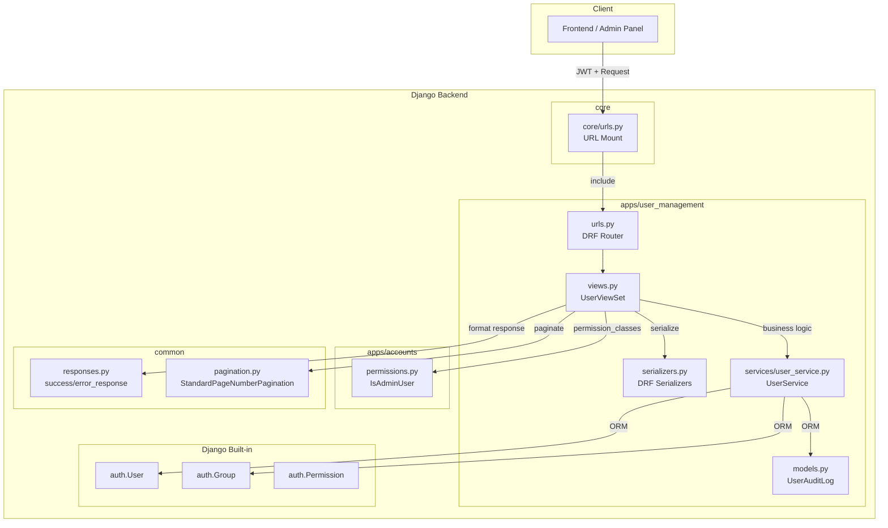
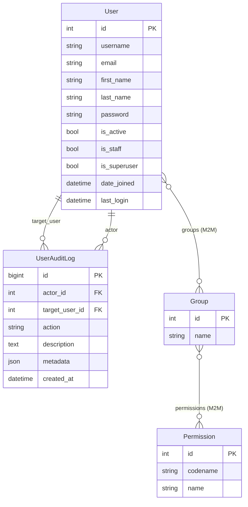

# Technical Design: Users Management

## Overview

This design describes the backend architecture for the Users Management module — a REST API layer that enables Admin group members to manage internal staff accounts (CRUD, activation/deactivation, bulk operations, password reset, audit logging). The module is mounted at `api/v1/admin/users/` and is fully additive — no existing code is modified.

Key design decisions:
- **Reuses Django's built-in User, Group, and Permission models** (integer PK) — no custom user model.
- **New Django app `apps/user_management/`** keeps concerns separated from the existing `apps/accounts/` auth module.
- **Service layer pattern** (`UserService`) encapsulates all business logic, keeping views thin.
- **ModelViewSet with @action decorators** — a single `UserViewSet` handles all CRUD and custom endpoints, leveraging DRF's router for automatic URL generation and reducing boilerplate.
- **Delegates group assignment only** — does NOT provide group CRUD (reserved for future Roles Management module).
- **UserAuditLog** model records all state-changing operations for traceability.
- **Bulk operations wrapped in `transaction.atomic()`** for consistency (rollback on unhandled errors).
- **Query optimization** via `select_related()` and `prefetch_related()` to minimize N+1 queries.

## Architecture



### Request Flow

1. Client sends request with JWT `Authorization: Bearer <token>` to `api/v1/admin/users/...`
2. `core/urls.py` routes to `apps.user_management.urls` (DRF Router-generated URL patterns)
3. `UserViewSet` verifies JWT via `JWTAuthentication` (DRF default) and checks `IsAdminUser` permission
4. ViewSet action delegates business logic to `UserService`
5. `UserService` performs operations on Django User/Group models and creates `UserAuditLog` entries
6. ViewSet serializes results and returns via `success_response()` / `error_response()`

## Components and Interfaces

### URL Routing Table

URLs are auto-generated by DRF's `DefaultRouter` from `UserViewSet`, plus explicit `@action` routes:

| Method | Path | ViewSet Action | Description |
|--------|------|---------------|-------------|
| GET | `/api/v1/admin/users/` | `list` | List users (paginated, filtered, sorted) |
| POST | `/api/v1/admin/users/` | `create` | Create new user |
| GET | `/api/v1/admin/users/me/` | `me` (@action detail=False) | Get current admin profile |
| GET | `/api/v1/admin/users/{id}/` | `retrieve` | Get user detail |
| PATCH | `/api/v1/admin/users/{id}/` | `partial_update` | Update user |
| POST | `/api/v1/admin/users/{id}/activate/` | `activate` (@action detail=True) | Activate user |
| POST | `/api/v1/admin/users/{id}/deactivate/` | `deactivate` (@action detail=True) | Deactivate user |
| POST | `/api/v1/admin/users/{id}/reset-password/` | `reset_password` (@action detail=True) | Reset password |
| GET | `/api/v1/admin/users/{id}/audit-log/` | `audit_log` (@action detail=True) | Get user audit log |
| POST | `/api/v1/admin/users/bulk-activate/` | `bulk_activate` (@action detail=False) | Bulk activate users |
| POST | `/api/v1/admin/users/bulk-deactivate/` | `bulk_deactivate` (@action detail=False) | Bulk deactivate users |

#### URL Configuration (`urls.py`)

```python
from rest_framework.routers import DefaultRouter
from .views import UserViewSet

router = DefaultRouter()
router.register(r'', UserViewSet, basename='user')

urlpatterns = router.urls
```

### View Classes — UserViewSet

The entire API is served by a single `UserViewSet` based on `ModelViewSet`. This leverages DRF's router for automatic URL generation and reduces boilerplate.

```python
from rest_framework.viewsets import ModelViewSet
from rest_framework.decorators import action
from rest_framework.permissions import IsAuthenticated
from apps.accounts.permissions import IsAdminUser

class UserViewSet(ModelViewSet):
    """
    ViewSet for managing backend users.
    Provides standard CRUD via ModelViewSet plus custom actions.
    """
    authentication_classes = [JWTAuthentication]
    permission_classes = [IsAdminUser]
    pagination_class = StandardPageNumberPagination
    http_method_names = ['get', 'post', 'patch', 'head', 'options']  # No PUT or DELETE

    def get_serializer_class(self):
        if self.action == 'list':
            return UserListSerializer
        if self.action == 'create':
            return UserCreateSerializer
        if self.action == 'partial_update':
            return UserUpdateSerializer
        if self.action == 'reset_password':
            return PasswordResetSerializer
        if self.action in ('bulk_activate', 'bulk_deactivate'):
            return BulkActionSerializer
        return UserDetailSerializer

    def get_queryset(self):
        return User.objects.prefetch_related("groups").all()

    # --- Standard CRUD actions ---
    # list: Parses query params (search, ordering, is_active, is_staff, is_superuser,
    #        group, date_joined_after/before, last_login_after/before).
    #        Calls UserService.list_users(). Returns paginated response.
    # create: Validates via UserCreateSerializer. Calls UserService.create_user().
    #          Returns 201 with user detail.
    # retrieve: Fetches user by id (with prefetch_related("groups", "user_permissions"))
    #            or returns 404. Serializes with UserDetailSerializer.
    # partial_update: Validates via UserUpdateSerializer. Calls UserService.update_user().
    #                  Returns updated user detail.

    @action(detail=False, methods=['get'], url_path='me', url_name='me')
    def me(self, request):
        """Returns the requesting Admin_User's profile using UserDetailSerializer."""
        ...

    @action(detail=True, methods=['post'], url_path='activate', url_name='activate')
    def activate(self, request, pk=None):
        """Fetches user by id or 404. Calls UserService.activate_user(). Returns user detail."""
        ...

    @action(detail=True, methods=['post'], url_path='deactivate', url_name='deactivate')
    def deactivate(self, request, pk=None):
        """Fetches user by id or 404. Calls UserService.deactivate_user(). Returns user detail or 400."""
        ...

    @action(detail=True, methods=['post'], url_path='reset-password', url_name='reset-password')
    def reset_password(self, request, pk=None):
        """Validates via PasswordResetSerializer. Calls UserService.reset_password(). Returns success."""
        ...

    @action(detail=True, methods=['get'], url_path='audit-log', url_name='audit-log')
    def audit_log(self, request, pk=None):
        """Returns paginated list of UserAuditLog for this user, ordered by created_at desc."""
        ...

    @action(detail=False, methods=['post'], url_path='bulk-activate', url_name='bulk-activate')
    def bulk_activate(self, request):
        """Validates via BulkActionSerializer. Calls UserService.bulk_activate(). Returns summary."""
        ...

    @action(detail=False, methods=['post'], url_path='bulk-deactivate', url_name='bulk-deactivate')
    def bulk_deactivate(self, request):
        """Validates via BulkActionSerializer. Calls UserService.bulk_deactivate(). Returns summary."""
        ...
```

### Serializers

#### UserListSerializer

| Field | Type | Source |
|-------|------|--------|
| id | IntegerField | User.id |
| username | CharField | User.username |
| email | EmailField | User.email |
| first_name | CharField | User.first_name |
| last_name | CharField | User.last_name |
| is_active | BooleanField | User.is_active |
| is_staff | BooleanField | User.is_staff |
| is_superuser | BooleanField | User.is_superuser |
| groups | ListField(CharField) | User.groups → names |
| date_joined | DateTimeField | User.date_joined |
| last_login | DateTimeField | User.last_login |

#### UserDetailSerializer (extends UserListSerializer)

| Additional Field | Type | Source |
|-----------------|------|--------|
| permissions | ListField(CharField) | `user.get_all_permissions()` → set of `"app_label.codename"` strings |

**Note:** The `permissions` field returns the user's **effective permissions** — the union of direct `user_permissions` AND all permissions inherited through group memberships. This is computed via Django's `user.get_all_permissions()` method, which returns a set of `"app_label.codename"` strings (e.g., `"auth.add_user"`, `"chatbot.view_session"`).

#### UserCreateSerializer

| Field | Type | Required | Notes |
|-------|------|----------|-------|
| username | CharField(max=150) | Yes | Alphanumeric + @.+-_ |
| email | EmailField | Yes | Normalized to lowercase |
| first_name | CharField(max=150) | No | Defaults to "" |
| last_name | CharField(max=150) | No | Defaults to "" |
| password | CharField(write_only) | Yes | Validated against AUTH_PASSWORD_VALIDATORS |
| groups | ListField(CharField) | No | List of group names, defaults to [] |
| is_active | BooleanField | No | Defaults to True |
| is_staff | BooleanField | No | Defaults to True |
| is_superuser | BooleanField | No | Defaults to False |

#### UserUpdateSerializer

| Field | Type | Required | Notes |
|-------|------|----------|-------|
| first_name | CharField(max=150) | No | |
| last_name | CharField(max=150) | No | |
| email | EmailField | No | Normalized to lowercase |
| groups | ListField(CharField) | No | Replaces all group memberships |
| is_active | BooleanField | No | |
| is_staff | BooleanField | No | |
| is_superuser | BooleanField | No | |

Rejects `username` field with 400 if included.

#### PasswordResetSerializer

| Field | Type | Required | Notes |
|-------|------|----------|-------|
| password | CharField(write_only) | Yes | Validated against AUTH_PASSWORD_VALIDATORS |

#### BulkActionSerializer

| Field | Type | Required | Notes |
|-------|------|----------|-------|
| user_ids | ListField(IntegerField) | Yes | Non-empty list of user IDs |

#### AuditLogSerializer

| Field | Type | Source |
|-------|------|--------|
| id | IntegerField | UserAuditLog.id |
| actor | IntegerField (nullable) | UserAuditLog.actor_id |
| actor_username | CharField (nullable) | UserAuditLog.actor.username |
| target_user | IntegerField (nullable) | UserAuditLog.target_user_id |
| action | CharField | UserAuditLog.action |
| description | CharField | UserAuditLog.description |
| metadata | JSONField | UserAuditLog.metadata |
| created_at | DateTimeField | UserAuditLog.created_at |

### Service Layer — UserService

`apps/user_management/services/user_service.py`

```python
class UserService:
    """
    Encapsulates all business logic for user management.
    All state-changing methods create UserAuditLog entries.
    """

    @staticmethod
    def list_users(
        search: str | None = None,
        ordering: str | None = None,
        is_active: bool | None = None,
        is_staff: bool | None = None,
        is_superuser: bool | None = None,
        group: str | None = None,
        date_joined_after: datetime | None = None,
        date_joined_before: datetime | None = None,
        last_login_after: datetime | None = None,
        last_login_before: datetime | None = None,
    ) -> QuerySet[User]:
        """
        Returns filtered, ordered queryset of Users.
        Uses .prefetch_related("groups") on the queryset for efficient
        serialization of group names in list responses.
        """
        ...

    @staticmethod
    def get_user(user_id: int) -> User:
        """
        Returns User or raises User.DoesNotExist.
        Uses .select_related() where applicable and
        .prefetch_related("groups", "user_permissions") for detail views
        to minimize N+1 queries when serializing groups and permissions.
        """
        ...

    @staticmethod
    def create_user(
        data: dict,
        actor: User,
    ) -> User:
        """
        Creates a new User with validated data.
        - Validates password against AUTH_PASSWORD_VALIDATORS
        - Validates group names exist
        - Normalizes email to lowercase
        - Hashes password via set_password()
        - Assigns groups
        - Creates audit log entry
        Raises ValidationError on invalid input.
        """
        ...

    @staticmethod
    def update_user(
        user: User,
        data: dict,
        actor: User,
    ) -> User:
        """
        Updates User fields (first_name, last_name, email, groups, is_active, is_staff, is_superuser).
        - Rejects username field
        - Validates group names exist
        - Enforces last-active-superuser protection
        - Normalizes email to lowercase
        - Creates audit log entry
        Raises ValidationError on invalid input.
        """
        ...

    @staticmethod
    def activate_user(user: User, actor: User) -> User:
        """Sets is_active=True. Creates audit log."""
        ...

    @staticmethod
    def deactivate_user(user: User, actor: User) -> User:
        """
        Sets is_active=False.
        - Rejects self-deactivation
        - Enforces last-active-superuser protection
        - Creates audit log
        Raises ValidationError on protection violation.
        """
        ...

    @staticmethod
    def reset_password(user: User, password: str, actor: User) -> None:
        """
        Validates password against AUTH_PASSWORD_VALIDATORS.
        Sets new password via:
            user.set_password(new_password)
            user.save(update_fields=["password"])
        Using update_fields=["password"] avoids race conditions with
        concurrent updates to other user fields.
        Creates audit log.
        Raises ValidationError on invalid password.
        """
        ...

    @staticmethod
    def bulk_activate(user_ids: list[int], actor: User) -> dict:
        """
        Activates multiple users. Wrapped in transaction.atomic() to ensure
        consistency — if an unhandled error occurs mid-batch, all changes
        in that batch are rolled back.

        Returns summary:
        {"activated_count": int, "skipped": [{"id": int, "reason": str}]}
        Skips: non-existent, already active.
        Creates audit log for each activation.
        """
        ...

    @staticmethod
    def bulk_deactivate(user_ids: list[int], actor: User) -> dict:
        """
        Deactivates multiple users. Wrapped in transaction.atomic() to ensure
        consistency — if an unhandled error occurs mid-batch, all changes
        in that batch are rolled back.

        Returns summary:
        {"deactivated_count": int, "skipped": [{"id": int, "reason": str}]}
        Skips: non-existent, already inactive, self, last active superuser.
        Creates audit log for each deactivation.
        """
        ...

    @staticmethod
    def get_audit_log(user_id: int) -> QuerySet:
        """Returns UserAuditLog entries for user ordered by created_at desc."""
        ...

    # --- Internal helpers ---

    @staticmethod
    def _is_last_active_superuser(user: User) -> bool:
        """True when user is the only active superuser in the system."""
        ...

    @staticmethod
    def _validate_group_names(group_names: list[str]) -> list[Group]:
        """
        Validates all group names exist. Returns Group objects.
        Raises ValidationError listing invalid names if any don't exist.
        """
        ...

    @staticmethod
    def _create_audit_log(
        actor: User,
        target_user: User,
        action: str,
        description: str,
        metadata: dict | None = None,
    ) -> None:
        """Creates a UserAuditLog record."""
        ...
```

## Data Models

### UserAuditLog

This is the only new model. Django's built-in `User`, `Group`, and `Permission` models are used as-is.

```python
class UserAuditLog(models.Model):
    """Records all state-changing operations on backend users."""

    id = models.BigAutoField(primary_key=True)
    actor = models.ForeignKey(
        User,
        on_delete=models.SET_NULL,
        null=True,
        related_name='audit_actions_performed',
        help_text="Admin who performed the action"
    )
    target_user = models.ForeignKey(
        User,
        on_delete=models.SET_NULL,
        null=True,
        related_name='audit_log_entries',
        help_text="User who was acted upon"
    )
    action = models.CharField(
        max_length=50,
        help_text="Action type identifier"
    )
    description = models.TextField(
        help_text="Human-readable description of the change"
    )
    metadata = models.JSONField(
        default=dict,
        blank=True,
        help_text="Extensible data: IP, user agent, old/new values (see schema below)"
    )
    created_at = models.DateTimeField(auto_now_add=True)

    class Meta:
        app_label = 'user_management'
        ordering = ['-created_at']
        indexes = [
            models.Index(fields=['target_user', '-created_at']),
            models.Index(fields=['actor', '-created_at']),
            models.Index(fields=['action']),
            models.Index(fields=['-created_at']),
        ]

    def __str__(self):
        return f"{self.action} on user {self.target_user_id} by {self.actor_id} at {self.created_at}"
```

#### Metadata JSONField Schema

The `metadata` JSONField SHALL follow this standard structure:

```json
{
  "ip_address": "192.168.1.1",
  "user_agent": "Mozilla/5.0...",
  "old_values": {"field": "old_value"},
  "new_values": {"field": "new_value"}
}
```

| Key | Type | Required | Description |
|-----|------|----------|-------------|
| `ip_address` | string | Optional | Extracted from `request.META['REMOTE_ADDR']` |
| `user_agent` | string | Optional | Extracted from `request.META['HTTP_USER_AGENT']` |
| `old_values` | object | Optional | Previous state of changed fields (for updates) |
| `new_values` | object | Optional | New state of changed fields (for updates) |

Examples:
- **User created**: `{"ip_address": "10.0.0.1", "user_agent": "..."}`
- **User updated**: `{"ip_address": "10.0.0.1", "user_agent": "...", "old_values": {"first_name": "Jon"}, "new_values": {"first_name": "John"}}`
- **Groups changed**: `{"ip_address": "...", "old_values": {"groups": ["Support"]}, "new_values": {"groups": ["Support", "Admin"]}}`
- **Password reset**: `{"ip_address": "10.0.0.1", "user_agent": "..."}` (no old/new values for security)

#### Action Types

| Action Value | Triggered By |
|-------------|--------------|
| `user_created` | POST /users/ |
| `user_updated` | PATCH /users/{id}/ |
| `user_activated` | POST /users/{id}/activate/ |
| `user_deactivated` | POST /users/{id}/deactivate/ |
| `password_reset` | POST /users/{id}/reset-password/ |
| `groups_changed` | PATCH /users/{id}/ (when groups field present) |
| `bulk_activated` | POST /users/bulk-activate/ |
| `bulk_deactivated` | POST /users/bulk-deactivate/ |

### ER Diagram



## Correctness Properties

*A property is a characteristic or behavior that should hold true across all valid executions of a system — essentially, a formal statement about what the system should do. Properties serve as the bridge between human-readable specifications and machine-verifiable correctness guarantees.*

### Property 1: Search Filter Correctness

*For any* set of Backend_Users and any non-empty search term, every user returned by the list endpoint with that search term SHALL have the search term as a case-insensitive substring in at least one of: username, email, first_name, or last_name.

**Validates: Requirements 1.2**

### Property 2: Ordering Correctness

*For any* set of Backend_Users and any valid ordering field (with optional `-` prefix), the list returned by the list endpoint SHALL be sorted according to that field in the specified direction.

**Validates: Requirements 1.3**

### Property 3: Boolean Filter Correctness

*For any* set of Backend_Users and any boolean filter (is_active, is_staff, or is_superuser) with value `true` or `false`, every user returned by the list endpoint SHALL have the corresponding field matching the filter value.

**Validates: Requirements 1.4, 1.5, 1.6**

### Property 4: Group Filter Correctness

*For any* set of Backend_Users and any valid group name filter, every user returned by the list endpoint SHALL be a member of the specified group.

**Validates: Requirements 1.7**

### Property 5: Date Range Filter Correctness

*For any* set of Backend_Users and any date range filter (date_joined_after/before or last_login_after/before), every user returned by the list endpoint SHALL have the corresponding date field within the specified range (inclusive).

**Validates: Requirements 1.8, 1.9**

### Property 6: Serializer Field Completeness

*For any* Backend_User, the Detail_Serializer response SHALL contain all fields (id, username, email, first_name, last_name, is_active, is_staff, is_superuser, groups, permissions, date_joined, last_login) and the List_Serializer response SHALL contain all fields except permissions.

**Validates: Requirements 1.10, 2.1, 14.5**

### Property 7: User Creation Round-Trip

*For any* valid user creation payload (valid username, valid email, valid password, existing group names), after creation the stored User SHALL have: username matching input, email matching input (lowercased), first_name/last_name matching input, group memberships matching the specified group names, and `check_password(input_password)` returning True.

**Validates: Requirements 4.1, 4.2, 4.4**

### Property 8: Username Uniqueness Invariant

*For any* existing Backend_User with username U, attempting to create or update another user with a username that matches U case-insensitively SHALL be rejected with a 400 error.

**Validates: Requirements 4.6, 11.2**

### Property 9: Email Uniqueness Invariant

*For any* existing Backend_User with email E, attempting to create or update another user with an email that matches E case-insensitively SHALL be rejected with a 400 error.

**Validates: Requirements 4.7, 5.11, 11.6**

### Property 10: Email Normalization Invariant

*For any* user create or update operation that provides an email address, the stored email SHALL equal the input email converted to lowercase.

**Validates: Requirements 4.12, 5.10, 11.8**

### Property 11: Invalid Group Atomicity

*For any* user create or update request where the groups list contains at least one non-existent group name, the entire request SHALL be rejected with a 400 error, no user SHALL be created or modified, and the error response SHALL list all invalid group names.

**Validates: Requirements 4.8, 4.9, 5.5**

### Property 12: Password Never in Response

*For any* API response from the User_Management_API (create, update, detail, list, activate, deactivate, reset-password), the response payload SHALL NOT contain a `password` field.

**Validates: Requirements 4.11, 10.2, 14.6**

### Property 13: Group Replacement on Update

*For any* Backend_User with existing group set G1, when updated with a new groups list G2 (all valid names), the user's group memberships SHALL be exactly G2 — no groups from G1 remain unless they are also in G2.

**Validates: Requirements 5.4**

### Property 14: Activate/Deactivate State Change

*For any* Backend_User, after calling activate the user's is_active field SHALL be True; after calling deactivate (when allowed) the user's is_active field SHALL be False and the User record SHALL still exist in the database.

**Validates: Requirements 6.1, 7.1, 7.5**

### Property 15: Self-Deactivation Prevention

*For any* Admin_User performing a deactivation or bulk-deactivation, if the target user ID equals the requesting admin's ID, the operation SHALL be rejected (400 in single, skipped in bulk with reason "cannot deactivate yourself").

**Validates: Requirements 7.2, 9.3**

### Property 16: Last Active Superuser Protection

*For any* system state where exactly one User has `is_superuser=True AND is_active=True`, any operation that would deactivate that user, set their `is_superuser` to False, or remove them from the 'Admin' group SHALL be rejected. In bulk operations, that user SHALL be skipped with the appropriate reason.

**Validates: Requirements 5.7, 5.8, 7.3, 9.4, 15.1, 15.2, 15.3, 15.4, 15.5**

### Property 17: Bulk Operation Summary Correctness

*For any* bulk activate/deactivate request with a list of user IDs, the returned summary SHALL satisfy: `activated_count + len(skipped) == len(input_ids)` (or `deactivated_count` for deactivate), and every ID in the input SHALL appear either in the successfully processed set or in the skipped list with a valid reason.

**Validates: Requirements 8.1, 8.2, 9.1, 9.2**

### Property 18: Audit Log Invariant

*For any* state-changing operation (create, update, activate, deactivate, bulk-activate, bulk-deactivate, password reset), a UserAuditLog record SHALL be created containing: a non-null action type, the target user's ID, the acting admin's ID, an auto-set timestamp, and a non-empty description.

**Validates: Requirements 12.1, 12.2**

### Property 19: Response Envelope Format

*For any* successful API response, the body SHALL match `{success: true, data: ..., message: ..., meta: ...}`. For any error response, the body SHALL match `{success: false, code: ..., message: ..., details: ...}`.

**Validates: Requirements 14.1, 14.2**

### Property 20: Password Validation Enforcement

*For any* password that violates Django's AUTH_PASSWORD_VALIDATORS (too short, too common, entirely numeric, too similar to user attributes), both user creation and password reset operations SHALL reject the password with a 400 error containing validation details.

**Validates: Requirements 4.3, 10.4**

## Error Handling

| Scenario | HTTP Status | Error Code | Message |
|----------|-------------|------------|---------|
| No JWT token provided | 401 | `authentication_required` | Authentication credentials were not provided |
| Invalid/expired JWT | 401 | `token_invalid` | Token is invalid or expired |
| User not in Admin group | 403 | `permission_denied` | You do not have permission to perform this action |
| User not found (by ID) | 404 | `user_not_found` | User with id {id} not found |
| Duplicate username | 400 | `username_exists` | A user with this username already exists |
| Duplicate email | 400 | `email_exists` | A user with this email already exists |
| Invalid group names | 400 | `invalid_groups` | The following groups do not exist: {names} |
| Password validation failed | 400 | `password_invalid` | Password does not meet requirements |
| Username not editable | 400 | `username_not_editable` | Username cannot be modified after creation |
| Cannot deactivate self | 400 | `cannot_deactivate_self` | You cannot deactivate your own account |
| Last active superuser protection | 400 | `last_superuser_protection` | Cannot modify the last active superuser |
| Invalid field value / missing required | 400 | `validation_error` | Validation failed (details in response) |
| Empty user_ids list | 400 | `validation_error` | user_ids list cannot be empty |

All errors are returned via `error_response(code, message, details, status)` from `common/responses.py`.

## Testing Strategy

### Approach

The testing strategy uses a **dual approach**:
1. **Property-based tests** (via `hypothesis` library) — verify universal invariants across randomized inputs
2. **Example-based unit tests** (via `pytest` + Django test client) — verify specific scenarios, edge cases, and integration points

### Property-Based Testing Configuration

- Library: **Hypothesis** (Python PBT standard)
- Minimum iterations: 100 per property (Hypothesis default `max_examples=100`)
- Each property test is tagged with a comment referencing the design property:
  ```python
  # Feature: users-management, Property 1: Search Filter Correctness
  ```

### Property Tests (Hypothesis)

| Property | What It Generates | What It Asserts |
|----------|-------------------|-----------------|
| P1: Search Filter | Random users + random search terms | All results contain term in ≥1 field |
| P2: Ordering | Random users + valid ordering fields | Results are sorted correctly |
| P3: Boolean Filter | Random users with varied boolean fields + filter value | All results match filter |
| P4: Group Filter | Random users in random groups + group name | All results belong to group |
| P5: Date Range Filter | Random users with varied dates + date range | All results within range |
| P6: Serializer Fields | Random users | All expected fields present |
| P7: Creation Round-Trip | Random valid creation payloads | Stored data matches input |
| P8: Username Uniqueness | Random usernames with case variations | Duplicate rejected |
| P9: Email Uniqueness | Random emails with case variations | Duplicate rejected |
| P10: Email Normalization | Random emails with mixed case | Stored email is lowercase |
| P11: Invalid Group Atomicity | Mix of valid + invented group names | No user created, all invalid names listed |
| P12: Password Not in Response | Random valid operations | No `password` key in any response |
| P13: Group Replacement | User with groups A, updated with groups B | Final groups == B exactly |
| P14: Activate/Deactivate | Random users | is_active changes correctly, record persists |
| P15: Self-Deactivation | Admin deactivating self | 400 or skipped |
| P16: Last Superuser | Single active superuser + protection-triggering ops | All rejected/skipped |
| P17: Bulk Summary | Random ID lists (mix valid/invalid) | Counts add up, all IDs accounted for |
| P18: Audit Log | Random state-changing operations | Audit record created with all fields |
| P19: Response Envelope | Any API call | Response structure matches envelope |
| P20: Password Validation | Random invalid passwords | Rejection with details |

### Example-Based Unit Tests

| Category | Tests |
|----------|-------|
| Auth | 401 without token, 403 for non-admin |
| List | Pagination meta correctness, default page_size=20 |
| Detail | 404 for non-existent ID, /me/ matches detail for same user |
| Create | Defaults (is_active=True), empty groups creates user with none, required fields |
| Update | Username rejected, empty groups removes all |
| Activate | Already-active user (idempotent) |
| Deactivate | 404 for non-existent |
| Password Reset | 404 for non-existent, success returns no password |
| Bulk | Partial skip scenarios with mixed reasons |
| Audit Log | Entries ordered by timestamp desc, 404 for non-existent user |
| Backward Compat | Existing auth/me endpoint unchanged |

### Test File Structure

```
apps/user_management/
├── tests/
│   ├── __init__.py
│   ├── conftest.py              # Fixtures: admin user, regular user, groups
│   ├── test_views_list.py       # List endpoint tests
│   ├── test_views_detail.py     # Detail + /me/ tests
│   ├── test_views_create.py     # Create tests
│   ├── test_views_update.py     # Update tests
│   ├── test_views_activate.py   # Activate/Deactivate tests
│   ├── test_views_bulk.py       # Bulk operations tests
│   ├── test_views_password.py   # Password reset tests
│   ├── test_views_audit.py      # Audit log endpoint tests
│   ├── test_service.py          # UserService unit tests
│   ├── test_properties.py       # Hypothesis property-based tests
│   └── test_permissions.py      # Auth/permission tests
```

### File Structure (Complete App Layout)

```
apps/user_management/
├── __init__.py
├── apps.py
├── models.py                    # UserAuditLog
├── admin.py                     # Django admin registration for UserAuditLog
├── serializers.py               # All serializers
├── views.py                     # UserViewSet (ModelViewSet with @action methods)
├── urls.py                      # DRF DefaultRouter registration
├── services/
│   ├── __init__.py
│   └── user_service.py          # UserService class
├── migrations/
│   ├── __init__.py
│   └── 0001_initial.py          # UserAuditLog migration
└── tests/
    └── (as above)
```

### Integration with core/urls.py

A single additive line in `core/urls.py`:

```python
path('api/v1/admin/users/', include('apps.user_management.urls')),
```

### Integration with settings.py

Add to `INSTALLED_APPS`:

```python
'apps.user_management',
```

### Boundary with Future Roles Management Module

**Users Management module responsibilities (THIS module):**
- ✅ Assign existing Groups to users (during create/update)
- ✅ Remove Group assignments from users (during update with new groups list)
- ✅ List group names on a user (serializers)
- ✅ Validate group names exist before assignment
- ✅ Display effective permissions (union of direct + group-inherited) on user detail

**Users Management does NOT:**
- ❌ Create, update, or delete Groups
- ❌ List all available Groups (no "GET /groups/" endpoint)
- ❌ Assign or modify Permissions on Groups
- ❌ List all available Permissions
- ❌ Define new Permissions

**Future Roles Management module will own:**
- Group CRUD (create, read, update, delete Groups)
- Permission assignment to Groups (add/remove Permissions from a Group)
- Listing all available Groups and Permissions
- Group hierarchy or role inheritance (if needed)

**Shared models without conflict:** Both modules operate on the same Django `auth.Group` and `auth.Permission` models. Users Management only reads Group objects (for validation and assignment); Roles Management will own Group/Permission mutations. No schema conflicts arise because Django's built-in M2M tables (`auth_user_groups`, `auth_group_permissions`) are shared infrastructure.
