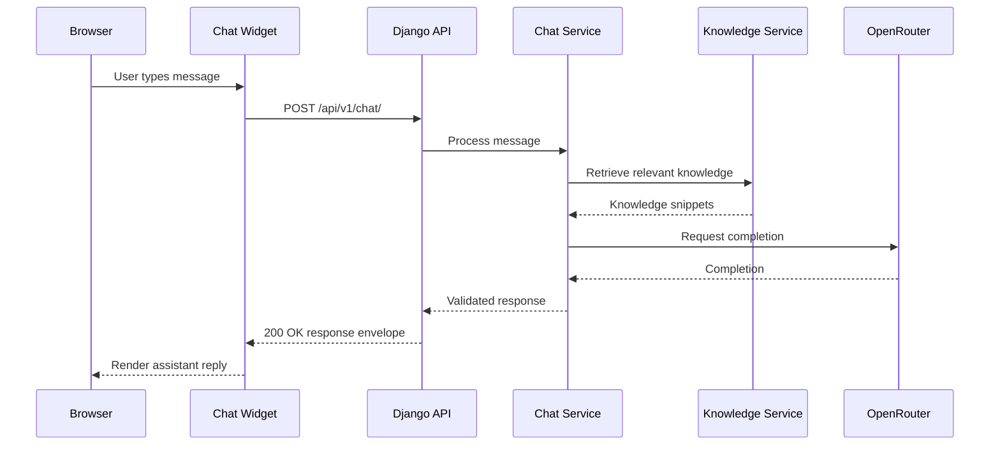
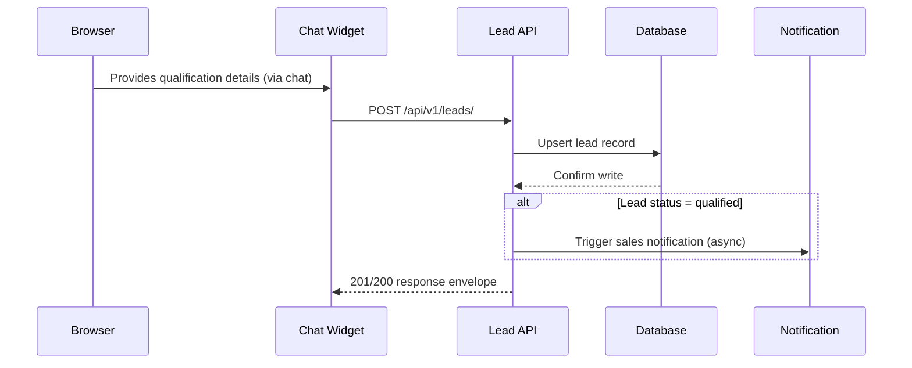
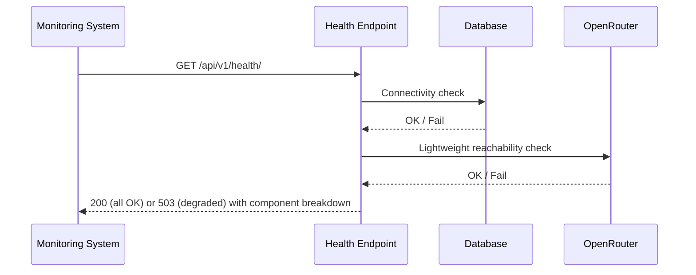
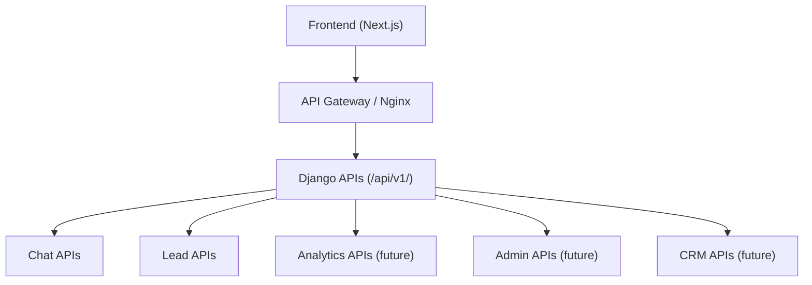

# B10 AI Assistant — API Specification

---

# Document Information

| Field | Value |
|---|---|
| Document Title | B10 AI Assistant — API Specification |
| Project | B10 AI Assistant |
| Company | B10 IT Solution |
| Backend | Django, Django REST Framework |
| Database | PostgreSQL |
| AI Provider | OpenRouter |
| Frontend Consumer | `b10itsolution` (Next.js — existing) |
| Document Purpose | Single source of truth for all backend APIs: contracts, validation, errors, security, and versioning |
| Document Status | Draft v1.0 |
| Companion Documents | PRD.md, TRD.md, SYSTEM_ARCHITECTURE.md, AI_SYSTEM_DESIGN.md |
| Base URL (current) | `/api/v1/` |

---

# Executive Summary

This document is the authoritative contract for every backend API exposed by `b10backend` to the `b10itsolution` frontend (and, in future phases, to internal dashboards, analytics consumers, and CRM integrations). It defines request/response schemas, validation rules, authentication and authorization requirements, error handling, rate limiting, observability requirements, and versioning strategy for every endpoint in the current API surface: Chat, Leads, Company, Services, FAQ, Feedback, and Health.

All APIs are RESTful, versioned under `/api/v1/`, JSON-only, and stateless at the transport layer — conversational state is persisted server-side and referenced by a `conversation_id`, not held in application memory. Every response follows one of two standardized envelopes (success or error), defined once and applied uniformly across all endpoints, so frontend error handling and success handling logic never needs to special-case a specific endpoint's shape.

This document is implementation-ready: every endpoint specification includes purpose, method, auth/permissions, request/response schema, validation rules, example payloads, status codes, rate limits, security considerations, logging/monitoring requirements, and future extension points.

---

# API Design Principles

| # | Principle | Application |
|---|---|---|
| 1 | RESTful | Resource-oriented URLs, standard HTTP methods and status codes |
| 2 | Versioned | All endpoints live under `/api/v1/`; breaking changes ship under `/api/v2/`, never as in-place mutations of `v1` |
| 3 | JSON Only | `Content-Type: application/json` required on all requests and responses; no form-encoded or XML support |
| 4 | Stateless | No server-side session state held in-process; all state lives in PostgreSQL/Redis, referenced by tokens/IDs in each request |
| 5 | Secure by Default | Rate limiting, input validation, and auth checks apply by default, not opt-in |
| 6 | Observable | Every request is logged with a correlation ID; every AI call is metered |
| 7 | Backward Compatible | Additive changes only within a version; no field removal or type change without a version bump |
| 8 | Extensible | New API domains (Analytics, Administration, Auth, CRM) attach under the same versioning and envelope conventions without special-casing |

---

# API Versioning Strategy

- **Current version:** `/api/v1/`
- **URL-path versioning** is used (not header-based), for explicitness and ease of debugging/caching.
- **Non-breaking changes** (new optional fields, new endpoints, new optional query parameters) are shipped within `v1` without a version bump.
- **Breaking changes** (removing/renaming a field, changing a field's type, changing required-ness, changing status code semantics) require a new version (`/api/v2/`).
- **Parallel version support:** When `v2` ships, `v1` remains available for a defined deprecation window (see Deprecation Strategy) so the frontend is never forced into a synchronized breaking migration.
- **Version discovery:** The Health endpoint (`GET /api/v1/health/`) returns the currently deployed API version(s) for diagnostic purposes.

---

# Required API Domains

| Domain | Status | Prefix |
|---|---|---|
| Chat APIs | Current | `/api/v1/chat/` |
| Lead APIs | Current | `/api/v1/leads/` |
| Company APIs | Current | `/api/v1/company/` |
| Service APIs | Current | `/api/v1/services/` |
| FAQ APIs | Current | `/api/v1/faqs/` |
| Feedback APIs | Current | `/api/v1/chat/feedback/` |
| Health APIs | Current | `/api/v1/health/` |
| Analytics APIs | Future | `/api/v1/analytics/` |
| Administration APIs | Future | `/api/v1/admin/` |
| Authentication APIs | Future | `/api/v1/auth/` |
| CRM APIs | Future | `/api/v1/integrations/crm/` |

---

# Standard Response Envelopes

## Success Envelope

All successful responses (2xx) share this shape:

```json
{
  "success": true,
  "data": {},
  "message": "",
  "meta": {}
}
```

| Field | Type | Description |
|---|---|---|
| `success` | boolean | Always `true` for successful responses |
| `data` | object \| array | The primary response payload |
| `message` | string | Optional human-readable summary; may be empty string |
| `meta` | object | Optional metadata: pagination info, request_id, timestamps |

## Error Envelope

All error responses (4xx/5xx) share this shape:

```json
{
  "success": false,
  "code": "",
  "message": "",
  "details": {}
}
```

| Field | Type | Description |
|---|---|---|
| `success` | boolean | Always `false` for error responses |
| `code` | string | Machine-readable error code (see Error Categories below) |
| `message` | string | Human-readable error summary, safe to display to end users |
| `details` | object | Field-level validation errors or additional context; may be empty object |

**Design decision:** The envelope shape is identical across every endpoint in this document, including future domains. Frontend code checks `success` once and branches accordingly — no endpoint returns a bare array, a bare object, or a differently-shaped error.

---

# Error Categories

| Category | HTTP Status | Code Prefix | Example `code` | Retry Guidance |
|---|---|---|---|---|
| Validation Errors | 400 | `VALIDATION_` | `VALIDATION_REQUIRED_FIELD` | Fix request and resubmit; do not retry as-is |
| Authentication Errors | 401 | `AUTH_` | `AUTH_INVALID_SESSION_TOKEN` | Re-authenticate / obtain new session token |
| Authorization Errors | 403 | `AUTHZ_` | `AUTHZ_FORBIDDEN` | Do not retry; requires different credentials/role |
| Not Found Errors | 404 | `NOT_FOUND_` | `NOT_FOUND_RESOURCE` | Do not retry; verify resource identifier |
| Rate Limit Errors | 429 | `RATE_LIMIT_` | `RATE_LIMIT_EXCEEDED` | Retry after `Retry-After` header duration |
| OpenRouter Errors | 502 / 504 | `AI_PROVIDER_` | `AI_PROVIDER_TIMEOUT`, `AI_PROVIDER_UNAVAILABLE` | Client may retry with backoff; server already applied internal retry/fallback before surfacing this |
| Database Errors | 500 / 503 | `DATABASE_` | `DATABASE_UNAVAILABLE` | Client may retry with backoff |
| Internal Server Errors | 500 | `INTERNAL_` | `INTERNAL_UNEXPECTED_ERROR` | Client may retry once; if persists, treat as outage |

**Design decision:** OpenRouter- and database-specific failures are never surfaced as generic `500` with no code — the frontend needs to distinguish "the AI provider is degraded, show a graceful chat fallback" from "the database is down, show a full-page error" from "your input was invalid, show inline field errors."

---

# Authentication and Authorization Strategy

| Consumer | Endpoints | Mechanism |
|---|---|---|
| Anonymous website visitor | Chat, Lead (via chat), Company, Services, FAQ, Feedback, Health (read) | Signed, short-lived **session token** issued by `POST /api/v1/chat/sessions/` (see Chat APIs), passed via `Authorization: Session <token>` header or HttpOnly cookie. Scoped strictly to that conversation session. |
| Internal admin/dashboard user (Future, Phase 4) | Administration, Lead admin listing (`GET /api/v1/leads/`) | Django session or JWT-based auth (`apps.users`), RBAC-scoped (admin, content manager, sales viewer) |
| Service-to-service (Future) | Analytics ingestion, CRM sync | Scoped API key / mutual auth, distinct credential space from public tokens |
| Monitoring systems | Health | No auth required for basic liveness; detailed health payload may require an internal API key in production to avoid leaking infra details publicly |

- No visitor login/account system exists in the current scope — this is intentional to minimize friction (see PRD).
- Session tokens are **not** JWTs containing PII; they are opaque references to server-side session state.
- `GET /api/v1/leads/` is documented here as a **future** administration endpoint and MUST NOT be exposed without authentication — see its endpoint spec for the interim-state requirement.

---

# Naming Conventions

| Convention | Rule |
|---|---|
| URL casing | lowercase, hyphen-free, plural nouns for collections (`/leads/`, `/services/`) |
| Path parameters | snake_case identifiers or slugs (`/services/{slug}/`) |
| JSON field casing | `snake_case` for all request/response fields, matching Django/DRF convention |
| Boolean fields | prefixed `is_`/`has_` where applicable (`is_qualified`, `has_phone`) |
| Timestamps | ISO 8601 UTC (`2026-07-03T10:00:00Z`) in all responses |
| IDs | UUID v4 strings for all resource identifiers |
| Enum values | lowercase snake_case strings (`"status": "qualified"`) |

## Serializer Conventions

- One serializer per resource representation; separate `*RequestSerializer` (input validation) and `*ResponseSerializer` (output shape) where input and output differ, to avoid leaking write-only or internal fields.
- All serializers inherit shared base validation (e.g., string trimming, max-length enforcement) from `common.serializers.BaseSerializer`.
- Nested/related objects are serialized inline for read endpoints (e.g., a service's related industries) rather than requiring N+1 client-side lookups.

---

# Pagination Strategy

- **Cursor-based pagination is not required at current scale**; standard **limit/offset pagination** is used for list endpoints.
- Query parameters: `?page=1&page_size=20` (default `page_size=20`, max `page_size=100`).
- Paginated responses include pagination metadata in the `meta` field of the success envelope:

```json
{
  "success": true,
  "data": [ ... ],
  "message": "",
  "meta": {
    "pagination": {
      "page": 1,
      "page_size": 20,
      "total_count": 47,
      "total_pages": 3
    }
  }
}
```

---

# Filtering Strategy

- Query-parameter based filtering on list endpoints, e.g., `GET /api/v1/services/?industry=healthtech`.
- Multiple filters are combined with AND semantics.
- Unrecognized filter parameters are ignored (not treated as an error), to keep the API forward-compatible with frontend code sending speculative filters.
- Filterable fields are explicitly documented per endpoint below; arbitrary field filtering is not supported (avoids leaking internal schema and unintentional query cost).

---

# Sorting Strategy

- Query parameter: `?ordering=field_name` for ascending, `?ordering=-field_name` for descending.
- Default ordering is documented per endpoint (typically most-relevant-first or most-recent-first).
- Only explicitly whitelisted fields per endpoint are sortable.

---

# Idempotency Strategy

| Endpoint Type | Idempotency Approach |
|---|---|
| `POST /api/v1/chat/` | Not idempotent by nature (each message advances conversation state); relies on `conversation_id` + message ordering, not idempotency keys |
| `POST /api/v1/leads/` | Idempotent on `(session_id)` — repeated submissions for the same session **upsert** the lead record rather than creating duplicates |
| `POST /api/v1/chat/feedback/` | Idempotency key recommended (`message_id` + `rating` combination) to prevent duplicate feedback entries from client retries |
| `GET` endpoints | Naturally idempotent (read-only) |

**Design decision:** Rather than requiring a client-generated `Idempotency-Key` header (added complexity for the frontend team at MVP stage), idempotency is achieved through natural business keys (`session_id` for leads) wherever possible. An `Idempotency-Key` header is a documented future extension point if client retry behavior proves unreliable in practice.

---

# Timeout and Retry Recommendations (Client-Side)

| Endpoint | Recommended Client Timeout | Recommended Client Retry |
|---|---|---|
| `POST /api/v1/chat/` | 15s (accounts for AI generation latency) | 1 retry on network error only; do not retry on 4xx; on 502/504 (`AI_PROVIDER_*`), show the server-provided graceful message rather than retrying automatically |
| `POST /api/v1/leads/` | 8s | 1 retry with backoff on network error or 5xx |
| `POST /api/v1/chat/feedback/` | 5s | Fire-and-forget acceptable; 1 retry on network error, non-blocking to UI |
| `GET /api/v1/company/`, `/services/`, `/faqs/` | 8s | 1 retry on network error or 5xx; safe to retry (read-only) |
| `GET /api/v1/health/` | 5s | No client retry needed (typically called by monitoring systems with their own retry/alerting policy) |

---

# Rate Limiting

| Endpoint | Limit | Scope | Notes |
|---|---|---|---|
| `POST /api/v1/chat/` | 20 requests/minute | Per session token | Prevents scripted spam; generous enough for natural conversation pace |
| `POST /api/v1/chat/sessions/` (session creation) | 5 requests/minute | Per IP | Stricter than message limit to prevent session-flooding abuse |
| `POST /api/v1/leads/` | 10 requests/minute | Per session token | Leads are typically submitted once or a few times per session |
| `POST /api/v1/chat/feedback/` | 30 requests/minute | Per session token | Higher ceiling since feedback is low-cost/low-risk |
| `GET /api/v1/company/`, `/services/`, `/faqs/` | 60 requests/minute | Per IP | Generous, cacheable, low-cost reads |
| `GET /api/v1/health/` | 120 requests/minute | Per IP | Accommodates frequent monitoring polling |

## Abuse Prevention

- Rate limits enforced via Redis-backed DRF throttling classes, keyed by session token where available, falling back to IP address for unauthenticated calls (e.g., session creation).
- Anonymous visitors are identified by session token post-session-creation; pre-session-creation requests are limited strictly by IP.
- Exceeding a rate limit returns `429` with `RATE_LIMIT_EXCEEDED` and a `Retry-After` header.
- Sustained abuse patterns (e.g., many session creations from one IP in a short window) are logged and surfaced to the abuse-monitoring dashboard (see Observability); automatic IP blocking is a documented future extension, not implemented at MVP.

---

# Standard Headers

| Header | Direction | Requirement |
|---|---|---|
| `Content-Type: application/json` | Request | Required on all `POST`/`PATCH` requests |
| `Authorization: Session <token>` | Request | Required on all endpoints except `POST /api/v1/chat/sessions/`, `GET /api/v1/company/`, `/services/`, `/faqs/`, `/health/` |
| `X-Request-ID` | Request (optional) / Response (always) | If provided by client, echoed back; otherwise server-generated. Used for correlation across logs. |
| `Retry-After` | Response (on 429/503) | Seconds to wait before retrying |
| `X-API-Version` | Response | Current API version serving the request |

---

# Required Diagrams

## 1. Chat Request Sequence



## 2. Lead Submission Sequence



## 3. Health Check Sequence



## 4. Future Architecture



---

# Endpoint Specifications

## 1. `POST /api/v1/chat/sessions/`

### Purpose
Create a new conversation session. Called once when the chat widget is first opened.

### Endpoint / Method
`POST /api/v1/chat/sessions/`

### Authentication Requirements
None (this is the entry point that issues the session token).

### Permissions
Public — any visitor may create a session, subject to rate limiting.

### Request Schema
```json
{
  "source_channel": "website_widget"
}
```

| Field | Type | Required | Notes |
|---|---|---|---|
| `source_channel` | string | No | Defaults to `"website_widget"`; reserved for future channels |

### Request Validation Rules
- `source_channel`, if provided, must be one of a whitelisted enum (`website_widget`); unrecognized values default to `website_widget` rather than erroring.

### Response Schema
```json
{
  "success": true,
  "data": {
    "session_id": "b6f1e2a0-...-...",
    "session_token": "eyJ...",
    "expires_at": "2026-07-03T14:00:00Z"
  },
  "message": "Session created",
  "meta": {}
}
```

### Success Example
`201 Created` — as above.

### Error Examples
```json
{
  "success": false,
  "code": "RATE_LIMIT_EXCEEDED",
  "message": "Too many session creation attempts. Please try again shortly.",
  "details": { "retry_after_seconds": 45 }
}
```

### Status Codes
| Code | Meaning |
|---|---|
| 201 | Session created |
| 429 | Rate limit exceeded |
| 500 | Internal server error |

### Rate Limits
5 requests/minute per IP (see Rate Limiting).

### Security Considerations
- Session tokens are cryptographically signed and short-lived (default 1 hour sliding expiry, refreshed on activity).
- No PII is embedded in the token itself.

### Logging Requirements
Log session creation event with IP (hashed/truncated for privacy where required), `source_channel`, `session_id`, `request_id`.

### Monitoring Requirements
Session-creation-rate metric; alert on abnormal spikes (possible abuse).

### Future Extension Points
`source_channel` enum extended for future integration points (e.g., embedded widget on partner sites).

---

## 2. `POST /api/v1/chat/`

### Purpose
Accept a visitor message within an existing session, process it through the chat pipeline (guardrails, knowledge retrieval, AI generation, response validation), and return the assistant's response.

### Endpoint / Method
`POST /api/v1/chat/`

### Authentication Requirements
Required — valid `Authorization: Session <token>` header, obtained from `POST /api/v1/chat/sessions/`.

### Permissions
The session token must match the `conversation_id` being posted to (a session cannot post into another session's conversation).

### Request Schema
```json
{
  "conversation_id": "b6f1e2a0-...-...",
  "message": "I need a website for my business."
}
```

| Field | Type | Required | Notes |
|---|---|---|---|
| `conversation_id` | UUID string | Yes | Must match an existing session owned by the presented token |
| `message` | string | Yes | 1–2000 characters |

### Request Validation Rules
- `message` must not be empty or whitespace-only.
- `message` max length: 2000 characters (longer input rejected with `VALIDATION_MAX_LENGTH`, not silently truncated).
- `conversation_id` must be a valid UUID and must belong to the authenticated session token.
- Request body must be valid JSON with `Content-Type: application/json`.

### Response Schema
```json
{
  "success": true,
  "data": {
    "message": "We can help build scalable business websites. Could you share a bit more about what the site needs to do?",
    "conversation_id": "b6f1e2a0-...-...",
    "mode": "service_recommendation",
    "suggestions": ["Web Application Development", "UI/UX Design"],
    "lead_status": "partial",
    "escalation": null
  },
  "message": "",
  "meta": {
    "request_id": "9c3f...-...",
    "latency_ms": 1420
  }
}
```

| Field | Type | Notes |
|---|---|---|
| `data.message` | string | The assistant's reply text |
| `data.conversation_id` | UUID string | Echoed back for client convenience |
| `data.mode` | string | Current conversation mode (see AI_SYSTEM_DESIGN.md Conversation Modes): `company_information`, `service_discovery`, `industry_recommendation`, `faq`, `requirement_discovery`, `lead_qualification`, `consultation`, `human_escalation`, `refusal` |
| `data.suggestions` | array of strings | Optional quick-reply suggestions the frontend may render as buttons |
| `data.lead_status` | string \| null | `null`, `partial`, or `qualified` — current lead state for this session |
| `data.escalation` | object \| null | Present only when `mode = human_escalation`; contains contact options (see below) |

**`escalation` object shape (when present):**
```json
{
  "reason": "explicit_request",
  "contact_options": {
    "email": "hello@b10itsolution.com",
    "contact_form_url": "https://b10itsolution.com/contact",
    "scheduling_url": "https://b10itsolution.com/schedule"
  }
}
```

### Success Example
`200 OK` — as above.

### Error Examples

**Validation error:**
```json
{
  "success": false,
  "code": "VALIDATION_MAX_LENGTH",
  "message": "Message exceeds the maximum allowed length.",
  "details": { "field": "message", "max_length": 2000 }
}
```

**Auth error:**
```json
{
  "success": false,
  "code": "AUTH_INVALID_SESSION_TOKEN",
  "message": "Your session has expired. Please refresh to start a new conversation.",
  "details": {}
}
```

**AI provider error (after internal retry/fallback exhausted):**
```json
{
  "success": false,
  "code": "AI_PROVIDER_UNAVAILABLE",
  "message": "We're having trouble responding right now. Please try again in a moment, or reach us directly.",
  "details": { "contact_form_url": "https://b10itsolution.com/contact" }
}
```

### Status Codes
| Code | Meaning |
|---|---|
| 200 | Message processed successfully |
| 400 | Validation error |
| 401 | Missing/invalid/expired session token |
| 403 | `conversation_id` does not belong to the presented session token |
| 429 | Rate limit exceeded |
| 502 | AI provider error (all retries/fallbacks exhausted) |
| 504 | AI provider timeout (all retries/fallbacks exhausted) |
| 500 | Internal server error |

### Rate Limits
20 requests/minute per session token.

### Security Considerations
- Guardrail pipeline (pre-filter, structural prompt isolation, post-validation) applies to every request — see AI_SYSTEM_DESIGN.md.
- Message content is treated as untrusted input; never reflected into logs or responses without sanitization review.
- No raw AI provider error details (stack traces, internal model identifiers) are exposed in the error response — `details` is scrubbed to only safe, user-facing context.

### Logging Requirements
Log: `request_id`, `session_id`, `conversation_id`, `mode`, guardrail pre/post verdicts, AI model used, token counts, latency, lead field deltas (redacted per PII policy).

### Monitoring Requirements
Request volume, latency percentiles (p50/p95), error rate by `code`, AI provider success/failure rate, guardrail refusal rate, mode distribution.

### Future Extension Points
- `data.suggestions` may expand to richer structured quick-replies (e.g., service cards).
- Streaming response support (Server-Sent Events or WebSocket) documented as a future `v2` consideration if response latency perception needs improvement.

---

## 3. `GET /api/v1/chat/{conversation_id}/messages/`

### Purpose
Retrieve message history for a session (used on widget reload/reconnect).

### Endpoint / Method
`GET /api/v1/chat/{conversation_id}/messages/`

### Authentication Requirements
Required — session token must match `conversation_id`.

### Permissions
Session-scoped; cannot access another session's messages.

### Request Schema
Query parameters:

| Param | Type | Required | Notes |
|---|---|---|---|
| `page` | integer | No | Default 1 |
| `page_size` | integer | No | Default 20, max 100 |

### Request Validation Rules
`conversation_id` path parameter must be a valid UUID owned by the authenticated session.

### Response Schema
```json
{
  "success": true,
  "data": [
    {
      "id": "f1a2...-...",
      "role": "visitor",
      "content": "I need a website for my business.",
      "created_at": "2026-07-03T10:00:01Z"
    },
    {
      "id": "f1a3...-...",
      "role": "assistant",
      "content": "We can help build scalable business websites...",
      "created_at": "2026-07-03T10:00:03Z"
    }
  ],
  "message": "",
  "meta": {
    "pagination": {
      "page": 1,
      "page_size": 20,
      "total_count": 2,
      "total_pages": 1
    }
  }
}
```

### Status Codes
| Code | Meaning |
|---|---|
| 200 | Success |
| 401 | Invalid/expired session token |
| 403 | `conversation_id` not owned by session |
| 404 | `conversation_id` not found |
| 500 | Internal server error |

### Rate Limits
60 requests/minute per session token (read-only, generous).

### Security Considerations
No cross-session data leakage; strictly filtered by authenticated session ownership at the query level, not just the application layer.

### Logging Requirements
Standard request logging; no special PII concerns beyond message content already covered by chat logging policy.

### Monitoring Requirements
Standard latency/error monitoring.

### Future Extension Points
Filtering by `role` or date range; cursor-based pagination if history volume grows significantly.

---

## 4. `POST /api/v1/chat/feedback/`

### Purpose
Store visitor feedback (e.g., thumbs up/down) on a specific assistant response.

### Endpoint / Method
`POST /api/v1/chat/feedback/`

### Authentication Requirements
Required — session token.

### Permissions
Session-scoped; feedback can only reference messages within the caller's own session.

### Request Schema
```json
{
  "message_id": "f1a3...-...",
  "rating": "positive",
  "comment": ""
}
```

| Field | Type | Required | Notes |
|---|---|---|---|
| `message_id` | UUID string | Yes | Must reference an assistant message within the caller's session |
| `rating` | string | Yes | Enum: `positive`, `negative` |
| `comment` | string | No | Max 500 characters |

### Request Validation Rules
- `rating` must be exactly `positive` or `negative`; any other value rejected with `VALIDATION_INVALID_CHOICE`.
- `message_id` must exist and belong to the caller's session; otherwise `404`.
- `comment` max length 500 characters.
- Duplicate feedback for the same `message_id` from the same session **updates** the existing feedback record (idempotent upsert) rather than creating a duplicate.

### Response Schema
```json
{
  "success": true,
  "data": {
    "feedback_id": "a9f2...-...",
    "message_id": "f1a3...-...",
    "rating": "positive"
  },
  "message": "Feedback recorded",
  "meta": {}
}
```

### Error Examples
```json
{
  "success": false,
  "code": "VALIDATION_INVALID_CHOICE",
  "message": "rating must be one of: positive, negative.",
  "details": { "field": "rating" }
}
```

### Status Codes
| Code | Meaning |
|---|---|
| 200/201 | Feedback recorded (200 on update, 201 on first creation) |
| 400 | Validation error |
| 401 | Invalid/expired session token |
| 404 | `message_id` not found or not owned by session |
| 429 | Rate limit exceeded |
| 500 | Internal server error |

### Rate Limits
30 requests/minute per session token.

### Security Considerations
Low sensitivity endpoint; still subject to input length limits to prevent abuse via oversized `comment` payloads.

### Logging Requirements
Log feedback events for analytics; do not log free-text `comment` content in general application logs beyond the dedicated feedback data store (may contain visitor-authored text).

### Monitoring Requirements
Feedback volume and positive/negative ratio trend, surfaced to `apps.analytics` (future) and product dashboards.

### Future Extension Points
Structured feedback categories (e.g., "inaccurate," "off-topic," "unhelpful") in addition to binary rating.

---

## 5. `POST /api/v1/leads/`

### Purpose
Create or update (upsert) a lead record, typically called by the chat pipeline as qualification fields are captured, but also usable for an explicit standalone contact-form submission.

### Endpoint / Method
`POST /api/v1/leads/`

### Authentication Requirements
Required — session token (for chat-originated leads) or a distinct contact-form submission path (see Future Extension Points) for non-chat leads.

### Permissions
Session-scoped upsert: a session may only create/update the lead record tied to its own `session_id`.

### Request Schema
```json
{
  "session_id": "b6f1e2a0-...-...",
  "name": "Jordan Lee",
  "company_name": "Lee Health Ventures",
  "email": "jordan@leehealth.com",
  "phone": "+1-555-0100",
  "industry": "healthtech",
  "project_type": "mobile_app_development",
  "budget": "25k_50k",
  "timeline": "1_3_months",
  "requirements": "Patient scheduling app with provider-side dashboard."
}
```

| Field | Type | Required | Notes |
|---|---|---|---|
| `session_id` | UUID string | Yes | Must match the authenticated session |
| `name` | string | Yes (for `qualified` status) | Max 150 characters |
| `company_name` | string | No | Max 200 characters |
| `email` | string | Yes (for `qualified` status) | Valid email format |
| `phone` | string | No | E.164-tolerant format, not strictly enforced |
| `industry` | string | Yes (for `qualified` status) | Enum matching `industries.json` IDs, or `other` |
| `project_type` | string | Yes (for `qualified` status) | Enum matching `services.json` IDs, or `other` |
| `budget` | string | No | Enum of predefined ranges (see Appendix) |
| `timeline` | string | No | Enum of predefined ranges (see Appendix) |
| `requirements` | string | Yes (for `qualified` status) | Free text, max 2000 characters |

### Request Validation Rules
- Partial submissions are allowed and expected (fields arrive incrementally as the conversation progresses); only fields present in the request are validated and updated — omitted fields are left unchanged on the existing record.
- `email`, if provided, must pass standard email format validation.
- `industry` and `project_type`, if provided, must match a known enum value or `other`; unrecognized arbitrary strings are rejected with `VALIDATION_INVALID_CHOICE`.
- Server computes `status` (`partial` vs. `qualified`) based on which required fields are present — the client does not set `status` directly.

### Response Schema
```json
{
  "success": true,
  "data": {
    "lead_id": "c4d5...-...",
    "session_id": "b6f1e2a0-...-...",
    "status": "qualified",
    "updated_fields": ["name", "company_name", "email"]
  },
  "message": "Lead updated",
  "meta": {}
}
```

### Error Examples
```json
{
  "success": false,
  "code": "VALIDATION_INVALID_FORMAT",
  "message": "email must be a valid email address.",
  "details": { "field": "email" }
}
```

### Status Codes
| Code | Meaning |
|---|---|
| 200 | Lead updated (existing record) |
| 201 | Lead created (first write for this session) |
| 400 | Validation error |
| 401 | Invalid/expired session token |
| 403 | `session_id` does not match authenticated session |
| 429 | Rate limit exceeded |
| 500 | Internal server error |

### Rate Limits
10 requests/minute per session token.

### Security Considerations
- PII fields (`name`, `email`, `phone`) are stored encrypted-at-rest per the managed PostgreSQL provider's encryption, transmitted only over TLS.
- Field-level access to lead data beyond creation (i.e., reading back full lead detail) is restricted to the future authenticated administration path — this endpoint is write/upsert-oriented for the chat flow.

### Logging Requirements
Log `lead_id`, `session_id`, `status` transitions, and which fields were updated (field names only, not PII values) for funnel analytics; full PII is queryable only via the authenticated lead data store.

### Monitoring Requirements
Lead creation rate, qualification completion rate, field-level drop-off (which field is last captured before abandonment).

### Future Extension Points
- Standalone (non-chat) contact-form submission variant, potentially at a distinct path (`POST /api/v1/leads/contact-form/`) with its own, simpler validation, once `apps.contact` is built out.
- CRM sync trigger (Phase 6) fired as a side effect of this endpoint reaching `qualified` status.

---

## 6. `GET /api/v1/leads/`

### Purpose
List lead records for internal sales/administration use.

### Endpoint / Method
`GET /api/v1/leads/`

### Current Status
**Not exposed publicly in MVP.** This is documented now as a **future administration endpoint** (Phase 2/4) to establish its contract ahead of implementation, per the source requirements. It must not be deployed without authentication.

### Authentication Requirements (Future)
Required — authenticated internal user (`apps.users`) with `sales_viewer` or `admin` role.

### Permissions (Future)
Role-gated; visitor session tokens must never satisfy this endpoint's auth requirement.

### Request Schema (Future)
Query parameters:

| Param | Type | Notes |
|---|---|---|
| `status` | string | Filter by `partial`, `qualified`, `escalated`, `converted`, `abandoned` |
| `industry` | string | Filter by industry enum |
| `ordering` | string | `-created_at` (default), `created_at`, `-updated_at` |
| `page`, `page_size` | integer | Standard pagination |

### Response Schema (Future)
```json
{
  "success": true,
  "data": [
    {
      "lead_id": "c4d5...-...",
      "name": "Jordan Lee",
      "company_name": "Lee Health Ventures",
      "email": "jordan@leehealth.com",
      "industry": "healthtech",
      "project_type": "mobile_app_development",
      "status": "qualified",
      "created_at": "2026-07-03T10:05:00Z"
    }
  ],
  "message": "",
  "meta": {
    "pagination": { "page": 1, "page_size": 20, "total_count": 1, "total_pages": 1 }
  }
}
```

### Status Codes (Future)
| Code | Meaning |
|---|---|
| 200 | Success |
| 401 | Not authenticated |
| 403 | Authenticated but insufficient role |
| 500 | Internal server error |

### Rate Limits (Future)
120 requests/minute per authenticated admin user.

### Security Considerations
- Until `apps.users`/RBAC exists (Phase 4), this endpoint **must remain unimplemented or behind an internal-only network boundary** — it is documented, not shipped, at MVP.
- Full PII (email, phone) is only ever returned to authenticated, role-checked callers.

### Logging Requirements (Future)
Log all access to this endpoint (who viewed which leads, when) as an audit trail, given PII sensitivity.

### Monitoring Requirements (Future)
Access frequency per admin user; alert on anomalous bulk-export-like access patterns.

### Future Extension Points
Export (CSV) variant; saved filter views; CRM-linked status.

---

## 7. `GET /api/v1/company/`

### Purpose
Return approved company information (overview, mission, business model) for the chat widget or website to render directly if needed, and as the source consumed by the chatbot's knowledge layer.

### Endpoint / Method
`GET /api/v1/company/`

### Authentication Requirements
None.

### Permissions
Public.

### Request Schema
None (no parameters).

### Response Schema
```json
{
  "success": true,
  "data": {
    "name": "B10 IT Solution",
    "company_type": "IT Services and Custom Software Development Company",
    "business_model": "B2B Service Company",
    "overview": "B10 IT Solution designs and builds custom digital products for growing businesses...",
    "services_summary": ["Web Application Development", "Mobile Application Development", "..."],
    "industries_summary": ["HealthTech", "EdTech", "SaaS", "Marketplaces", "E-Commerce", "Enterprise"]
  },
  "message": "",
  "meta": {}
}
```

### Status Codes
| Code | Meaning |
|---|---|
| 200 | Success |
| 500 | Internal server error |

### Rate Limits
60 requests/minute per IP.

### Security Considerations
Public, read-only, no sensitive data — low risk surface. Still input-validated (no query parameters accepted, extras ignored) and rate-limited to prevent scraping-driven load.

### Logging Requirements
Standard access logging; low-priority for detailed logging given no PII or business-sensitive mutation risk.

### Monitoring Requirements
Cache hit rate (this endpoint is a strong caching candidate — see Caching in TRD.md).

### Future Extension Points
Localized company info once multi-language support (AI_SYSTEM_DESIGN.md Future Multi-language Support) ships.

---

## 8. `GET /api/v1/services/`

### Purpose
Return the full approved service catalog.

### Endpoint / Method
`GET /api/v1/services/`

### Authentication Requirements
None.

### Permissions
Public.

### Request Schema
Query parameters:

| Param | Type | Notes |
|---|---|---|
| `industry` | string | Filter services by `related_industries` containing this value |
| `ordering` | string | `name` (default), `-name` |

### Request Validation Rules
`industry`, if provided, must match a known industry enum; unrecognized values return an empty result set (not an error), consistent with the general filtering strategy of ignoring/no-matching rather than erroring on unknown filter values where reasonable.

### Response Schema
```json
{
  "success": true,
  "data": [
    {
      "slug": "web-application-development",
      "name": "Web Application Development",
      "summary": "Custom web application design and development.",
      "related_industries": ["saas", "ecommerce", "enterprise"]
    }
  ],
  "message": "",
  "meta": {
    "pagination": { "page": 1, "page_size": 20, "total_count": 7, "total_pages": 1 }
  }
}
```

### Status Codes
| Code | Meaning |
|---|---|
| 200 | Success |
| 500 | Internal server error |

### Rate Limits
60 requests/minute per IP.

### Security Considerations
Public, read-only, low risk.

### Logging Requirements
Standard access logging.

### Monitoring Requirements
Cache hit rate; response time (should be near-instant given static/cached catalog data).

### Future Extension Points
Full-text search (`?q=`); richer filtering by keyword/tag.

---

## 9. `GET /api/v1/services/{slug}/`

### Purpose
Return detailed information for a single service.

### Endpoint / Method
`GET /api/v1/services/{slug}/`

### Authentication Requirements
None.

### Permissions
Public.

### Request Schema
Path parameter: `slug` (string, e.g., `web-application-development`).

### Request Validation Rules
`slug` must match an existing service; otherwise `404`.

### Response Schema
```json
{
  "success": true,
  "data": {
    "slug": "web-application-development",
    "name": "Web Application Development",
    "summary": "Custom web application design and development.",
    "description": "We design and build scalable, maintainable web applications tailored to your business processes...",
    "related_industries": ["saas", "ecommerce", "enterprise"],
    "example_use_cases": ["Internal operations dashboards", "Customer-facing SaaS platforms"]
  },
  "message": "",
  "meta": {}
}
```

### Error Examples
```json
{
  "success": false,
  "code": "NOT_FOUND_RESOURCE",
  "message": "No service found for the given identifier.",
  "details": { "slug": "unknown-service" }
}
```

### Status Codes
| Code | Meaning |
|---|---|
| 200 | Success |
| 404 | Service not found |
| 500 | Internal server error |

### Rate Limits
60 requests/minute per IP.

### Security Considerations
Public, read-only, low risk.

### Logging Requirements
Standard access logging.

### Monitoring Requirements
404 rate (spike may indicate stale frontend links after catalog changes).

### Future Extension Points
Related case studies/portfolio links once such content exists.

---

## 10. `GET /api/v1/faqs/`

### Purpose
Return the approved FAQ list.

### Endpoint / Method
`GET /api/v1/faqs/`

### Authentication Requirements
None.

### Permissions
Public.

### Request Schema
Query parameters:

| Param | Type | Notes |
|---|---|---|
| `page`, `page_size` | integer | Standard pagination |

### Response Schema
```json
{
  "success": true,
  "data": [
    {
      "id": "engagement-process",
      "question": "How does your engagement process typically work?",
      "answer": "We start with a discovery consultation to understand your goals, followed by a scoped proposal before development begins."
    }
  ],
  "message": "",
  "meta": {
    "pagination": { "page": 1, "page_size": 20, "total_count": 12, "total_pages": 1 }
  }
}
```

### Status Codes
| Code | Meaning |
|---|---|
| 200 | Success |
| 500 | Internal server error |

### Rate Limits
60 requests/minute per IP.

### Security Considerations
Public, read-only, low risk.

### Logging Requirements
Standard access logging.

### Monitoring Requirements
Cache hit rate.

### Future Extension Points
Category grouping; full-text search.

---

## 11. `GET /api/v1/health/`

### Purpose
Report system health for load balancer liveness/readiness checks and external monitoring.

### Endpoint / Method
`GET /api/v1/health/`

### Authentication Requirements
None for basic liveness (`?detail=false` or default). A detailed/verbose payload may require an internal API key in production (see Security Considerations).

### Permissions
Public (basic); internal-key-gated (detailed).

### Request Schema
Query parameter: `detail` (boolean, optional, default `false`).

### Response Schema (basic)
```json
{
  "success": true,
  "data": {
    "status": "ok"
  },
  "message": "",
  "meta": {
    "version": "v1"
  }
}
```

### Response Schema (detailed, `?detail=true` with internal key)
```json
{
  "success": true,
  "data": {
    "status": "ok",
    "checks": {
      "database": "ok",
      "redis": "ok",
      "ai_provider": "ok"
    }
  },
  "message": "",
  "meta": {
    "version": "v1",
    "timestamp": "2026-07-03T10:00:00Z"
  }
}
```

### Degraded Example
```json
{
  "success": false,
  "code": "SERVICE_DEGRADED",
  "message": "One or more dependencies are unavailable.",
  "details": {
    "database": "ok",
    "redis": "ok",
    "ai_provider": "unreachable"
  }
}
```

### Status Codes
| Code | Meaning |
|---|---|
| 200 | All checked components healthy |
| 503 | One or more critical components unhealthy |
| 500 | Health check itself failed unexpectedly |

### Rate Limits
120 requests/minute per IP.

### Security Considerations
Detailed component breakdown is gated behind an internal API key in production to avoid revealing infrastructure topology to unauthenticated external callers; basic `status: ok/degraded` remains public for load balancer use.

### Logging Requirements
Log health check failures at `WARNING`/`ERROR` level; do not log routine successful checks at `INFO` volume that would flood logs (sample or suppress routine successes).

### Monitoring Requirements
This endpoint **is** the primary input to uptime monitoring and load-balancer routing decisions; its own latency and error rate are tracked as a top-level SLO indicator.

### Future Extension Points
Per-dependency latency reporting; version/build metadata for deployment verification.

---

# Observability Requirements

| Capability | Requirement |
|---|---|
| Request logging | Every request logged with method, path, status code, latency, `request_id` |
| Correlation IDs | `X-Request-ID` propagated from request through logs, AI calls, and any async tasks triggered by the request; server-generated if not supplied by the client |
| Performance metrics | Per-endpoint latency histograms (p50/p95/p99), request volume, error rate |
| OpenRouter usage metrics | Per-model request volume, token usage, latency, fallback trigger rate — tied to the originating `request_id`/`conversation_id` |
| Error metrics | Error count and rate broken down by `code`, surfaced per endpoint |

---

# Deprecation Strategy

1. A field, endpoint, or behavior slated for removal is marked `deprecated` in this document and, where feasible, in the response `meta` (`"meta": { "deprecated": true, "sunset_date": "2027-01-01" } }`) for at least one full deprecation window before removal.
2. Deprecation window: minimum **90 days** from announcement to removal for any breaking change, communicated to the frontend team directly (this is an internal API, not a public third-party API, so communication is coordination-based, not purely self-service).
3. New major versions (`/api/v2/`) are introduced for breaking changes; `/api/v1/` continues to function throughout the deprecation window of any `v1`-specific behavior being replaced.
4. Deprecated endpoints continue to receive security patches but not new features during the deprecation window.

---

# Backward Compatibility Strategy

| Change Type | Compatibility Rule |
|---|---|
| Add new optional request field | Allowed within `v1`, no version bump |
| Add new response field | Allowed within `v1`, no version bump — clients must ignore unknown fields |
| Add new endpoint | Allowed within `v1`, no version bump |
| Remove/rename a field | Requires `v2` (or a documented deprecation window if absolutely necessary within `v1`, discouraged) |
| Change a field's type or required-ness | Requires `v2` |
| Change status code semantics for an existing scenario | Requires `v2` |
| Change error `code` values | Requires `v2`, or careful additive-only introduction of new codes alongside old ones during a transition window |

**Design decision:** The frontend (`b10itsolution`) is expected to defensively ignore unknown response fields and never assume an exhaustive enum without a documented fallback (`"other"` values are provided precisely to support this), which is what makes most additive changes safe within a single version.

---

# Appendix

## A. Enum Reference

### `mode` (Chat responses)
`company_information`, `service_discovery`, `industry_recommendation`, `faq`, `requirement_discovery`, `lead_qualification`, `consultation`, `human_escalation`, `refusal`

### `lead_status` / Lead `status`
`partial`, `qualified`, `escalated`, `converted`, `abandoned`

### `industry` (Lead / Service filter)
`healthtech`, `edtech`, `saas`, `marketplaces`, `ecommerce`, `enterprise`, `other`

### `project_type` (Lead)
`web_application_development`, `mobile_application_development`, `custom_software_development`, `ui_ux_design`, `cloud_ready_solutions`, `ai_powered_solutions`, `maintenance_and_support`, `other`

### `budget` (Lead)
`under_10k`, `10k_25k`, `25k_50k`, `50k_100k`, `over_100k`, `not_sure`

### `timeline` (Lead)
`immediate`, `1_3_months`, `3_6_months`, `6_plus_months`, `exploratory`

### `rating` (Feedback)
`positive`, `negative`

## B. Full Error Code Reference

| Code | HTTP Status | Meaning |
|---|---|---|
| `VALIDATION_REQUIRED_FIELD` | 400 | A required field was missing |
| `VALIDATION_MAX_LENGTH` | 400 | A field exceeded its maximum length |
| `VALIDATION_INVALID_FORMAT` | 400 | A field failed format validation (e.g., email) |
| `VALIDATION_INVALID_CHOICE` | 400 | A field's value is not among the allowed enum values |
| `AUTH_MISSING_SESSION_TOKEN` | 401 | No session token provided |
| `AUTH_INVALID_SESSION_TOKEN` | 401 | Session token is malformed or expired |
| `AUTHZ_FORBIDDEN` | 403 | Caller lacks permission for this resource |
| `NOT_FOUND_RESOURCE` | 404 | Requested resource does not exist |
| `RATE_LIMIT_EXCEEDED` | 429 | Too many requests in the current window |
| `AI_PROVIDER_TIMEOUT` | 504 | OpenRouter call timed out after retries/fallback |
| `AI_PROVIDER_UNAVAILABLE` | 502 | OpenRouter call failed after retries/fallback |
| `DATABASE_UNAVAILABLE` | 503 | Database connectivity failure |
| `SERVICE_DEGRADED` | 503 | One or more dependencies unhealthy (Health endpoint) |
| `INTERNAL_UNEXPECTED_ERROR` | 500 | Unhandled server-side error |

## C. Example: Full Success Response (Chat)

```json
{
  "success": true,
  "data": {
    "message": "Great — we've built HealthTech products before, including patient scheduling tools. What kind of platform are you thinking: web, mobile, or both?",
    "conversation_id": "b6f1e2a0-1234-4abc-9def-0123456789ab",
    "mode": "requirement_discovery",
    "suggestions": ["Web only", "Mobile only", "Both"],
    "lead_status": "partial",
    "escalation": null
  },
  "message": "",
  "meta": {
    "request_id": "9c3f4a10-...-...",
    "latency_ms": 1180
  }
}
```

## D. Example: Full Error Response (Rate Limit)

```json
{
  "success": false,
  "code": "RATE_LIMIT_EXCEEDED",
  "message": "You're sending messages too quickly. Please wait a moment before trying again.",
  "details": { "retry_after_seconds": 20 }
}
```

---

*End of Document*
