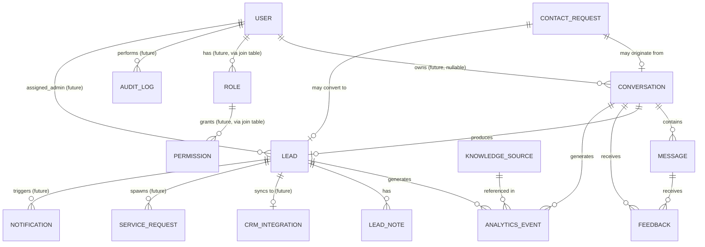
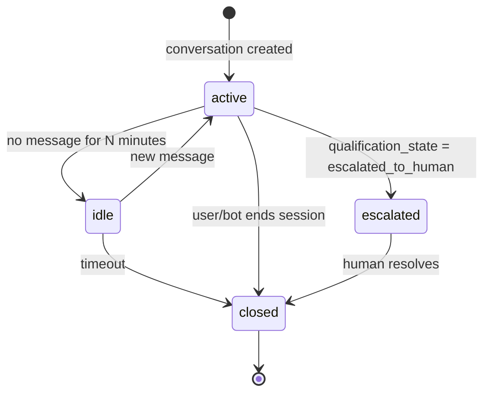
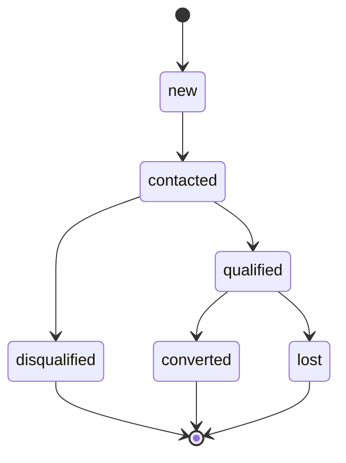

# DATABASE_DESIGN.md

## B10 AI Assistant — Database Design Document

---

# Document Information

| Field | Value |
|---|---|
| Project | B10 AI Assistant |
| Company | B10 IT Solution |
| Document Type | Database Design Specification |
| Backend Framework | Django / Django REST Framework |
| Database Engine | PostgreSQL 15+ |
| Future Infrastructure | Redis, Celery, Admin Dashboard, Analytics Pipeline, CRM Integrations |
| Status | Implementation-ready draft |
| Version | 1.0 |
| Scope | Current modules (Chatbot, Leads, Feedback, Analytics, Knowledge Management) and future modules (Users, Administration, CRM, Notifications, Services, Contact, Email, Audit) |

---

# Executive Summary

B10 AI Assistant is a domain-specific conversational business consultant. It answers company and service questions, gathers requirements, qualifies leads, guides prospects through consultation, and escalates to human staff when appropriate. The database schema described here is the persistence layer for this system, implemented on PostgreSQL and accessed through Django's ORM.

The design targets two things at once: a lean, shippable schema for the current chatbot/lead/feedback/analytics/knowledge feature set, and an extensible foundation that will not require destructive migrations when authentication, administration, CRM sync, notifications, and reporting are added later. This is achieved by:

- Establishing entity boundaries now that match where future entities will attach (e.g., `Conversation.user` as a nullable FK from day one, rather than added later as a backfill).
- Using UUID primary keys throughout, so that IDs are stable across services, safe to expose in URLs, and mergeable across future distributed writers (e.g., a Celery worker or a CRM sync job).
- Using JSONB for variable-shape data (message metadata, event payloads, knowledge source metadata) so that schema evolution of "what's inside" a field doesn't require a migration.
- Applying soft deletion and full audit timestamps consistently, so that lead/consultation history — the core business asset — is never destructively lost.

The document below specifies every current table field-by-field, the relationships between them, indexing and constraint strategy, and the future tables (with their intended FK relationships to current tables) so implementers can see the full intended shape of the system before building it.

---

# Database Goals

1. Persist full conversation and message history for anonymous and (future) authenticated users.
2. Capture structured lead data suitable for qualification, scoring, and eventual CRM export.
3. Record feedback tied to conversations and individual messages for quality monitoring.
4. Support analytics aggregation (volume, response time, conversion, FAQ detection, LLM usage/cost) without requiring a separate analytics database at current scale.
5. Track knowledge source metadata (documents/URLs powering the assistant's domain knowledge) independent of where the content itself is stored.
6. Avoid any schema redesign when Users, Roles/Permissions, Administration, CRM Integration, Notifications, Email tracking, Service Requests, Contact Requests, and Audit Logs are introduced.
7. Keep the schema normalized to 3NF for transactional tables, with deliberate, documented denormalization only in analytics/reporting tables.
8. Make every table safe to query for reporting without locking or degrading chatbot write performance.

---

# Design Principles

| # | Principle | Application |
|---|---|---|
| 1 | Normalize where practical | Core entities (Conversation, Message, Lead, Feedback) are 3NF. Repeated/variable attributes go into JSONB rather than sparse columns or unnormalized side tables. |
| 2 | Avoid premature complexity | No table is created for a future feature until it has a concrete near-term consumer; instead, current tables reserve nullable FK columns and stable identifiers that future tables will point to. |
| 3 | Prefer UUID primary keys | All tables use `id UUID PRIMARY KEY DEFAULT gen_random_uuid()`. Rationale below in Primary Key Strategy. |
| 4 | Soft deletion support | Every business entity has `is_deleted BOOLEAN` + `deleted_at TIMESTAMPTZ`, not a hard `DELETE`. |
| 5 | Auditability | `created_at`, `updated_at` on every table; sensitive mutations (lead status changes, admin actions) are additionally recorded in `AuditLog` (future) and `LeadNote`/status-history patterns (current). |
| 6 | Extensibility | Nullable FK "stubs" (e.g., `Conversation.user_id`, `Lead.assigned_admin_id`, `Lead.crm_external_id`) are added now so future tables attach without altering existing columns. |
| 7 | Analytics-friendly design | `AnalyticsEvent` is an append-only event table with JSONB payload, indexed by `event_type` and `occurred_at`, designed for time-bucketed aggregation. |
| 8 | Low coupling | Cross-module references use FK + nullable design rather than embedding one module's data inside another's row. |
| 9 | Future CRM compatibility | `Lead` carries `external_crm_id`, `external_crm_provider`, and `synced_at` columns from the start; `CRMIntegration` (future) references leads without requiring new columns on `Lead` beyond what already exists. |
| 10 | Production scalability | High-write tables (`Message`, `AnalyticsEvent`) are designed for future partitioning by time without a primary-key redesign (see Partitioning Considerations). |

---

# Technology Decisions

| Decision | Choice | Rationale |
|---|---|---|
| RDBMS | PostgreSQL 15+ | Native UUID, JSONB, partial/expression indexes, `gen_random_uuid()` via `pgcrypto`/`pgcrypto`-free `uuid-ossp` alternative, mature partitioning (`PARTITION BY RANGE`), full-text search built in. |
| ORM | Django ORM | Team already standardized on Django/DRF; migrations map 1:1 to the tables below. |
| Primary keys | UUID v4 | Global uniqueness, safe for public URLs/API responses, no leakage of row counts, mergeable if data is ever generated by multiple writers (Celery workers, sync jobs). |
| Timestamps | `TIMESTAMPTZ` | Stores instants in UTC, converts to local time at display layer; avoids ambiguity across the app server and any future multi-region deployment. |
| Variable-shape data | `JSONB` | Indexable, queryable (`->>`, `@>`, GIN index), avoids sparse nullable columns for optional/evolving fields like message metadata or event payloads. |
| Free text | `TEXT` | PostgreSQL has no performance benefit to `VARCHAR(n)` over `TEXT`; `TEXT` avoids arbitrary length ceilings on requirement descriptions, feedback comments, etc. |
| Enumerated states | `TEXT` + `CHECK` constraint (not native `ENUM`) | Native Postgres `ENUM` types are painful to alter (`ALTER TYPE ... ADD VALUE` has transactional restrictions in older Postgres and cannot be removed). A `CHECK (status IN (...))` constraint gives equivalent integrity guarantees and is trivially migratable. Django's `choices=` maps directly onto this. |
| Caching / queues | Redis + Celery (future) | Not part of the relational schema; Redis holds ephemeral session/cache state, Celery uses Redis/Postgres as broker/result backend. Referenced here only where they affect schema (e.g., `Notification.status` reflecting a Celery-delivered send). |
| Search | Postgres full-text (`tsvector`) initially | Deferred: FAQ/knowledge search can start with `pg_trgm`/`tsvector` on `KnowledgeSource` and `Message.content`; vector/embedding search (`pgvector`) is a documented future extension, not required for v1. |

---

# Naming Conventions

- **Tables**: singular, `snake_case` at the Postgres level, matching Django's default `app_label_modelname` table naming with `db_table` explicitly set to `snake_case` (e.g., `db_table = "conversation"`, `db_table = "message"`).
- **Columns**: `snake_case`. Boolean columns are prefixed `is_`/`has_` (`is_deleted`, `is_resolved`). Timestamp columns are suffixed `_at` (`created_at`, `resolved_at`). Foreign keys are suffixed `_id` and named after the referenced entity in singular (`conversation_id`, `lead_id`).
- **Indexes**: `ix_<table>_<column(s)>`, e.g. `ix_message_conversation_id_created_at`.
- **Unique constraints**: `uq_<table>_<column(s)>`.
- **Check constraints**: `ck_<table>_<rule>`.
- **Foreign keys**: `fk_<table>_<referenced_table>`.
- **Enumerated string values**: lowercase `snake_case` (`in_progress`, `qualified`, `human_escalated`).
- **JSONB payload keys**: `camelCase` inside JSON payloads is acceptable (matches typical frontend/API conventions) even though SQL identifiers are `snake_case` — these are two different namespaces and should not be forced to match.

---

# High Level Entity Overview

**Current (build now):**

| Entity | Purpose |
|---|---|
| `Conversation` | One chat session/thread, anonymous or (later) authenticated. |
| `Message` | One turn (user or assistant) inside a conversation. |
| `Lead` | A qualified/qualifying prospect captured from a conversation. |
| `LeadNote` | Free-text, timestamped notes/status-history attached to a lead. |
| `Feedback` | Rating/comment on a conversation or a specific message. |
| `KnowledgeSource` | Metadata describing a document/URL/dataset feeding the assistant's knowledge. |
| `AnalyticsEvent` | Append-only event stream for product analytics. |
| `ContactRequest` | Direct "contact us" submissions that may or may not originate from a conversation. |

**Future (design-reserved, not built yet):**

| Entity | Purpose |
|---|---|
| `User` | Authenticated account (admin staff first, prospects later). |
| `Role`, `Permission` | RBAC for the admin dashboard. |
| `Notification` | Outbound notification record (email/SMS/in-app) with delivery status. |
| `EmailEvent` | Fine-grained email delivery/open/click tracking. |
| `ServiceRequest` | A formal request for a specific service, downstream of a qualified lead. |
| `CRMIntegration` | Sync state between a `Lead`/`ServiceRequest` and an external CRM record. |
| `AuditLog` | System-wide record of who changed what, when. |

---

# Entity Relationship Diagram



---

# Entity Descriptions

### Conversation
A single chat session between an anonymous or authenticated visitor and the assistant. Tracks lifecycle state (`active`, `idle`, `closed`, `escalated`), a browser/device-independent `session_key`, and lead-qualification progress so the bot can resume context.

### Message
One utterance within a `Conversation`, from either the `user` or the `assistant` role (with a reserved `system` role for internal/tooling messages). Carries ordering, LLM response metadata (model, tokens, latency), and error capture for failed generations.

### Lead
A prospect captured once a conversation has gathered enough qualifying information. One conversation produces at most one lead (1:1 by design; a returning visitor who starts a new conversation creates a new lead, later reconcilable via `email`/`phone` matching or, in the future, `User`).

### LeadNote
An append-only timeline of notes and status transitions on a `Lead`, written either by the system (automatic status changes) or, in the future, by an admin user.

### Feedback
A rating (and optional comment) attached to either an entire `Conversation` or a specific `Message`. Exactly one of `conversation_id`/`message_id` context applies per feedback type (see Constraints).

### KnowledgeSource
Metadata about a piece of knowledge (document, URL, FAQ set, service catalog entry) that the assistant draws on. The content itself may remain file-based (e.g., on disk or object storage); this table is the addressable, versioned, queryable index over that content.

### AnalyticsEvent
An append-only, generic event log (`conversation_started`, `message_sent`, `lead_qualified`, `escalation_triggered`, `llm_call`, `faq_matched`, etc.) with a JSONB payload. This is the substrate for all analytics reporting rather than bespoke counter tables.

### ContactRequest
A direct "talk to us" form submission, which may or may not be linked to a prior `Conversation`, and may later be converted into a `Lead`.

---

# Table Specifications

## `conversation`

**Purpose:** Represents one chat session and its qualification/lifecycle state.

**Fields, Data Types, Constraints:**

| Column | Type | Constraints | Notes |
|---|---|---|---|
| `id` | UUID | PK, default `gen_random_uuid()` | |
| `session_key` | TEXT | NOT NULL, UNIQUE (`uq_conversation_session_key`) | Opaque client-generated or server-issued session token; primary anonymous-user correlator. |
| `user_id` | UUID | NULL, FK → `user.id` (future table; column exists now) | NULL for all anonymous conversations today. |
| `status` | TEXT | NOT NULL, DEFAULT `'active'`, CHECK (`ck_conversation_status`) IN (`active`, `idle`, `closed`, `escalated`, `abandoned`) | Conversation lifecycle. |
| `qualification_state` | TEXT | NOT NULL, DEFAULT `'not_started'`, CHECK IN (`not_started`, `gathering`, `qualified`, `disqualified`, `escalated_to_human`) | Independent from `status`: a conversation can be `closed` but `qualified`. |
| `channel` | TEXT | NOT NULL, DEFAULT `'web_widget'`, CHECK IN (`web_widget`, `api`, `whatsapp`, `other`) | Future-proofs multi-channel entry points. |
| `locale` | TEXT | NULL | e.g. `en-IN`. |
| `metadata` | JSONB | NOT NULL, DEFAULT `'{}'` | Referrer URL, UTM params, device/browser info, IP-derived geo (store hashed/truncated IP only — see Security). |
| `last_message_at` | TIMESTAMPTZ | NULL | Denormalized for fast "recent conversations" sort; updated on each message insert. |
| `escalated_at` | TIMESTAMPTZ | NULL | Set when `qualification_state` → `escalated_to_human`. |
| `closed_at` | TIMESTAMPTZ | NULL | |
| `is_deleted` | BOOLEAN | NOT NULL, DEFAULT `false` | Soft delete. |
| `deleted_at` | TIMESTAMPTZ | NULL | |
| `created_at` | TIMESTAMPTZ | NOT NULL, DEFAULT `now()` | |
| `updated_at` | TIMESTAMPTZ | NOT NULL, DEFAULT `now()` | Updated via Django `auto_now` or a trigger. |

**Indexes:**
- `ix_conversation_session_key` (unique, already covers lookups by session)
- `ix_conversation_status_created_at` on (`status`, `created_at`) — dashboard "active conversations" queries
- `ix_conversation_user_id` on (`user_id`) WHERE `user_id IS NOT NULL` (partial index; sparse column today)
- `ix_conversation_last_message_at` on (`last_message_at` DESC) — recency sorting

**Relationships:** 1:N with `message`; 1:0..1 with `lead`; 1:N with `feedback`; 1:N with `analytics_event`.

**Typical Queries:** fetch by `session_key`; list active conversations for admin queue; conversations with `qualification_state = 'qualified'` and no linked lead (integrity check).

**Retention:** Soft-deleted after configurable inactivity window (proposed 24 months); never hard-deleted while a linked `Lead` exists.

**Example Row:**
```
id: 3fa2c1e4-...
session_key: "sess_9c1a..."
user_id: null
status: "escalated"
qualification_state: "escalated_to_human"
channel: "web_widget"
metadata: {"utm_source": "google", "referrer": "https://b10it.com/services"}
```

---

## `message`

**Purpose:** One turn within a conversation, from the user, the assistant, or the system.

**Fields:**

| Column | Type | Constraints | Notes |
|---|---|---|---|
| `id` | UUID | PK, default `gen_random_uuid()` | |
| `conversation_id` | UUID | NOT NULL, FK → `conversation.id` (`fk_message_conversation`), ON DELETE CASCADE-on-hard-delete only (soft delete used in practice) | |
| `role` | TEXT | NOT NULL, CHECK IN (`user`, `assistant`, `system`) | |
| `content` | TEXT | NOT NULL | Raw message text. |
| `sequence_number` | INTEGER | NOT NULL | Monotonic per-conversation ordering, assigned at write time; avoids relying on `created_at` ties. |
| `message_type` | TEXT | NOT NULL, DEFAULT `'text'`, CHECK IN (`text`, `quick_reply`, `card`, `form`, `system_event`) | Supports rich UI message types without new tables. |
| `response_metadata` | JSONB | NOT NULL, DEFAULT `'{}'` | Model name, prompt version, retrieved knowledge source IDs, intent classification, confidence. |
| `token_count_input` | INTEGER | NULL | |
| `token_count_output` | INTEGER | NULL | |
| `processing_time_ms` | INTEGER | NULL | Wall-clock time to generate the assistant reply. |
| `error_code` | TEXT | NULL | Set when generation failed (`llm_timeout`, `llm_error`, `content_filtered`, etc.). |
| `error_detail` | TEXT | NULL | |
| `is_deleted` | BOOLEAN | NOT NULL, DEFAULT `false` | |
| `deleted_at` | TIMESTAMPTZ | NULL | |
| `created_at` | TIMESTAMPTZ | NOT NULL, DEFAULT `now()` | |

**Constraints:**
- `uq_message_conversation_sequence` UNIQUE (`conversation_id`, `sequence_number`)
- `ck_message_error_consistency`: CHECK (`error_code IS NULL OR role = 'assistant'`)

**Indexes:**
- `ix_message_conversation_id_sequence` on (`conversation_id`, `sequence_number`) — primary access pattern (load full transcript in order)
- `ix_message_conversation_id_created_at` on (`conversation_id`, `created_at`)
- `ix_message_role` on (`role`) WHERE `is_deleted = false` (partial, for analytics scans)
- GIN index `ix_message_response_metadata_gin` on `response_metadata` — enables `?` / `@>` queries (e.g., "all messages that cited knowledge source X")

**Relationships:** N:1 with `conversation`; 1:N with `feedback` (feedback can target a specific message).

**Typical Queries:** load transcript for a conversation ordered by `sequence_number`; compute average `processing_time_ms` per day; find messages with non-null `error_code` for reliability monitoring.

**Retention:** Follows parent `conversation` retention; candidate for time-based partitioning (see Partitioning Considerations) given highest write volume of any table.

**Example Row:**
```
id: 8b7e...
conversation_id: 3fa2c1e4-...
role: "assistant"
content: "Based on what you've described, our Custom Software Development service..."
sequence_number: 4
message_type: "text"
response_metadata: {"model": "llm-x", "intent": "service_recommendation", "knowledge_source_ids": ["..."]}
token_count_input: 512
token_count_output: 128
processing_time_ms: 940
```

---

## `lead`

**Purpose:** Structured record of a qualified or qualifying prospect.

**Fields:**

| Column | Type | Constraints | Notes |
|---|---|---|---|
| `id` | UUID | PK | |
| `conversation_id` | UUID | NULL, FK → `conversation.id`, UNIQUE (`uq_lead_conversation_id`) | Nullable because leads may eventually be created outside chat (manual entry, `ContactRequest` conversion). |
| `full_name` | TEXT | NULL | |
| `company_name` | TEXT | NULL | |
| `email` | TEXT | NULL | CHECK (`ck_lead_email_format`) via regex or Django `EmailField` validation at app layer |
| `phone` | TEXT | NULL | Stored in normalized E.164 form where possible. |
| `industry` | TEXT | NULL | |
| `project_type` | TEXT | NULL | Free text or controlled vocabulary (service catalog code). |
| `budget_range` | TEXT | NULL | Bucketed string (e.g., `"5L-10L"`) rather than numeric, since prospects rarely give exact figures. |
| `timeline` | TEXT | NULL | e.g., `"1-3 months"`. |
| `requirements` | TEXT | NULL | Free-text requirement summary generated from the conversation. |
| `lead_status` | TEXT | NOT NULL, DEFAULT `'new'`, CHECK IN (`new`, `contacted`, `qualified`, `disqualified`, `converted`, `lost`) | |
| `lead_score` | SMALLINT | NOT NULL, DEFAULT `0`, CHECK (`ck_lead_score_range`) BETWEEN 0 AND 100 | Computed score (rule-based initially, model-based later). |
| `source` | TEXT | NOT NULL, DEFAULT `'chatbot'`, CHECK IN (`chatbot`, `contact_form`, `manual`, `import`) | |
| `assigned_admin_id` | UUID | NULL, FK → `user.id` (future) | Reserved column for admin assignment workflow. |
| `external_crm_id` | TEXT | NULL | |
| `external_crm_provider` | TEXT | NULL | e.g., `hubspot`, `zoho` |
| `crm_synced_at` | TIMESTAMPTZ | NULL | |
| `is_deleted` | BOOLEAN | NOT NULL, DEFAULT `false` | |
| `deleted_at` | TIMESTAMPTZ | NULL | |
| `created_at` | TIMESTAMPTZ | NOT NULL, DEFAULT `now()` | |
| `updated_at` | TIMESTAMPTZ | NOT NULL, DEFAULT `now()` | |

**Indexes:**
- `ix_lead_email` on (`email`) WHERE `email IS NOT NULL` — dedupe/lookup
- `ix_lead_phone` on (`phone`) WHERE `phone IS NOT NULL`
- `ix_lead_status_created_at` on (`lead_status`, `created_at`) — pipeline views
- `ix_lead_score` on (`lead_score` DESC) — prioritization
- `ix_lead_conversation_id` (backing the unique constraint)

**Relationships:** 1:0..1 with `conversation`; 1:N with `lead_note`; 1:N with `analytics_event`; future 1:0..1 with `crm_integration`; future 1:N with `service_request`.

**Typical Queries:** pipeline board grouped by `lead_status`; leads not yet synced to CRM (`crm_synced_at IS NULL`); top leads by `lead_score` for the current week.

**Retention:** Never soft-deleted automatically; leads are the core business record. Manual deletion only, for compliance (e.g., GDPR-style erasure requests), which should hard-delete PII fields while retaining an anonymized row for analytics continuity.

**Example Row:**
```
full_name: "Anita Rao"
company_name: "Rao Textiles Pvt Ltd"
email: "anita@raotextiles.example"
industry: "Manufacturing"
project_type: "Inventory Management System"
budget_range: "3L-5L"
timeline: "1-2 months"
lead_status: "qualified"
lead_score: 78
source: "chatbot"
```

---

## `lead_note`

**Purpose:** Append-only timeline of notes and status changes on a lead.

**Fields:**

| Column | Type | Constraints | Notes |
|---|---|---|---|
| `id` | UUID | PK | |
| `lead_id` | UUID | NOT NULL, FK → `lead.id` (`fk_lead_note_lead`) | |
| `author_id` | UUID | NULL, FK → `user.id` (future) | NULL = system-generated note. |
| `note_type` | TEXT | NOT NULL, DEFAULT `'comment'`, CHECK IN (`comment`, `status_change`, `system`) | |
| `content` | TEXT | NOT NULL | |
| `previous_status` | TEXT | NULL | Populated when `note_type = 'status_change'`. |
| `new_status` | TEXT | NULL | |
| `created_at` | TIMESTAMPTZ | NOT NULL, DEFAULT `now()` | |

**Indexes:** `ix_lead_note_lead_id_created_at` on (`lead_id`, `created_at`).

**Relationships:** N:1 with `lead`.

**Typical Queries:** full activity timeline for a lead, ordered by `created_at`.

**Retention:** Follows parent lead; not independently deleted.

---

## `feedback`

**Purpose:** Rating/comment on either a conversation as a whole or a specific message.

**Fields:**

| Column | Type | Constraints | Notes |
|---|---|---|---|
| `id` | UUID | PK | |
| `conversation_id` | UUID | NOT NULL, FK → `conversation.id` | Always set — even message-level feedback records its parent conversation for easy conversation-level rollups. |
| `message_id` | UUID | NULL, FK → `message.id` | Set only for message-level feedback. |
| `feedback_type` | TEXT | NOT NULL, CHECK IN (`conversation`, `message`) | |
| `rating` | SMALLINT | NULL, CHECK (`ck_feedback_rating_range`) BETWEEN 1 AND 5 | Nullable to allow thumbs-only (`sentiment`) feedback. |
| `sentiment` | TEXT | NULL, CHECK IN (`positive`, `negative`) | For simple thumbs up/down UI. |
| `comment` | TEXT | NULL | |
| `created_at` | TIMESTAMPTZ | NOT NULL, DEFAULT `now()` | |

**Constraints:**
- `ck_feedback_message_consistency`: CHECK (`(feedback_type = 'message' AND message_id IS NOT NULL) OR (feedback_type = 'conversation' AND message_id IS NULL)`)
- `ck_feedback_rating_or_sentiment`: CHECK (`rating IS NOT NULL OR sentiment IS NOT NULL`)

**Indexes:**
- `ix_feedback_conversation_id` on (`conversation_id`)
- `ix_feedback_message_id` on (`message_id`) WHERE `message_id IS NOT NULL`
- `ix_feedback_created_at` on (`created_at`) — trend reporting

**Relationships:** N:1 with `conversation`; N:0..1 with `message`.

**Typical Queries:** average rating per week; messages with negative sentiment for QA review.

**Retention:** Retained indefinitely; low volume relative to messages.

---

## `knowledge_source`

**Purpose:** Metadata index over the content that powers the assistant's domain knowledge; content may live on disk/object storage.

**Fields:**

| Column | Type | Constraints | Notes |
|---|---|---|---|
| `id` | UUID | PK | |
| `source_key` | TEXT | NOT NULL, UNIQUE (`uq_knowledge_source_key`) | Stable identifier referenced from `message.response_metadata`. |
| `source_type` | TEXT | NOT NULL, CHECK IN (`document`, `url`, `faq`, `service_catalog`, `manual_entry`) | |
| `title` | TEXT | NOT NULL | |
| `location` | TEXT | NULL | File path or URL; content itself not stored in Postgres in v1. |
| `version` | INTEGER | NOT NULL, DEFAULT `1` | Incremented on each content update. |
| `status` | TEXT | NOT NULL, DEFAULT `'active'`, CHECK IN (`active`, `draft`, `archived`) | |
| `metadata` | JSONB | NOT NULL, DEFAULT `'{}'` | Tags, category, language, checksum of source content. |
| `last_verified_at` | TIMESTAMPTZ | NULL | Last time content was confirmed accurate/current. |
| `created_at` | TIMESTAMPTZ | NOT NULL, DEFAULT `now()` | |
| `updated_at` | TIMESTAMPTZ | NOT NULL, DEFAULT `now()` | |

**Indexes:**
- `ix_knowledge_source_status` on (`status`) WHERE `status = 'active'`
- `ix_knowledge_source_type` on (`source_type`)
- GIN index on `metadata` for tag-based filtering

**Relationships:** referenced (loosely, by `source_key` inside JSONB, not FK) from `message.response_metadata`; referenced from `analytics_event` for "knowledge usage" events.

**Typical Queries:** list active sources by type; sources not verified in >90 days.

**Retention:** Archived, not deleted, to preserve historical citation accuracy in old messages.

---

## `analytics_event`

**Purpose:** Append-only generic event stream underlying all analytics/reporting.

**Fields:**

| Column | Type | Constraints | Notes |
|---|---|---|---|
| `id` | UUID | PK | |
| `event_type` | TEXT | NOT NULL, CHECK IN (`conversation_started`, `conversation_closed`, `message_sent`, `lead_created`, `lead_qualified`, `lead_converted`, `escalation_triggered`, `llm_call`, `llm_error`, `faq_matched`, `knowledge_source_referenced`, `feedback_submitted`) | Extend via migration adding a new allowed value — see Migration Strategy for how CHECK-based enums are extended safely. |
| `conversation_id` | UUID | NULL, FK → `conversation.id` | |
| `lead_id` | UUID | NULL, FK → `lead.id` | |
| `message_id` | UUID | NULL, FK → `message.id` | |
| `payload` | JSONB | NOT NULL, DEFAULT `'{}'` | Event-specific detail: e.g. for `llm_call`, `{model, tokens, latency_ms, cost_usd}`. |
| `occurred_at` | TIMESTAMPTZ | NOT NULL, DEFAULT `now()` | Distinct from `created_at` in case of buffered/replayed events. |

**Indexes:**
- `ix_analytics_event_type_occurred_at` on (`event_type`, `occurred_at`) — the dominant aggregation query shape
- `ix_analytics_event_conversation_id` on (`conversation_id`) WHERE `conversation_id IS NOT NULL`
- `ix_analytics_event_lead_id` on (`lead_id`) WHERE `lead_id IS NOT NULL`
- GIN index on `payload` for ad-hoc analysis (e.g., cost-per-model queries)
- BRIN index `ix_analytics_event_occurred_at_brin` on (`occurred_at`) as a low-overhead complement for large time-range scans once the table grows large (BRIN is cheap on naturally time-ordered append-only data)

**Relationships:** N:1 (nullable) with `conversation`, `lead`, `message`.

**Typical Queries:** daily conversation/message counts; `llm_call` cost rollups by day/model; FAQ frequency (`faq_matched` grouped by `payload->>'question_id'`); funnel: `conversation_started` → `lead_created` → `lead_qualified` → `lead_converted`.

**Retention:** Highest-volume table alongside `message`. Retain raw events 12–18 months, then roll up into pre-aggregated daily/weekly summary tables (future `analytics_daily_summary`) and archive/drop raw rows — see Archival Strategy.

---

## `contact_request`

**Purpose:** Direct contact-us submissions, independent of or linked to a chat conversation.

**Fields:**

| Column | Type | Constraints | Notes |
|---|---|---|---|
| `id` | UUID | PK | |
| `conversation_id` | UUID | NULL, FK → `conversation.id` | Set if submitted from within a chat widget. |
| `converted_lead_id` | UUID | NULL, FK → `lead.id` | Set once converted. |
| `full_name` | TEXT | NOT NULL | |
| `email` | TEXT | NOT NULL | |
| `phone` | TEXT | NULL | |
| `message` | TEXT | NOT NULL | |
| `status` | TEXT | NOT NULL, DEFAULT `'new'`, CHECK IN (`new`, `reviewed`, `converted`, `closed`) | |
| `created_at` | TIMESTAMPTZ | NOT NULL, DEFAULT `now()` | |

**Indexes:** `ix_contact_request_status_created_at` on (`status`, `created_at`); `ix_contact_request_email` on (`email`).

**Relationships:** N:0..1 with `conversation`; N:0..1 with `lead`.

**Typical Queries:** unreviewed contact requests queue.

**Retention:** Same PII-handling policy as `lead`.

---

# Data Dictionary

A consolidated cross-table reference of shared field semantics:

| Field Name | Appears In | Type | Semantic |
|---|---|---|---|
| `id` | all tables | UUID | Surrogate primary key, generated at insert time, never reused. |
| `created_at` | all tables | TIMESTAMPTZ | Row insert time, UTC, immutable after write. |
| `updated_at` | mutable tables | TIMESTAMPTZ | Last mutation time; absent on strictly append-only tables (`message`, `analytics_event`, `lead_note`, `feedback`). |
| `is_deleted` / `deleted_at` | `conversation`, `message`, `lead` | BOOLEAN / TIMESTAMPTZ | Soft-delete pair; queries must filter `is_deleted = false` by default (enforced via Django manager, not DB view, to keep query planning simple). |
| `status` / `*_status` | `conversation`, `lead`, `contact_request`, `knowledge_source` | TEXT + CHECK | Finite state machine value; transitions are application-enforced, not DB-enforced (see Constraints). |
| `metadata` / `payload` / `response_metadata` | `conversation`, `message`, `analytics_event`, `knowledge_source` | JSONB | Schema-flexible extension point; documented per-table above rather than globally, since shape differs by table. |
| `email`, `phone` | `lead`, `contact_request` | TEXT | PII; see Security Considerations for handling. |

---

# Primary Keys Strategy

All tables use `UUID` primary keys generated with `gen_random_uuid()` (Postgres `pgcrypto` extension) at insert time, exposed directly through the API and Django ORM.

**Why UUID over `BIGSERIAL`:**
- IDs are safe to expose in URLs/API responses without leaking row-count/growth-rate business intelligence to competitors scraping the public chatbot.
- No coordination needed if data is ever written by multiple processes (Celery workers backfilling analytics, a future CRM sync job inserting `lead` rows, a data migration script) — no risk of PK collision the way there would be with client-generated sequential IDs.
- Matches Django's `UUIDField(primary_key=True, default=uuid.uuid4)` idiom cleanly.

**Trade-off acknowledged:** UUIDv4 primary keys are 16 bytes (vs 8 for `BIGINT`) and, being random, cause more index page fragmentation on the clustered index than a monotonic key. This is judged acceptable at current and near-term scale; if `message`/`analytics_event` write volume grows enough that index bloat becomes measurable, the mitigation is UUIDv7 (time-ordered UUIDs) rather than reverting to integer keys — see Scalability Considerations.

---

# Foreign Key Strategy

- All FKs are `NOT NULL` unless the relationship is genuinely optional (e.g., `message.error_code`-adjacent nullables, or forward-looking columns like `conversation.user_id` that are unpopulated today).
- `ON DELETE` behavior: since hard deletes are avoided in favor of soft deletes, `ON DELETE CASCADE`/`RESTRICT` is a safety net, not the primary deletion mechanism. Convention:
  - Strictly dependent child rows with no independent meaning (`message` → `conversation`, `lead_note` → `lead`) use `ON DELETE CASCADE`.
  - Rows with independent business meaning (`lead` → `conversation`, `feedback` → `conversation`) use `ON DELETE RESTRICT`, forcing an explicit decision rather than silent cascading loss.
- Nullable "reserved" FKs pointing at not-yet-built tables (`conversation.user_id` → future `user.id`, `lead.assigned_admin_id` → future `user.id`) are added as plain UUID columns now, with the FK constraint itself deferred until the referenced table exists (see Migration Strategy, Phase 2). This avoids either (a) building `user` prematurely or (b) a later `ALTER TABLE ... ADD COLUMN` that would need backfilling on a large table.

---

# Constraints

Summary of constraint classes applied across the schema (see per-table specs above for the full list):

| Constraint Type | Examples | Purpose |
|---|---|---|
| `PRIMARY KEY` | every `id` column | Row identity |
| `UNIQUE` | `conversation.session_key`, `lead.conversation_id`, `knowledge_source.source_key`, `message(conversation_id, sequence_number)` | Enforce 1:1 and dedup invariants at the DB layer, not just app layer |
| `CHECK` | status/type/role enums, `feedback` rating range, `lead_score` range, `feedback` type-consistency | State-machine and range integrity without native ENUM's migration pain |
| `NOT NULL` | see per-table field tables | Every field that the application logic assumes is always present |
| `FOREIGN KEY` | see Foreign Key Strategy | Referential integrity between related rows |

Business-rule constraints intentionally **not** pushed to the database (kept in Django validation / service layer instead), because they are process rules rather than data-shape rules:
- Lead status transition legality (e.g., `converted` cannot go back to `new`) — enforced in a Django model method / service function, logged via `lead_note`.
- Conversation → Lead qualification threshold logic.

---

# Index Strategy

General approach: index for the query patterns the application actually issues (listed per table above), not defensively on every column.

| Index Kind | Where Used | Reason |
|---|---|---|
| B-tree single-column | FKs, `status`, `email`, `phone` | Standard equality/range lookups |
| B-tree composite | `(conversation_id, sequence_number)` on `message`, `(event_type, occurred_at)` on `analytics_event`, `(status, created_at)` on `lead`/`conversation` | Matches compound `WHERE` + `ORDER BY` patterns exactly; column order = equality columns first, then range/sort column |
| Partial index | `ix_conversation_user_id WHERE user_id IS NOT NULL`, `ix_lead_email WHERE email IS NOT NULL`, `ix_message_role WHERE is_deleted = false` | Column is sparse or queries always filter a fixed predicate — smaller, faster index than indexing every row |
| Unique index | `session_key`, `lead.conversation_id`, `knowledge_source.source_key` | Enforces uniqueness and doubles as the lookup index |
| GIN | `message.response_metadata`, `analytics_event.payload`, `knowledge_source.metadata` | JSONB containment/key-existence queries (`@>`, `?`, `->>`) |
| BRIN | `analytics_event.occurred_at` (introduced once table exceeds ~10M rows) | Extremely low storage overhead for large, naturally time-ordered append-only tables; much cheaper than B-tree at this scale for range scans |

Index maintenance note: every additional index slows writes. `message` and `analytics_event` are the highest-write tables — indexes on them are deliberately minimal (listed above) and any new index proposed for these two tables should be justified against a real query, not added speculatively.

---

# Conversation Schema

See `conversation` table specification above for full field/index/constraint detail. Lifecycle state diagram:



---

# Message Schema

See `message` table specification above. Ordering is guaranteed by `sequence_number`, assigned atomically per-conversation at write time (application-level counter, or a Postgres sequence scoped per conversation via a trigger, to avoid gaps under concurrent writes to the same conversation — unlikely in a single-user chat, but defensive against retries).

---

# Lead Schema

See `lead` and `lead_note` table specifications above. Status flow:



Every transition writes a `lead_note` row with `note_type = 'status_change'`.

---

# Feedback Schema

See `feedback` table specification above.

---

# Analytics Schema

See `analytics_event` table specification above. Suggested initial reporting views (implemented as Postgres views or materialized views, not new base tables):

```sql
CREATE MATERIALIZED VIEW analytics_daily_conversation_summary AS
SELECT
    date_trunc('day', occurred_at) AS day,
    count(*) FILTER (WHERE event_type = 'conversation_started') AS conversations_started,
    count(*) FILTER (WHERE event_type = 'lead_qualified') AS leads_qualified,
    count(*) FILTER (WHERE event_type = 'escalation_triggered') AS escalations
FROM analytics_event
GROUP BY 1;
```

Refreshed on a schedule via Celery beat once that infrastructure lands; queried directly (non-materialized) until then.

---

# Knowledge Metadata Schema

See `knowledge_source` table specification above.

---

# Future User Schema

Reserved design (not built in v1, shown to confirm current tables already anticipate it correctly):

**`user`**

| Column | Type | Notes |
|---|---|---|
| `id` | UUID | PK |
| `email` | TEXT | UNIQUE, NOT NULL |
| `password_hash` | TEXT | Django's standard hasher output |
| `full_name` | TEXT | |
| `is_active` | BOOLEAN | |
| `is_staff` | BOOLEAN | Django admin convention |
| `last_login_at` | TIMESTAMPTZ | |
| `created_at`, `updated_at` | TIMESTAMPTZ | |

**`role`** (`id`, `name`, `description`) and **`permission`** (`id`, `code`, `description`), joined via **`user_role`** (`user_id`, `role_id`) and **`role_permission`** (`role_id`, `permission_id`) — standard RBAC join-table pattern. This is deferred rather than built now because Django's built-in `auth` app (`User`, `Group`, `Permission`) may be adopted wholesale instead of a bespoke table set; the decision is logged in Architectural Decisions below as an open item.

When built, `conversation.user_id`, `lead.assigned_admin_id`, and `lead_note.author_id` gain their FK constraints against `user.id` — no column additions required.

---

# Future Administration Schema

No new base tables required beyond `user`/`role`/`permission` above and `audit_log` below. The admin dashboard is a read/write surface over existing tables:
- Dashboard metrics: queries against `analytics_event` and materialized views.
- Lead management: CRUD over `lead`/`lead_note`.
- Conversation review: read-only over `conversation`/`message`.
- Feedback review: read-only over `feedback`.
- Knowledge management: CRUD over `knowledge_source` (content upload handled by application/storage layer, not this schema).

---

# Audit Logging Schema

**`audit_log`** (future)

| Column | Type | Notes |
|---|---|---|
| `id` | UUID | PK |
| `actor_user_id` | UUID | FK → `user.id`, NULL for system actions |
| `action` | TEXT | e.g. `lead.status_changed`, `knowledge_source.updated`, `admin.login` |
| `target_table` | TEXT | Table name of the affected row |
| `target_id` | UUID | Row id of the affected record |
| `changes` | JSONB | Before/after diff |
| `ip_address` | INET | |
| `occurred_at` | TIMESTAMPTZ | |

Indexes: `(target_table, target_id)`, `(actor_user_id, occurred_at)`. This is deliberately separate from `analytics_event`: `audit_log` is a security/compliance record (who did what to which row) while `analytics_event` is a product-behavior record (what happened in the product). Conflating them would force compliance retention rules onto product analytics data and vice versa.

---

# Soft Deletion Strategy

- `conversation`, `message`, and `lead` carry `is_deleted BOOLEAN DEFAULT false` + `deleted_at TIMESTAMPTZ`.
- Default Django manager (`objects`) filters `is_deleted = false`; a secondary manager (`all_objects`) provides unfiltered access for admin/audit tooling.
- Soft-deleted rows are excluded from analytics aggregation going forward but historical `analytics_event` rows referencing them are untouched (events are immutable facts about what happened, independent of later deletion of the source row).
- Hard deletion is reserved for explicit compliance erasure requests, and even then only PII columns are nulled/hashed (see Security Considerations) rather than removing the row, to preserve referential integrity for `analytics_event`/`feedback` rows that reference it.
- `lead_note` and `feedback` are not independently soft-deletable; they are deleted (hard) only as a cascade of an explicit compliance erasure on the parent, never through routine user action.

---

# Timestamp Strategy

- Every table: `created_at TIMESTAMPTZ NOT NULL DEFAULT now()`.
- Mutable tables additionally: `updated_at TIMESTAMPTZ NOT NULL DEFAULT now()`, maintained via Django's `auto_now=True` at the ORM layer (acceptable given all writes currently go through Django; if a future service writes directly to Postgres, this moves to a `BEFORE UPDATE` trigger instead).
- All timestamps are `TIMESTAMPTZ`, stored in UTC. Application/API layer converts to the user's locale for display; the database never stores naive local time.
- Business-meaning timestamps (`escalated_at`, `closed_at`, `crm_synced_at`, `last_verified_at`) are separate, nullable columns rather than being inferred from `lead_note`/`audit_log` history, because the hot-path queries (e.g., "leads not yet synced") need a fast indexed column, not a subquery over a history table.

---

# Query Patterns

Representative queries the schema is optimized for:

```sql
-- Full transcript for a conversation, in order
SELECT * FROM message
WHERE conversation_id = $1 AND is_deleted = false
ORDER BY sequence_number;

-- Admin pipeline board
SELECT lead_status, count(*) FROM lead
WHERE is_deleted = false
GROUP BY lead_status;

-- Leads pending CRM sync
SELECT id, email, lead_status FROM lead
WHERE crm_synced_at IS NULL AND lead_status = 'qualified';

-- Daily LLM cost
SELECT date_trunc('day', occurred_at) AS day,
       sum((payload->>'cost_usd')::numeric) AS total_cost
FROM analytics_event
WHERE event_type = 'llm_call'
GROUP BY 1 ORDER BY 1;

-- FAQ frequency, last 30 days
SELECT payload->>'question_id' AS question, count(*)
FROM analytics_event
WHERE event_type = 'faq_matched' AND occurred_at > now() - interval '30 days'
GROUP BY 1 ORDER BY 2 DESC;
```

---

# Performance Considerations

- `message` and `analytics_event` are the write-heavy tables; both use minimal indexing and append-only patterns (no `UPDATE` on historical rows) to keep write latency low and avoid index bloat from in-place updates.
- `conversation.last_message_at` is denormalized specifically to avoid a `MAX(created_at)` aggregation over `message` on every conversation-list render.
- JSONB columns are queried via GIN index only for the specific known access patterns documented per table; ad-hoc deep JSONB queries outside those patterns should expect a sequential scan and are acceptable only for low-frequency admin/reporting use, not hot paths.
- Connection pooling (PgBouncer, transaction mode) is assumed at the infrastructure layer once concurrent load grows beyond what Django's direct connections handle comfortably; this is an infra decision, not a schema one, but is noted here since it affects how migrations should be run (see Migration Strategy — avoid long-held locks).

---

# Partitioning Considerations

Not required at launch. Recommended trigger point: `message` or `analytics_event` exceeding roughly 20–50 million rows, or when query latency on time-bounded scans (e.g., "events in the last 7 days") degrades measurably.

When triggered:
- `analytics_event`: `PARTITION BY RANGE (occurred_at)`, monthly partitions. The UUID PK plus a partitioning key already present (`occurred_at`) means no PK redesign is needed — Postgres 15 allows a non-partition-key UUID primary key as long as it's not required to be globally unique via a single index (application already guarantees uniqueness via `gen_random_uuid()`, so a per-partition unique index on `id` is sufficient).
- `message`: `PARTITION BY RANGE (created_at)`, monthly partitions, same rationale.
- Both cases: old partitions become read-only/compressed candidates for the Archival Strategy below.
- This is a planned future migration, not a day-one requirement — introducing partitioning prematurely adds operational complexity (every unique constraint and FK must include the partition key) without a performance justification at current scale.

---

# Archival Strategy

- `analytics_event`: raw rows retained 12–18 months in the primary table; older rows rolled up into `analytics_daily_conversation_summary`-style aggregate tables (materialized or physical) and then moved to cold storage (exported to object storage as Parquet/CSV) or dropped, per compliance/business retention policy — exact horizon is a business decision, flagged in Open Questions.
- `message`/`conversation`: archived (soft-deleted, excluded from default queries) after a configurable inactivity window, not deleted, since transcripts may be needed for lead-quality review or dispute resolution.
- `lead`: never auto-archived; retained per CRM/business retention policy, subject to explicit compliance erasure.
- Archival is implemented as a scheduled Celery task once that infrastructure exists; until then, a manual/cron-triggered Django management command performs the same rollup.

---

# Backup Strategy

- Continuous WAL archiving + daily base backups (standard PostgreSQL `pg_basebackup`/managed-provider equivalent), enabling point-in-time recovery.
- Backup retention: minimum 30 days of PITR-capable backups; longer-term (monthly) snapshots retained per business/compliance requirement.
- Before every schema migration in production, an on-demand backup/snapshot is taken in addition to the regular schedule.
- Soft-deletion and the append-only design of `message`/`analytics_event` reduce reliance on backups for routine "oops" recovery, but backups remain the only protection against infrastructure failure, migration bugs, or compliance-driven bulk erasure mistakes.

---

# Migration Strategy

**Tooling:** Django migrations (`makemigrations`/`migrate`), one migration per logical schema change, reviewed like code.

**Phase 1 (current build):** Create `conversation`, `message`, `lead`, `lead_note`, `feedback`, `knowledge_source`, `analytics_event`, `contact_request` exactly as specified above, including the "reserved" nullable columns (`conversation.user_id`, `lead.assigned_admin_id`, `lead.external_crm_id`, etc.) without their FK constraints (since target tables don't exist yet). In Postgres/Django this is expressed as a plain `UUIDField(null=True, blank=True)` with no `ForeignKey`, in v1.

**Phase 2 (Users/Admin):** Create `user`, `role`, `permission`, `user_role`, `role_permission`. Add FK constraints (`ADD CONSTRAINT ... FOREIGN KEY`) to the already-existing reserved columns. Because those columns already exist and are already NULL-populated for all current rows, this is a metadata-only change (no table rewrite, near-instant on Postgres since it doesn't need to validate against a NOT NULL population).

**Phase 3 (CRM/Services/Notifications):** Create `crm_integration`, `service_request`, `notification`, `email_event` as net-new tables with FKs to existing `lead`/`user`. No changes to existing tables required.

**Phase 4 (Audit):** Create `audit_log`. Application code begins writing to it; no existing table changes.

**General migration safety rules:**
- Additive changes (`ADD COLUMN ... NULL`, `ADD COLUMN ... DEFAULT`) are safe online operations in Postgres 11+ and are preferred over destructive changes.
- Extending a `CHECK (... IN (...))` enum-style constraint requires `DROP CONSTRAINT` + `ADD CONSTRAINT` with the expanded list; done via `ADD CONSTRAINT ... NOT VALID` followed by `VALIDATE CONSTRAINT` in a separate step to avoid a long table lock, matching why `CHECK` was chosen over native `ENUM` in Technology Decisions.
- Any migration expected to touch a large table (`message`, `analytics_event`) is run with Django's `atomic = False` migration flag where needed, plus `CREATE INDEX CONCURRENTLY` for new indexes, to avoid locking writes during deploy.
- No migration in this plan requires a data backfill across `message` or `analytics_event`, by design — this is the direct payoff of adding reserved nullable columns early.

---

# Security Considerations

- **PII fields** (`lead.email`, `lead.phone`, `lead.full_name`, `contact_request.email/phone/full_name`) are the primary compliance surface. Recommend column-level encryption at rest via the storage layer (managed Postgres provider's disk encryption) as baseline, with application-layer field encryption considered if regulatory requirements demand it (flagged in Open Questions).
- **IP addresses**: if captured in `conversation.metadata`, store truncated/hashed, not raw, unless there is a specific fraud/abuse-prevention justification, and document the retention period.
- **Access control**: application-level row access is enforced by Django/DRF permissions once `user`/`role` exist; until then, all access is via trusted backend service code, not direct client DB access.
- **SQL injection**: mitigated structurally by using the Django ORM/parameterized queries throughout; the only raw SQL in this document (materialized views, partitioning DDL) is operator-run migration code, not application runtime code.
- **Secrets**: no credentials or API keys are stored in this schema; they belong in environment/secret-manager configuration, not the database.
- **Right-to-erasure**: soft-delete plus the "null the PII columns, keep the row" hard-erasure path (see Soft Deletion Strategy) is the mechanism for handling deletion requests without breaking `analytics_event`/`feedback` referential integrity.

---

# Scalability Considerations

- Current design comfortably supports millions of conversations/messages on a single well-resourced Postgres instance (vertical scaling), which is the appropriate strategy until a concrete bottleneck is measured.
- Read scaling: a read replica for admin dashboard/analytics queries, once built, offloads reporting load from the primary write path (`message`/`analytics_event` inserts) — no schema change required, this is a deployment-topology decision.
- Write scaling for `message`/`analytics_event`: time-based partitioning (see Partitioning Considerations) is the primary lever; UUIDv7 (time-ordered) primary keys are the secondary lever if index bloat becomes measurable, since UUIDv7 preserves the "no coordination needed" benefit of UUIDv4 while improving index locality.
- Caching layer (Redis, future): intended for session/ephemeral conversation state and rate-limiting, not as a cache in front of Postgres reads in v1 — the relational schema remains the single source of truth.
- Horizontal database scaling (sharding) is explicitly out of scope for the foreseeable roadmap and is not designed for in this document; if ever needed, `lead_id`/`conversation_id`-based sharding would be the natural key, enabled by the fact that every table already carries these as explicit UUID FKs rather than relying on join-heavy composite keys.

---

# Future Extensibility

Confirmed extension points already reserved in the current schema:

| Future Need | Mechanism Already in Place |
|---|---|
| Authenticated users | `conversation.user_id`, `lead.assigned_admin_id`, `lead_note.author_id` — nullable UUID columns today, FK added in Phase 2 |
| CRM sync | `lead.external_crm_id`, `external_crm_provider`, `crm_synced_at` |
| Admin assignment/workflow | `lead.assigned_admin_id`, `lead_note` timeline |
| Notifications | New `notification` table FK's to `lead`/`user`/`contact_request`; no existing table changes needed |
| Service requests | New `service_request` table FK's to `lead`; no existing table changes needed |
| Richer knowledge search | `knowledge_source` already has `metadata` JSONB and a stable `source_key`; adding a `pgvector` embedding column later is a single additive `ADD COLUMN` |
| Multi-channel (WhatsApp, API) | `conversation.channel` enum already includes non-web values |
| New analytics event types | `analytics_event.event_type` CHECK constraint extended via the safe `NOT VALID` + `VALIDATE` pattern in Migration Strategy |

---

# Risks

| Risk | Impact | Mitigation |
|---|---|---|
| `CHECK`-based enums drift out of sync between Django `choices=` and the DB constraint | Silent data-shape mismatch | Single source of truth: define choices in a shared Python constants module used both by Django model `choices=` and by the migration that writes the `CHECK` constraint text. |
| JSONB columns become a dumping ground for data that should be structured | Query complexity grows, indexes can't help | Document (as done above) exactly what keys are expected per JSONB column; treat undocumented keys added ad hoc as a code-review flag. |
| Soft-deleted rows silently included in a report because a query forgot `is_deleted = false` | Incorrect analytics/admin views | Default Django manager filters automatically; anyone using `all_objects`/raw SQL must justify it in review. |
| `analytics_event`/`message` growth outpaces the "vertical scaling is enough" assumption | Query latency degrades | Partitioning plan is pre-specified (see Partitioning Considerations) so it's a known playbook, not a scramble. |
| PII retention policy not yet finalized by the business | Compliance exposure | Flagged explicitly in Open Questions; schema supports whatever policy is chosen (soft-delete + PII-null erasure path) without further schema change. |

---

# Assumptions

1. All current write traffic goes through Django/DRF; no other service writes directly to Postgres in v1.
2. A conversation has exactly one lead at most (1:1), not many; a prospect who reconverses starts a new conversation and, if warranted, a new lead, reconciled later by email/phone or future `user_id`.
3. Knowledge content itself (documents/URLs) is managed outside Postgres (filesystem/object storage) in v1; `knowledge_source` is metadata-only.
4. LLM provider is OpenRouter-compatible (per analytics requirement "OpenRouter usage metrics"); `analytics_event.payload` for `llm_call` events is shaped to capture whatever fields that provider's API exposes (model, tokens, cost).
5. Django's built-in `auth` app may ultimately be reused for `user`/permissions rather than the bespoke `role`/`permission` tables sketched here — both options are compatible with the current schema's reserved columns.

---

# Open Questions

1. What is the business-mandated PII retention period for `lead`/`contact_request` data, and is field-level encryption at rest required by contract/regulation, or is provider-level disk encryption sufficient?
2. Should `lead_score` be purely rule-based initially, and if a scoring model is introduced later, does it need its own `lead_score_history` table, or is a single current value with `lead_note` history sufficient?
3. Will Django's built-in `auth`/`Group`/`Permission` be adopted as-is for the future `user`/`role`/`permission` schema, or is a custom RBAC model required (e.g., for permissions finer-grained than Django's default)?
4. What is the target SLA for analytics query freshness — is a nightly materialized view refresh acceptable, or is near-real-time reporting required (which would push toward a streaming/Celery-driven incremental aggregation instead)?
5. Should `ContactRequest` and `Lead` be merged into a single table with a `source` discriminator instead of two tables with a conversion link? Current design keeps them separate because a contact request is a lighter-weight, less-qualified object; revisit if in practice most contact requests convert 1:1 into leads with little added data.

---

# Architectural Decisions

| ID | Decision | Status | Rationale (summary) |
|---|---|---|---|
| ADR-001 | Use UUID primary keys on all tables | Accepted | URL-safety, multi-writer safety, ORM idiom fit; trade-off (index bloat) accepted at current scale |
| ADR-002 | Use `TEXT + CHECK` instead of native Postgres `ENUM` for state fields | Accepted | Avoids `ALTER TYPE` migration friction; Django `choices=` maps cleanly |
| ADR-003 | Soft delete on `conversation`/`message`/`lead`; hard erasure only nulls PII, doesn't remove rows | Accepted | Preserves referential integrity for `analytics_event`/`feedback`; supports compliance erasure without breaking history |
| ADR-004 | Reserve nullable FK "stub" columns for future entities now (`user_id`, `assigned_admin_id`, `external_crm_id`, etc.) | Accepted | Avoids backfill migrations on large tables later |
| ADR-005 | `analytics_event` as a single generic append-only event table rather than bespoke counter tables per metric | Accepted | New metrics are new `event_type` values, not new tables/migrations |
| ADR-006 | Defer partitioning until a measured trigger point rather than partitioning `message`/`analytics_event` from day one | Accepted | Avoids operational complexity (composite unique/FK constraints under partitioning) without current justification |
| ADR-007 | Keep `AuditLog` (compliance/security record) separate from `AnalyticsEvent` (product-behavior record) | Accepted | Different retention/access rules; conflating them would compromise both |
| ADR-008 | `user`/`role`/`permission` schema: custom tables vs. Django's built-in `auth` app | Open | See Open Questions #3 |

---

# Appendix

### A. Full DDL Sketch (illustrative, Django migrations are authoritative)

```sql
CREATE EXTENSION IF NOT EXISTS pgcrypto;

CREATE TABLE conversation (
    id UUID PRIMARY KEY DEFAULT gen_random_uuid(),
    session_key TEXT NOT NULL,
    user_id UUID NULL,
    status TEXT NOT NULL DEFAULT 'active',
    qualification_state TEXT NOT NULL DEFAULT 'not_started',
    channel TEXT NOT NULL DEFAULT 'web_widget',
    locale TEXT NULL,
    metadata JSONB NOT NULL DEFAULT '{}',
    last_message_at TIMESTAMPTZ NULL,
    escalated_at TIMESTAMPTZ NULL,
    closed_at TIMESTAMPTZ NULL,
    is_deleted BOOLEAN NOT NULL DEFAULT false,
    deleted_at TIMESTAMPTZ NULL,
    created_at TIMESTAMPTZ NOT NULL DEFAULT now(),
    updated_at TIMESTAMPTZ NOT NULL DEFAULT now(),
    CONSTRAINT uq_conversation_session_key UNIQUE (session_key),
    CONSTRAINT ck_conversation_status CHECK (status IN ('active','idle','closed','escalated','abandoned')),
    CONSTRAINT ck_conversation_qualification_state CHECK (qualification_state IN ('not_started','gathering','qualified','disqualified','escalated_to_human')),
    CONSTRAINT ck_conversation_channel CHECK (channel IN ('web_widget','api','whatsapp','other'))
);

CREATE INDEX ix_conversation_status_created_at ON conversation (status, created_at);
CREATE INDEX ix_conversation_user_id ON conversation (user_id) WHERE user_id IS NOT NULL;
CREATE INDEX ix_conversation_last_message_at ON conversation (last_message_at DESC);

CREATE TABLE message (
    id UUID PRIMARY KEY DEFAULT gen_random_uuid(),
    conversation_id UUID NOT NULL REFERENCES conversation(id) ON DELETE CASCADE,
    role TEXT NOT NULL CHECK (role IN ('user','assistant','system')),
    content TEXT NOT NULL,
    sequence_number INTEGER NOT NULL,
    message_type TEXT NOT NULL DEFAULT 'text' CHECK (message_type IN ('text','quick_reply','card','form','system_event')),
    response_metadata JSONB NOT NULL DEFAULT '{}',
    token_count_input INTEGER NULL,
    token_count_output INTEGER NULL,
    processing_time_ms INTEGER NULL,
    error_code TEXT NULL,
    error_detail TEXT NULL,
    is_deleted BOOLEAN NOT NULL DEFAULT false,
    deleted_at TIMESTAMPTZ NULL,
    created_at TIMESTAMPTZ NOT NULL DEFAULT now(),
    CONSTRAINT uq_message_conversation_sequence UNIQUE (conversation_id, sequence_number),
    CONSTRAINT ck_message_error_consistency CHECK (error_code IS NULL OR role = 'assistant')
);

CREATE INDEX ix_message_conversation_id_sequence ON message (conversation_id, sequence_number);
CREATE INDEX ix_message_response_metadata_gin ON message USING GIN (response_metadata);

-- (lead, lead_note, feedback, knowledge_source, analytics_event, contact_request follow the same pattern
--  per the field tables in Table Specifications; omitted here for brevity — Django migrations are authoritative.)
```

### B. Glossary

- **Qualification**: the process by which a conversation's gathered information is judged sufficient to create/advance a `Lead`.
- **Escalation**: handoff of a conversation from the assistant to a human staff member.
- **Soft delete**: marking a row as deleted (`is_deleted = true`) without removing it from the table.
- **Partial index**: a Postgres index built over only the rows matching a `WHERE` predicate, reducing size for sparse columns.
- **BRIN index**: Block Range Index; extremely compact index type suited to large, naturally-ordered append-only tables.

### C. Revision Log

| Version | Date | Change |
|---|---|---|
| 1.0 | Initial | First implementation-ready draft covering current + future modules |
