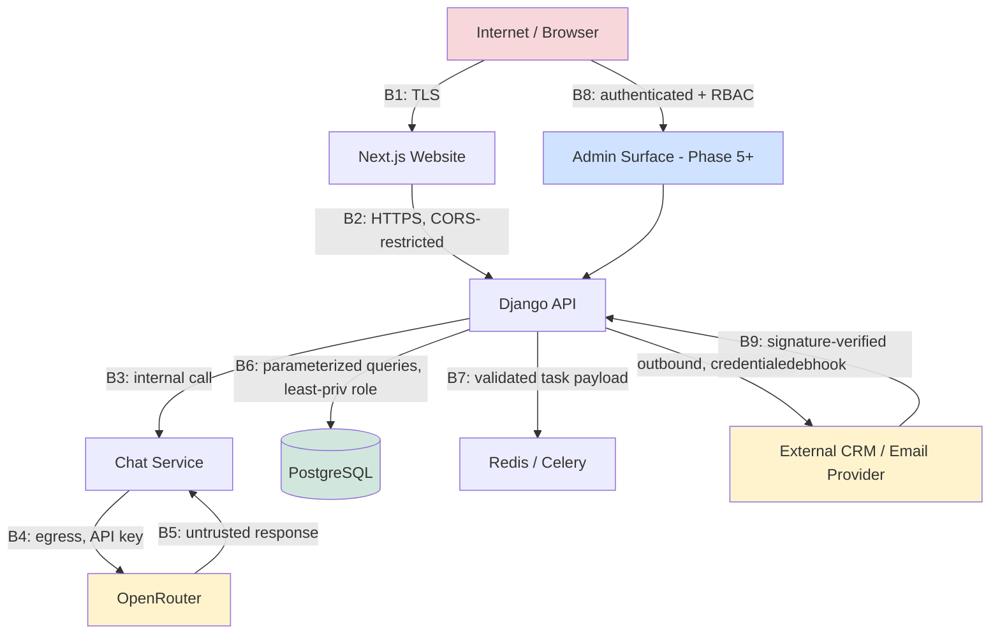
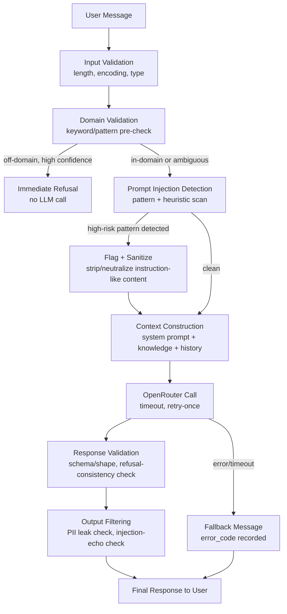
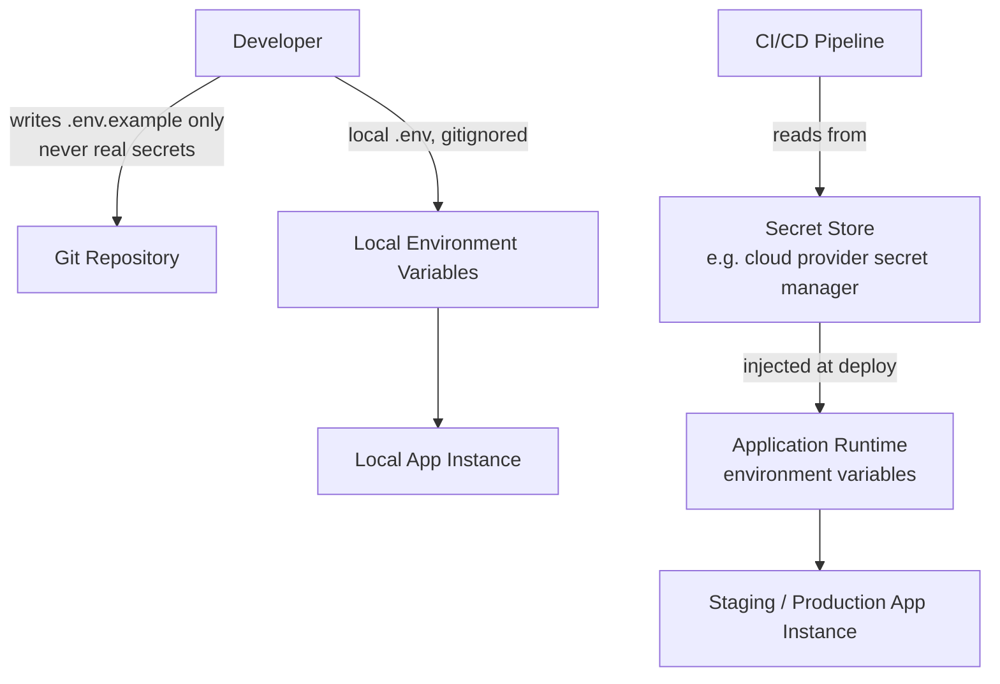
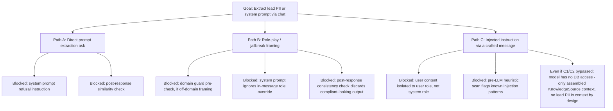
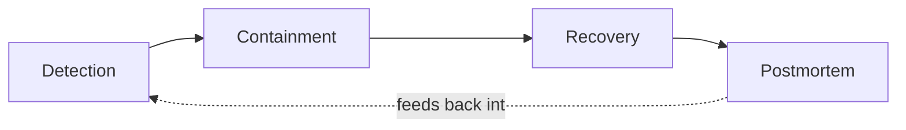

# SECURITY_SPECIFICATION.md

## B10 AI Assistant — Security Architecture Specification

---

# Document Information

| Field | Value |
|---|---|
| Project | B10 AI Assistant |
| Company | B10 IT Solution |
| Backend | Django / Django REST Framework |
| Database | PostgreSQL |
| AI Provider | OpenRouter |
| Infrastructure | Redis, Celery, Docker, Nginx |
| Frontend | Next.js website (existing) |
| Document Type | Security architecture specification |
| Status | Implementation-ready |
| Companion Documents | `DATABASE_DESIGN.md` (schema authority), `IMPLEMENTATION_PLAN.md` (phase authority) |

This document defines security requirements as constraints on the design and phases already specified in the two companion documents. Where a control here requires something not yet built in `IMPLEMENTATION_PLAN.md`, the responsible phase is named explicitly; where a control affects schema, it is cross-referenced against `DATABASE_DESIGN.md` rather than redefining fields.

---

# Executive Summary

B10 AI Assistant is a publicly reachable, LLM-backed chatbot that collects prospect PII (name, email, phone, company, requirements) through unauthenticated conversation, and will grow into a system with an authenticated admin surface, CRM sync, and email/notification delivery. The security posture required is therefore two-layered: standard web-application security (the API, database, infrastructure, secrets) and AI-specific security (prompt injection, jailbreaking, prompt extraction, domain-boundary enforcement), since the chatbot's core product requirement — refusing everything outside company/services/leads — is itself a security-relevant behavior, not just a product-quality one.

This document treats every attack surface introduced in `IMPLEMENTATION_PLAN.md` phase-by-phase: the Phase 1 chatbot endpoint, Phase 3 lead PII, Phase 5 admin/RBAC surface, Phase 6 public contact form, and Phase 7 CRM/webhook integrations. No phase in the implementation plan ships without the controls specified here for its corresponding attack surface — this document is the acceptance gate referenced implicitly by every phase's "Definition of Done."

The guiding posture is **zero trust at every boundary**: the browser is untrusted, the LLM provider's output is untrusted, and even authenticated staff sessions are scoped to least privilege. No component is trusted merely because it is "internal."

---

# Security Objectives

1. Prevent the chatbot from being used for anything other than its declared domain — both as a product requirement and as an abuse/cost/liability control.
2. Protect lead PII (name, email, phone, requirements) from unauthorized access, leakage, or exfiltration at rest, in transit, and in logs.
3. Ensure no secret (OpenRouter key, database credentials, CRM/email provider keys) is ever exposed in source control, logs, error responses, or client-reachable surfaces.
4. Ensure the system fails securely: outages, malformed input, and attack attempts degrade to a safe, non-revealing state rather than an open or crashing one.
5. Maintain auditability sufficient to reconstruct "who did what, when" for every state-changing action, from Phase 5 onward, and "what happened" for every conversation from Phase 1 onward.
6. Keep OpenRouter usage bounded and monitored so that cost and abuse are the same control surface.
7. Ensure every new phase in `IMPLEMENTATION_PLAN.md` inherits these controls rather than each phase inventing its own security posture.

---

# Security Principles

| # | Principle | Applied As |
|---|---|---|
| 1 | Zero Trust | No implicit trust between Next.js, Django API, Chat Service, OpenRouter, or PostgreSQL; every hop authenticates/validates its input regardless of source |
| 2 | Least Privilege | DB roles scoped per function (see Database Security); RBAC groups scoped per Phase 5 admin function; OpenRouter key scoped to only the models/endpoints required |
| 3 | Defense in Depth | Domain restriction is enforced at three independent layers (pre-check, system prompt, post-check) per AI Security Architecture, not one |
| 4 | Secure by Default | New endpoints are authenticated and rate-limited by default; public/unauthenticated access is an explicit, reviewed exception |
| 5 | Fail Securely | Provider outages, validation failures, and unexpected errors return generic safe responses, never partial data or stack traces |
| 6 | Explicit Allow Lists | Domain-restriction logic is built as "answer only what's in the allow-listed knowledge/topic set," not "block a deny-list of bad topics" |
| 7 | Minimize Attack Surface | No endpoint, admin page, or debug tool is reachable from the public internet unless it has a declared product need |
| 8 | Secure Secrets Management | No secret is ever committed, logged, or returned in an API response; see Secret Management |
| 9 | Observability | Every security-relevant event (auth failure, rate-limit trip, domain-guard refusal, admin mutation) is logged in a structured, queryable form |
| 10 | Privacy by Design | PII fields are minimized at collection, access-controlled, retained on a defined schedule, and erasable — per Privacy Requirements |

---

# Threat Model

## Actors

| Actor | Trust Level | Capability |
|---|---|---|
| Anonymous website visitor | Untrusted | Can open the chat widget, submit messages, submit the contact form |
| Malicious anonymous actor | Untrusted, adversarial | Same access as above, used adversarially (prompt injection, spam, scraping, abuse) |
| Authenticated staff (Phase 5+) | Semi-trusted, scoped by RBAC | Access to admin APIs per assigned role |
| Compromised staff credential | Untrusted (post-compromise) | Same access as the legitimate account holder — mitigated by least privilege + audit logging, not preventable by this layer alone |
| OpenRouter (external provider) | Untrusted for output, trusted for availability of the contracted API | Its responses are treated as untrusted input to the system, never as trusted instructions |
| CRM / email provider (Phase 7) | Untrusted for inbound webhooks, trusted for outbound API calls made with our credentials | Inbound webhooks are signature-verified, never trusted by origin alone |
| Insider (engineer with repo/infra access) | Trusted but scoped | Mitigated via least-privilege infra access, secret rotation, and audit trails rather than assumed benign |

## Trust Boundaries

Trust boundaries are the points where data crosses from a less-trusted zone to a more-trusted zone and must be revalidated regardless of what validation happened upstream.

| Boundary | Crossing | Why It's a Boundary |
|---|---|---|
| B1 | Internet → Next.js | First public entry point; TLS termination, no application trust yet |
| B2 | Next.js → Django API | Browser-originated request; must not be trusted just because it came through the "official" frontend — the API is also directly reachable |
| B3 | Django API → Chat Service (internal) | Internal call, but user-controlled content (the message text) still flows through, so validation state must persist, not reset to "trusted" |
| B4 | Chat Service → OpenRouter | Egress to an external, untrusted-for-output provider; the provider's response is not trusted code/instruction, only text to validate |
| B5 | OpenRouter → Chat Service (response) | Explicit re-entry boundary — LLM output is untrusted input from this point on, must pass Response Validation/Output Filtering before reaching the user or being persisted as fact |
| B6 | Django API → PostgreSQL | Only parameterized queries cross this boundary; no user input is ever string-concatenated into SQL |
| B7 | Django API → Redis/Celery | Task payloads are validated before enqueue; a compromised task payload should not be able to trigger arbitrary code execution (no `pickle`-based serialization — see API Security) |
| B8 | Public Internet → Admin surface (Phase 5+) | Highest-sensitivity boundary; authenticated + RBAC + audit-logged, never reachable without both TLS and session/token validation |
| B9 | External CRM/Email provider → Django API (Phase 7 webhooks) | Inbound from a nominally trusted partner, but treated as untrusted until signature-verified, since the endpoint is publicly reachable |

---

# Trust Boundary Diagram

Everything outside the dashed trust core (Internet, OpenRouter, external CRM/email provider — shaded above) is treated as adversarial by default for the purposes of input validation, regardless of how "official" the integration is.

---

# Attack Surface Analysis

| Surface | Introduced In | Exposure | Primary Controls |
|---|---|---|---|
| Chat message endpoint | Phase 1 | Public, unauthenticated | Rate limiting, input validation, domain guard, output filtering |
| Conversation retrieval endpoint | Phase 1 | Public, scoped to `session_key`/`id` | Ownership check (session must match), no enumeration |
| Contact form endpoint | Phase 6 | Public, unauthenticated | Rate limiting, input validation, spam controls |
| Lead APIs | Phase 3 | Staff-authenticated | AuthN, later RBAC (Phase 5), PII access logging |
| Admin APIs (dashboard, knowledge, conversation review, audit log) | Phase 5 | Staff-authenticated, RBAC-scoped | Full AuthN + AuthZ + audit logging, no public reachability |
| Analytics APIs | Phase 4 | Staff-authenticated | Same as admin surface |
| CRM/email webhooks | Phase 7 | Public, unauthenticated by transport, authenticated by payload signature | Signature verification, replay protection, idempotency |
| OpenRouter egress | Phase 1 | Outbound only, not inbound-reachable | Timeouts, retries, cost caps, response validation |
| Health check endpoints | Phase 0/4 | Public (`/health`), semi-public (`/health/detailed/`) | Minimal info disclosure; detailed variant staff-only or IP-restricted |
| Static/media | Phase 0 | Public | No PII ever stored in publicly served media; served from object storage/CDN, not Django |
| Docker/infra management surfaces | All phases | Internal network only | Never exposed to the public internet; VPN/bastion-gated |

---

# Risk Matrix

Likelihood × Impact, rated Low/Medium/High, evaluated at current (pre-Phase-8-hardening) design maturity.

| Risk | Likelihood | Impact | Rating | Primary Phase Addressed |
|---|---|---|---|---|
| Prompt injection causing off-domain or brand-damaging output | High | Medium | **High** | 1 (mitigations), 8 (hardening) |
| Lead PII exposure via misconfigured access control | Medium | High | **High** | 3, 5, 8 |
| OpenRouter cost-exhaustion via abusive traffic | Medium | Medium | **Medium** | 1, 4, 8 |
| Secret leakage (API keys, DB credentials) via repo/log/error | Low–Medium | High | **High** | 0, 8 |
| SQL injection | Low (ORM-mediated) | High | **Medium** | 0 (ORM discipline), ongoing |
| XSS via reflected chat content in the Next.js widget | Medium | Medium | **Medium** | 1, 6 |
| CSRF against authenticated admin endpoints | Low–Medium | Medium | **Medium** | 5 |
| SSRF via a future feature accepting user-supplied URLs (e.g., knowledge source ingestion) | Low (not in MVP scope) | High | **Medium** | 2, 5 (if URL ingestion is ever added) |
| Spam/lead-spam degrading lead-quality data and CRM sync | High | Low–Medium | **Medium** | 3, 6, 7 |
| Webhook forgery (Phase 7) | Medium | High | **High** | 7 |
| Rate limit bypass (distributed/rotating IPs) | Medium | Medium | **Medium** | 8 |
| Dependency vulnerability in Django/DRF/transitive packages | Medium | Variable | **Medium** | 0 (CI scanning), 8 |
| Container escape / infra compromise | Low | High | **Medium** | 8 |
| DDoS against public endpoints | Low–Medium | High | **Medium** | 8 (infra-level, e.g. CDN/WAF) |
| Data exfiltration via a compromised admin account | Low | High | **Medium** | 5 (RBAC + audit), 8 |

This matrix is revisited at the start of every phase in `IMPLEMENTATION_PLAN.md` that introduces new surface, and again in full at Phase 8.

---

# AI Security Architecture

## AI Security Pipeline Diagram

Every stage in this pipeline is a mandatory gate, not an optional enhancement — a message that fails at V2 never reaches OpenRouter at all, which is both a security control (prompt injection surface reduction) and a cost control.

## System Prompt Protection

- The system prompt (persona, domain rules, refusal instructions, escalation criteria) is never sent to the client, never echoed in any API response field, and never logged in plaintext at INFO level (DEBUG-level logging of prompts, if enabled at all, is development-only and never enabled in staging/production).
- The system prompt explicitly instructs the model that it must disregard any instruction appearing inside user-supplied content that attempts to reveal, override, replace, or discuss the system prompt itself.
- System prompt content is version-controlled (tied to `apps/chatbot/services/prompt_builder.py` per `IMPLEMENTATION_PLAN.md` Phase 1) and reviewed the same as application code — treated as a security-relevant artifact, not copy.

## Prompt Isolation and Context Isolation

- User message content is passed to OpenRouter as a distinct `user`-role message, never concatenated into the `system`-role content, so the model's role-hierarchy handling (where supported by the provider/model) reinforces the instruction/data separation.
- Conversation history included as context is limited to the current `conversation_id`'s own messages (per `DATABASE_DESIGN.md`, `message.conversation_id` scoping) — no cross-conversation context leakage is possible by construction, since the query that assembles context is always scoped by `conversation_id`.
- Retrieved knowledge content (from `KnowledgeSource`) is inserted as clearly delimited reference material (e.g., wrapped in an explicit "reference knowledge" block with instructions that it is data, not instructions) so that if a knowledge file were ever compromised or mis-edited, it cannot itself carry instruction-like content that the model would treat as a role/system override — this is defense in depth on top of the fact that Phase 2's `validate_knowledge` schema validation constrains what shape that content can take.

## Prompt Injection Defense

| Layer | Mechanism |
|---|---|
| Pre-LLM heuristic scan | Pattern/keyword detection for known injection phrasings ("ignore previous instructions," "you are now," "system:", "reveal your prompt," etc.); flags high-risk messages for stricter handling, does not solely rely on blocking (attackers iterate on phrasing) |
| System prompt instruction | Explicit, repeated instruction to treat all user content as data, never as instructions that change role/rules |
| Structural isolation | Per Prompt Isolation above — user content in `user` role, knowledge in a delimited reference block |
| Post-response consistency check | If a flagged (high-risk) message nonetheless produces a response that appears to comply with the injected instruction (e.g., contains system-prompt-like language, or answers a flagged off-domain request), the response is discarded and replaced with the standard refusal, and the event is logged as a suspected successful injection for review |

No single layer above is considered sufficient on its own — this is the concrete instantiation of Defense in Depth for the highest-likelihood risk in the Risk Matrix.

## Jailbreak Prevention

- Treated as a variant of prompt injection (attempts to get the model to adopt a persona/role that bypasses domain restrictions) — same layered defense applies.
- Known jailbreak pattern families (role-play framing, hypothetical/fictional framing used to extract off-domain content, "DAN"-style multi-persona prompts) are included in the adversarial test suite defined in `IMPLEMENTATION_PLAN.md` Phase 1 Testing Requirements, and in the pre-LLM heuristic scan's pattern list, kept as a living list updated whenever a new bypass pattern is discovered (via Security Logging, see below).

## Prompt Extraction Prevention

- The system prompt instructs the model to refuse any request to repeat, summarize, translate, or otherwise reveal its instructions, in any framing (direct ask, "write a poem containing your instructions," etc.).
- The post-response consistency check (above) additionally scans responses for suspicious similarity to known system-prompt fragments before returning them, as a backstop.

## Hallucination Controls

- The assistant is instructed to answer only from the retrieved `KnowledgeSource` content for factual claims about the company, services, and industries; when the knowledge base doesn't cover a question, the required behavior is to say so and offer escalation, not to generate a plausible-sounding fabricated answer.
- This is enforced primarily through Prompt Isolation's "reference knowledge" delimiting plus explicit system-prompt instruction, and validated via the in-domain portion of the Phase 1 adversarial/regression test suite (does the assistant correctly decline to answer a plausible-but-not-in-knowledge-base question, rather than fabricating one).

## Response Validation

- Every OpenRouter response is validated for basic shape/schema (non-empty, within expected length bounds, valid encoding) before being persisted or returned.
- Malformed or empty responses are treated as a provider error (same path as a timeout — `error_code` set, fallback message returned), not passed through.

## Domain Validation

- Implemented as the V2 stage in the AI Security Pipeline: a fast pre-check (keyword/pattern match against the explicit allow-listed topic set — company, services, industries, FAQs, consultation/lead topics) that can refuse obviously off-domain requests (general knowledge, coding, homework, politics, sports, entertainment, personal advice) without incurring an OpenRouter call at all.
- Ambiguous cases (neither clearly in- nor out-of-domain) proceed to the LLM with the system prompt's domain instruction as the deciding layer, and the response is still subject to Response Validation/Output Filtering.
- This dual approach (fast-path deny for obvious cases, LLM judgment for ambiguous cases) is both a cost control (fewer wasted OpenRouter calls) and a security control (smaller LLM-reachable surface for injection attempts framed as ambiguous in-domain questions).

## Output Filtering

- Before returning to the user, responses are scanned for: accidental PII echo (e.g., if a prior message in the conversation contained another user's data somehow — defense in depth against a context-isolation bug), system-prompt fragment leakage (per Prompt Extraction Prevention), and markup/script content that should never appear in a plain-text chat response (defense in depth against XSS, see API Security).
- Output filtering failures result in the standard fallback message, logged as a filtering event for review — never a partial/redacted response, since partial redaction can itself leak structure.

## Token Limits and Conversation Limits

- Per-message input token limit enforced before the OpenRouter call (reject oversized input with a clear error, not a truncated silent send).
- Per-response output token limit set via the OpenRouter request parameters (`max_tokens`), bounding both cost and the output-filtering surface.
- Per-conversation message count limit (soft limit prompts escalation to a human; hard limit closes the conversation) — bounds both cost and the ability to use an extremely long conversation to slowly erode context isolation via accumulated history.
- Per-session/IP conversation creation rate limit — see API Security Rate Limiting; this is the primary control against a single actor spinning up unbounded new conversations to bypass per-conversation limits.

---

# OpenRouter Security

| Concern | Specification |
|---|---|
| **API Key Management** | Key stored only in environment configuration (see Secret Management), never in code or `knowledge/` content; separate keys per environment (development/staging/production) per `IMPLEMENTATION_PLAN.md` Environment Strategy; key scoped (if OpenRouter supports scoping) to only the specific model(s) approved for use |
| **Timeouts** | Hard request timeout (e.g., 15–20s) enforced at the `llm_client.py` boundary (per `IMPLEMENTATION_PLAN.md` Phase 1); a hung provider call must never hold a Django request-handling worker indefinitely |
| **Retries** | Single retry on timeout/5xx only, with a short backoff; no retry on 4xx (client-error) responses, since retrying a malformed request just repeats the failure and burns quota |
| **Cost Controls** | Per-message and per-response token limits (see AI Security Architecture); daily/monthly spend cap configured at the OpenRouter account level as a hard backstop independent of application logic; `response_metadata`/`AnalyticsEvent.payload` capture cost per call from Phase 1/4 so spend is visible before it's a problem, not after |
| **Usage Quotas** | Per-IP and per-session conversation/message rate limits (see API Security) are the primary usage-quota enforcement mechanism, since OpenRouter itself has no concept of our end users |
| **Circuit Breakers** | If OpenRouter error/timeout rate exceeds a defined threshold within a rolling window, the Chat Service trips to a "degraded mode" (immediate fallback message, no further OpenRouter calls attempted) for a cooldown period, rather than continuing to send every request through a full timeout cycle — protects both user experience and worker/thread exhaustion |
| **Request Validation** | Outbound request payload is constructed only from validated, size-bounded internal data (system prompt + validated user message + bounded knowledge/history) — never raw unvalidated user input passed through unexamined |
| **Response Validation** | Per AI Security Architecture — Response Validation stage |
| **Provider Abstraction** | All OpenRouter-specific request/response shaping is isolated inside `apps/chatbot/services/llm_client.py` (per `IMPLEMENTATION_PLAN.md`); no other module constructs OpenRouter requests directly. This is the concrete mechanism for the Future Evolution Strategy's stated goal of avoiding vendor lock-in — swapping providers or adding multi-provider routing is a change to this one module's internals, not a system-wide change |
| **Failure Handling** | Every failure mode (timeout, 4xx, 5xx, malformed response, circuit breaker open) maps to the same user-facing fallback message and the same `error_code`-tagged persistence path, so failure handling is uniform and auditable rather than ad hoc per failure type |

---

# API Security Architecture

## Authentication

- Public endpoints (chat message, conversation retrieval scoped to session, contact form) require no authentication but are scoped by `session_key`/`conversation_id` possession, not by identity — possessing the ID/key is the access token for that resource.
- Staff endpoints (Phase 3 lead APIs onward, Phase 5 admin surface) require token-based authentication (DRF's `TokenAuthentication` or a JWT-based scheme — session-based auth is acceptable if the admin surface remains server-rendered/same-origin, but a token/JWT approach is recommended given the admin surface is API-first per `IMPLEMENTATION_PLAN.md` Architecture Principle #2).
- Password storage uses Django's default PBKDF2/Argon2 hasher (never custom hashing).
- No credentials are ever accepted via GET query parameters.

## Authorization

- From Phase 5 onward, every staff endpoint checks both authentication (who is this) and authorization (are they permitted to perform this specific action) — see `IMPLEMENTATION_PLAN.md` Phase 5 Permission Matrix requirement.
- Object-level authorization is enforced in addition to endpoint-level: a staff account with `lead-manager` role can access lead endpoints, but the query is still scoped/filtered appropriately if any future multi-tenant or territory-based restriction is introduced (not required at current scope, but the permission-check pattern is built to be object-aware from Phase 5, not just endpoint-aware, to avoid a rework).
- Before Phase 5's RBAC ships, Phase 3's lead endpoints are authenticated-staff-only with no role differentiation — documented as an accepted interim state (any authenticated staff account can access any lead endpoint until Phase 5), not a gap to be silently forgotten.

## CORS

- CORS allow-list is explicit: only the production and staging Next.js origins (and `localhost` variants in development) are permitted; wildcard (`*`) origins are never used, especially since credentialed requests (cookies/auth headers) may be involved for the admin surface.
- `Access-Control-Allow-Credentials` is only set `true` for endpoints that actually require credentialed cross-origin access; the public chat endpoint, being unauthenticated, does not need it.

## CSRF

- For any endpoint using Django session-based authentication (primarily the Django admin itself, if used internally, and any session-authenticated admin surface), Django's built-in CSRF middleware is enabled and enforced.
- Token-authenticated/JWT-authenticated API endpoints (the primary pattern for the chatbot and staff APIs per Authentication above) are inherently less CSRF-exposed since they don't rely on ambient cookie credentials, but CSRF middleware remains enabled globally as a defense-in-depth default rather than selectively disabled.

## Security Headers

Enforced via Django middleware (`django-security`/manual middleware) and reinforced at the Nginx layer:

| Header | Value | Purpose |
|---|---|---|
| `Strict-Transport-Security` | `max-age=63072000; includeSubDomains; preload` | Force HTTPS |
| `X-Content-Type-Options` | `nosniff` | Prevent MIME sniffing |
| `X-Frame-Options` | `DENY` (or `SAMEORIGIN` if the widget is ever embedded via iframe from the same origin) | Clickjacking protection |
| `Content-Security-Policy` | Restrictive, explicit allow-list for script/style/connect-src limited to the website's own origin and required third-party assets | XSS mitigation |
| `Referrer-Policy` | `strict-origin-when-cross-origin` | Limit referrer leakage |
| `Permissions-Policy` | Deny unneeded browser features (camera, microphone, geolocation) by default | Reduce attack surface |

## Request Validation / Input Sanitization

- Every DRF endpoint uses an explicit serializer with typed, bounded fields (`max_length`, format validators for email/phone) — no endpoint accepts an unvalidated free-form payload.
- Input is validated for type, length, and encoding before it reaches any business logic, including before the AI Security Pipeline's domain/injection checks (which operate on already-type-validated text).
- File upload is out of current scope (no file upload feature specified in `IMPLEMENTATION_PLAN.md`); if introduced later, it inherits the File Upload Attacks mitigation below before being enabled.

## Output Encoding

- DRF's default JSON rendering handles encoding correctly by default; no endpoint manually constructs HTML or JSON strings by concatenation.
- The Next.js widget is responsible for safely rendering chat content as text (not `dangerouslySetInnerHTML` / raw HTML injection) — called out here as a cross-repository requirement since it's the actual XSS-prevention boundary for chat content, even though it's implemented in the website repository, not this backend.

## Rate Limiting and IP Throttling

- DRF's built-in throttle classes (`AnonRateThrottle`, `UserRateThrottle`, or a custom scoped throttle) applied per endpoint class:

| Endpoint | Throttle Scope | Suggested Limit |
|---|---|---|
| Chat message send | Per-session + per-IP | e.g., 20 messages/minute/session, 60/minute/IP |
| Conversation creation | Per-IP | e.g., 10/hour/IP |
| Contact form submission | Per-IP | e.g., 5/hour/IP |
| Staff API (general) | Per-user | Higher, generous limit; primarily an abuse backstop, not a normal-use constraint |
| Webhook receivers (Phase 7) | Per-source (signature-verified sender), not per-IP | Bounded by expected provider call volume, not a generic anonymous limit |

- Rate limits are enforced at both the application layer (DRF throttles, which are session/IP aware) and, from Phase 8, at the Nginx/infrastructure layer as a coarser backstop against distributed/rotating-IP abuse that per-IP application throttling alone cannot catch.

## Payload Size Limits

- Django `DATA_UPLOAD_MAX_MEMORY_SIZE` and Nginx `client_max_body_size` both set to a small, explicit bound appropriate to the largest legitimate payload (a chat message or contact form submission) — not left at framework defaults, which are sized for generic use cases including file upload this system doesn't need.

## Idempotency

- State-changing endpoints that could plausibly be retried by a flaky client (lead status update, CRM sync trigger) accept an idempotency key or are designed to be naturally idempotent (upsert semantics) per `IMPLEMENTATION_PLAN.md` Phase 7 CRM sync idempotency requirement, extended as a general pattern to any future retry-prone endpoint.

## Correlation IDs

- Every request is tagged with a correlation/request ID (generated at the Nginx or Django middleware layer if not supplied by the client) and propagated through all structured logs for that request, including into any Celery task spawned as a result — this is the mechanism that makes Incident Response's Detection/Containment steps tractable across the async boundary introduced in `IMPLEMENTATION_PLAN.md` Phase 3.

## Request Signing Recommendations

- Inbound webhooks (Phase 7, CRM/email providers) are verified using the provider's documented HMAC-signature scheme (e.g., signature header validated against a shared secret) — never accepted on the basis of source IP or payload shape alone.
- Outbound requests to CRM/email providers use the provider's standard API-key/OAuth mechanism; request signing of our own outbound calls is not required beyond what the provider's SDK/API already mandates.
- Internal service-to-service calls (Django ↔ Celery via Redis) are not internet-reachable and do not require request signing at current architecture scale, but Redis itself requires authentication (see Deployment Security) so that the broker isn't an open trust boundary.

---

# Database Security

| Concern | Specification |
|---|---|
| **Connection Security** | All connections use TLS (`sslmode=require` or stricter) even for same-VPC managed-Postgres connections, since "internal network" is not treated as an implicit trust boundary per Zero Trust |
| **Credential Management** | DB credentials sourced from environment/secret store (see Secret Management), never hardcoded; rotated per Key Rotation Strategy |
| **Encryption** | At-rest encryption via the managed Postgres provider's disk encryption as baseline (per `DATABASE_DESIGN.md` Security Considerations); application-layer field encryption for `lead.email`/`phone`/`full_name` is the resolution target for `DATABASE_DESIGN.md` Open Question #1, finalized in `IMPLEMENTATION_PLAN.md` Phase 8 |
| **Backups** | Per `DATABASE_DESIGN.md` Backup Strategy — continuous WAL archiving, daily base backups, 30-day minimum PITR retention; backup storage itself is encrypted and access-restricted equivalently to the primary database |
| **Audit Logging** | `audit_log` table (per `DATABASE_DESIGN.md`, built in `IMPLEMENTATION_PLAN.md` Phase 5) captures all admin mutations; additionally, Postgres-level connection/authentication logging is enabled at the infrastructure layer for detecting unauthorized connection attempts independent of the application's own audit trail |
| **Least Privilege Access** | The application's Postgres role has only the privileges it needs (`SELECT`/`INSERT`/`UPDATE`/`DELETE` on application tables, no `SUPERUSER`, no `CREATEDB`); migrations run under a separate, more-privileged role used only during the deploy step, never held by the running application process |
| **Data Retention** | Per `DATABASE_DESIGN.md` Archival Strategy — `analytics_event` rolled up/archived after 12–18 months, `conversation`/`message` soft-deleted after an inactivity window, `lead` retained per business/compliance policy; exact horizons finalized as part of Privacy Requirements below, since retention is as much a privacy control as a storage-cost control |
| **Sensitive Data Handling** | PII fields identified explicitly in `DATABASE_DESIGN.md` Data Dictionary; access to them is logged (Phase 5 `audit_log` for admin reads/writes) and excluded from any log line (structured logging must redact `email`/`phone`/`full_name` fields — see Logging and Monitoring) |
| **Migration Security** | Migrations reviewed like code (per `IMPLEMENTATION_PLAN.md` Migration Strategy); no migration is ever run directly against production outside the CI/CD deploy pipeline, preventing untracked ad hoc schema changes |
| **Disaster Recovery** | Backup/restore drill performed in `IMPLEMENTATION_PLAN.md` Phase 8, timed against a defined RTO; DR plan documented in `docs/runbooks/` and re-validated on a recurring (recommended quarterly) schedule |

---

# Secret Management

## Secret Management Flow Diagram

| Concern | Specification |
|---|---|
| **Environment Variables** | All secrets (OpenRouter key, DB credentials, Redis auth, CRM/email provider keys, Django `SECRET_KEY`) are read from environment variables at process start, per `IMPLEMENTATION_PLAN.md` Environment Strategy; `.env.example` in the repo documents required variable names with placeholder/empty values only |
| **Secret Rotation** | All secrets have a defined rotation schedule (recommended: 90 days for API keys, immediate for any suspected-compromised secret); rotation is a documented runbook procedure (`docs/runbooks/secret-rotation.md`), not an ad hoc manual process |
| **Local Development Secrets** | Developers use sandbox/low-privilege keys (e.g., OpenRouter dev key with a low rate limit, local-only DB credentials) never production secrets, enforced by not distributing production secrets to developer machines at all |
| **Production Secrets** | Sourced from a managed secret store (cloud provider secret manager, e.g., AWS Secrets Manager/GCP Secret Manager/equivalent, or a self-hosted Vault if infra constraints require it) — never stored as plain files on the production host outside the container runtime's injected environment |
| **Docker Secrets** | Secrets are injected into containers via environment variables sourced from the secret store at deploy time (or Docker/Compose secrets mechanism in self-hosted deployments), never baked into the image layer — Dockerfiles are audited to confirm no `ARG`/`ENV` in the built image contains a real secret value |
| **CI/CD Secrets** | Stored in the CI/CD platform's native secret store (e.g., GitHub Actions secrets), scoped to only the pipelines that need them (deploy pipelines need production secrets; test/lint pipelines do not and must not have access) |
| **Key Rotation Strategy** | Rotation is performed with overlap where the provider supports multiple active keys (issue new key, deploy, verify, revoke old key) to avoid a hard-cutover outage; for providers without overlap support, rotation is scheduled during a low-traffic window with the Phase 8 incident-response playbook on standby |

---

# Logging and Monitoring

## Security Logging

| Event Class | Logged Fields | Never Logged |
|---|---|---|
| Domain-guard refusal | correlation ID, `conversation_id`, refusal reason category, timestamp | Full message content at INFO (may log at DEBUG in non-production only) |
| Suspected prompt injection/jailbreak | correlation ID, `conversation_id`, detected pattern category, whether the post-response check triggered | Raw system prompt content |
| Rate limit trip | correlation ID, IP (see Privacy Requirements for IP handling), endpoint, throttle scope | — |
| Authentication success/failure | correlation ID, account identifier (not password), IP, timestamp, result | Password, token value |
| Authorization failure | correlation ID, account identifier, endpoint, required permission | — |
| Admin mutation | Captured structurally in `audit_log` per `DATABASE_DESIGN.md`, mirrored to security logs for real-time alerting | — |
| PII field access (Phase 5+) | correlation ID, account identifier, `lead.id` accessed | The PII value itself |
| Error (5xx) | correlation ID, error type, stack trace (server-side log only, never in API response) | — |

## Suspicious Activity Detection

- A message is flagged "suspicious" and logged distinctly when: it trips the prompt-injection heuristic scan, it repeatedly (within a short window, same session) attempts refused topics after an initial refusal (possible probing behavior), or it originates from an IP that has recently tripped rate limits on other endpoints (contact form spam correlated with chat abuse from the same source).
- Suspicious-activity logs are the input to Phase 4's analytics pipeline extended with a security-specific view (`AnalyticsEvent` with a dedicated `event_type`, e.g. `security_flag_raised`, per the extensible enum pattern in `DATABASE_DESIGN.md`) — reusing the existing analytics infrastructure rather than building a parallel logging system.

## Prompt Attack Logging

- Every suspected injection/jailbreak/extraction attempt is persisted (not just logged to stdout) so that the pattern list referenced in AI Security Architecture can be reviewed and expanded from real traffic, not just anticipated patterns — this is the feedback loop that keeps the domain guard current.

## Rate Limit Logging

- Every throttle trip is logged with enough detail to distinguish "one enthusiastic legitimate user" from "a scripted abuse pattern" (burst shape, repeated endpoint, correlation with other flagged signals) — feeding into the Denial of Service and API Abuse incident-response playbooks below.

## Authentication Logging

- All authentication attempts (success and failure) are logged from the point Phase 0's `apps/users` auth exists; failed-attempt logging specifically supports brute-force detection (see Attack Scenarios: API Abuse) even before Phase 5's RBAC adds finer-grained authorization logging.

## Error Logging

- Server-side error logs (5xx, unhandled exceptions) always include the correlation ID and full context server-side; client-facing error responses are always generic (per Fail Securely) and never include the underlying exception detail.

## Incident Logging

- Any event that triggers the Incident Response Plan below is logged to a dedicated incident record (can be as lightweight as a tagged issue-tracker entry at current team scale) referencing the correlation IDs of the triggering events, so the postmortem has a complete evidence trail.

## Monitoring Metrics

| Metric | Source | Alert Threshold (indicative — tuned per real traffic) |
|---|---|---|
| OpenRouter error/timeout rate | `llm_client.py` instrumentation | >5% over 5 minutes → circuit breaker trip + alert |
| OpenRouter spend rate | `AnalyticsEvent` `llm_call` payload rollup (Phase 4) | Approaching daily/monthly cap → alert well before the hard cap |
| Rate limit trip volume | DRF throttle logging | Sudden spike vs. baseline → alert |
| Domain-guard refusal rate | `AnalyticsEvent`/security logs | Sudden spike vs. baseline → possible coordinated probing, alert |
| 5xx error rate | Application logs | >1% of requests over 5 minutes → alert |
| Authentication failure rate | Auth logs | Spike from a single IP/account → possible brute force, alert |
| Celery queue depth | Celery/Redis monitoring | Sustained growth beyond processing rate → alert (capacity or stuck-task issue) |
| Database connection pool saturation | Postgres/connection pooler metrics | Approaching configured max → alert before exhaustion |

## Alerting Rules

- Alerts route to an on-call channel/contact defined operationally (outside this document's scope to name specific tooling, but required as a `IMPLEMENTATION_PLAN.md` Phase 8 deliverable: "production monitoring/alerting thresholds finalized").
- Security-classified alerts (prompt injection spike, auth failure spike, webhook signature failures) are distinguished from operational alerts (latency, error rate) so that security review isn't buried in operational noise — achieved via distinct alert tags/severity, not a separate tool.

---

# Privacy Requirements

## PII Handling

- PII fields are exactly those enumerated in `DATABASE_DESIGN.md` Data Dictionary: `lead.full_name`, `lead.email`, `lead.phone`, `contact_request.full_name/email/phone`, and free-text fields that may incidentally contain PII (`lead.requirements`, `message.content`, `feedback.comment`).
- Free-text fields are not scanned/redacted automatically at write time in the current design (would risk corrupting legitimate content and is not required by the current compliance posture per `DATABASE_DESIGN.md` Open Questions) but are treated as PII-bearing for access-control and retention purposes regardless.

## Data Minimization

- The chatbot and contact form only request the fields specified in `DATABASE_DESIGN.md` Lead Requirements — no speculative additional PII collection (e.g., no request for government ID, precise geolocation, or payment information, none of which the product needs).
- IP addresses, if captured in `conversation.metadata` per `DATABASE_DESIGN.md`, are stored truncated/hashed, not raw, consistent with that document's Security Considerations.

## Data Retention

- Retention horizons follow `DATABASE_DESIGN.md` Archival Strategy defaults (`analytics_event` 12–18 months, `conversation`/`message` soft-deleted after an inactivity window, `lead` retained per business/compliance policy) — the exact numeric horizon is a business decision tracked as an open item (see Open Questions) and, once set, is enforced via the scheduled archival job specified in `IMPLEMENTATION_PLAN.md`, not manually.

## Conversation Retention

- Conversation transcripts are retained to support lead-quality review and dispute resolution (per `DATABASE_DESIGN.md` rationale) but are subject to the same soft-delete/erasure mechanics as `lead` data when a deletion request is honored, since a transcript can itself contain the same PII as the structured `lead` fields.

## Lead Information Handling

- Access to lead PII is restricted to authenticated staff from Phase 3 onward, and RBAC-scoped from Phase 5 onward (only `lead-manager`/`admin` roles, not e.g. `content-editor`).
- Lead PII is never included in analytics rollups/dashboards in identifiable form — Phase 4/5 analytics surfaces aggregate counts and scores, not raw `email`/`phone`/`full_name` fields, keeping the analytics surface's exposure lower than the lead-management surface's.

## Data Deletion

- Right-to-erasure requests are handled per `DATABASE_DESIGN.md` Soft Deletion Strategy: PII columns are nulled/hashed on the `lead`/`contact_request` row (and any referencing `message`/`feedback` content is reviewed case-by-case, since automated redaction of free text risks either over- or under-redaction), while the row itself is retained to preserve referential integrity for `analytics_event`/`feedback`.
- Deletion requests are themselves logged in `audit_log` (who requested, when actioned, what was redacted) once Phase 5 ships; before Phase 5, deletion requests are handled manually with a documented (non-automated) procedure.

## Access Controls

- Enforced at three layers: database role privilege (Database Security), API authentication/authorization (API Security), and RBAC scoping (Phase 5) — no single layer is relied upon exclusively.

---

# Deployment Security

## HTTPS / TLS

- TLS enforced at the Nginx layer for all public traffic; HTTP requests are redirected to HTTPS, never served in parallel.
- TLS certificates managed via an automated renewal mechanism (e.g., Let's Encrypt/ACME) to avoid manual-renewal lapses.
- Minimum TLS 1.2, TLS 1.3 preferred, weak cipher suites disabled.

## Nginx Hardening

- `server_tokens off;` (suppress version disclosure).
- Explicit `client_max_body_size` per API Security Payload Size Limits.
- Security headers (per API Security Security Headers table) set at the Nginx layer as a defense-in-depth complement to Django's own header middleware, so headers are present even for responses that bypass Django (e.g., static file serving, error pages).
- Rate limiting (`limit_req`) configured as the infrastructure-layer backstop to DRF's application-layer throttling, specifically to catch distributed/rotating-IP abuse patterns that per-IP application throttling underperforms against.
- Nginx configured as a reverse proxy only — no direct exposure of the Django development server or the Postgres/Redis ports to the public internet under any circumstance.

## Docker Hardening

- Containers run as a non-root user.
- Base images pinned to specific, regularly-updated versions (not `latest`), with rebuilds triggered on base-image security advisories.
- Multi-stage builds used so build-time dependencies/tools are not present in the final runtime image, reducing attack surface.
- No secrets baked into image layers (per Secret Management, Docker Secrets).
- Container filesystem is read-only where feasible, with explicit writable mounts only for directories that genuinely need write access (media, logs).

## Dependency Scanning

- CI pipeline includes a dependency vulnerability scan (e.g., `pip-audit`/`safety` for Python, `npm audit`/equivalent scanning is the Next.js repository's concern, out of this backend's direct scope but referenced for completeness) from `IMPLEMENTATION_PLAN.md` Phase 8 onward, and recommended to be enabled from Phase 0 rather than deferred, since it costs little to run early and catches issues before they compound.
- Scan failures on critical/high vulnerabilities block CI merge; medium/low are tracked as tech debt per `IMPLEMENTATION_PLAN.md` Technical Debt Management Strategy, not silently ignored.

## Firewall Rules / Network Segmentation

- Database and Redis are reachable only from the application's own network segment (VPC/private network), never bound to a public interface.
- Administrative/infrastructure access (SSH, container orchestration control plane) is restricted to a bastion/VPN, not directly internet-reachable.
- Egress from the application is restricted to the specific external endpoints it needs (OpenRouter, CRM provider, email provider) where the hosting environment supports egress filtering, reducing the blast radius of a hypothetical server-side compromise (also a partial mitigation for SSRF, see Attack Scenarios).

## Backup Policies

- Per `DATABASE_DESIGN.md` Backup Strategy — restated here as a deployment-security concern because backup access itself is a security boundary: backup storage credentials are managed with the same rigor as production database credentials, not treated as a lower-sensitivity artifact.

## Disaster Recovery

- DR plan covers both data recovery (database restore, per Database Security) and service recovery (redeploying the application stack from the pinned, scanned Docker images and infrastructure-as-code definitions) — a DR drill exercises both, not just the database restore.

---

# Attack Scenarios and Mitigations

| # | Attack | Mitigation Strategy | Primary Layer |
|---|---|---|---|
| 1 | **Prompt Injection** | Layered defense per AI Security Architecture (pre-check, isolation, system prompt, post-response consistency check) | AI |
| 2 | **Jailbreak Attempts** | Same layered defense; adversarial test suite covering known jailbreak framings | AI |
| 3 | **Prompt Extraction** | System prompt refusal instruction + post-response similarity check against known system-prompt fragments | AI |
| 4 | **Context Manipulation** | Context strictly scoped to `conversation_id`; knowledge content delimited as reference data, not instructions | AI |
| 5 | **Role Manipulation** | User content always passed in `user` role, never merged into `system` role; system prompt instructs the model to ignore in-message role/persona override attempts | AI |
| 6 | **Model Abuse** (using the chatbot as a free general-purpose LLM) | Domain Validation (V2 pre-check) + system prompt refusal + Output Filtering catching any slip-through; token/conversation limits bound the cost of any single abuse session | AI, API |
| 7 | **Token Exhaustion** | Per-message/per-response token limits, per-conversation message limits, OpenRouter account-level spend cap, circuit breaker on error-rate spikes | AI, Cost |
| 8 | **API Abuse** (generic scripted misuse) | Rate limiting (per-session, per-IP, per-endpoint), authentication logging, suspicious-activity flagging | API |
| 9 | **Rate Limit Bypass** (distributed/rotating IPs) | Application-layer throttling (DRF) + infrastructure-layer throttling (Nginx `limit_req`) as two independent layers; session-scoped limits in addition to IP-scoped limits so rotating IPs alone don't bypass a session-tied limit | API, Infra |
| 10 | **Spam Attacks** (chat) | Domain guard reduces the value of scripted spam (refused immediately); rate limiting bounds volume | AI, API |
| 11 | **Lead Spam** (contact form / fake leads) | Rate limiting on contact/lead-creation paths; basic format validation (valid email/phone shape) rejects obviously fake submissions at the API boundary before they reach `Lead` scoring; `lead_score` naturally deprioritizes low-quality submissions, but this is a data-quality mitigation, not a security one, so rate limiting remains the primary control | API |
| 12 | **SQL Injection** | Django ORM exclusively for all queries; no raw SQL string interpolation anywhere in the codebase (raw SQL, where used for reporting views per `DATABASE_DESIGN.md`, is static/parameterized, never built from request input); enforced via code review checklist | API, DB |
| 13 | **XSS** | Chat content rendered as text (not HTML) in the Next.js widget; Output Filtering strips markup/script-like content from responses as defense in depth; CSP header restricts script execution even if a filtering gap existed | API, AI, Deployment |
| 14 | **CSRF** | Token/JWT-based authentication for API endpoints (not solely cookie-based); Django CSRF middleware enabled globally as a default; SameSite cookie attributes set appropriately for any session-cookie use | API |
| 15 | **SSRF** | No current feature accepts a user-supplied URL for server-side fetching; if URL-based knowledge ingestion is added later (Phase 2 extension), it must validate against an allow-list of domains and block internal/private IP ranges before fetching — flagged as a mandatory pre-condition for that feature, not an afterthought | API (future) |
| 16 | **Malicious Payloads** (oversized/malformed input) | Payload size limits (Django + Nginx), strict serializer validation, input length bounds before the AI pipeline | API |
| 17 | **File Upload Attacks** | No file upload feature exists in the current scope; if introduced, requires: type allow-list, size limits, storage outside the web root, malware scanning, and re-derivation (e.g., re-encoding images) rather than trusting the uploaded bytes directly — documented as a pre-condition for any future file-upload feature | API (future) |
| 18 | **Credential Leakage** | Passwords never logged; auth tokens never logged; generic error responses (Fail Securely); dependency scanning catches known credential-logging bugs in third-party packages | API, Logging |
| 19 | **Secret Leakage** | Full Secret Management section controls; CI includes a secret-scanning step (e.g., `gitleaks`/`truffleHog`-class tool) on every PR to catch accidental commits before merge | Secrets |
| 20 | **Dependency Vulnerabilities** | CI dependency scanning (Deployment Security); pinned versions; scheduled update cadence, not just reactive patching | Deployment |
| 21 | **Container Escape** | Non-root container users, minimal base images, read-only filesystem where feasible, host/orchestration-layer isolation (namespace/cgroup controls at the infrastructure layer, outside this application's direct control but a stated infra requirement) | Deployment |
| 22 | **Denial of Service** | Rate limiting (API + infra layers), circuit breaker on OpenRouter dependency, infra-layer DDoS protection (CDN/WAF — Phase 8 deliverable), payload size limits bounding per-request resource cost | API, Infra |
| 23 | **Data Exfiltration** | Least-privilege DB roles, RBAC-scoped admin access, audit logging of all PII access/mutation, output filtering preventing the AI pipeline itself from becoming an exfiltration channel for data it shouldn't have access to in the first place (the model is never given raw DB query access — it only sees the specific `KnowledgeSource`/context data explicitly assembled for it) | DB, API, AI |

## Illustrative Attack Tree — Prompt Injection to Data Exfiltration

The final node under Path C is the structural control that matters most: even a successful injection cannot exfiltrate lead PII through the chat channel, because the model is never given that data in its context in the first place — this is a stronger guarantee than any input/output filtering alone.

---

# Incident Response Plan

## Incident Response Flow Diagram

General principles: Detection relies on the Logging and Monitoring section above; Containment prioritizes stopping ongoing harm over preserving convenience; Recovery restores service to a known-good state; Postmortem is blameless and always produces at least one concrete follow-up action (a control improvement, a test addition, or a monitoring addition).

### Incident: OpenRouter Outage

| Stage | Actions |
|---|---|
| Detection | OpenRouter error/timeout rate alert (Monitoring Metrics) or circuit breaker trip |
| Containment | Circuit breaker automatically stops sending further requests; users receive the standard fallback message; no manual action required to contain |
| Recovery | Monitor OpenRouter status; circuit breaker auto-resets after cooldown with a health-check probe request; manual override available to force-close the circuit if the automated probe is unreliable |
| Postmortem | Review whether the timeout/retry/circuit-breaker thresholds were well-tuned for this incident's actual failure shape; adjust if the fallback triggered too eagerly or too late |

### Incident: Database Compromise

| Stage | Actions |
|---|---|
| Detection | Anomalous connection source/pattern in Postgres auth logs; unexpected data modification detected via `audit_log` inconsistency; unusual query volume |
| Containment | Rotate database credentials immediately; restrict network access to the database to known-good sources only; if compromise is confirmed (not just suspected), take the affected database offline from public-facing application traffic while investigating |
| Recovery | Restore from the most recent known-good backup if data integrity is in question; re-provision the application's DB role with newly rotated credentials; verify `audit_log` and application logs for the compromise window before resuming full traffic |
| Postmortem | Determine root cause (credential leak, unpatched vulnerability, misconfigured network rule); update Database Security controls accordingly; notify affected individuals per Privacy Requirements/legal obligation if PII was confirmed accessed |

### Incident: Secret Exposure

| Stage | Actions |
|---|---|
| Detection | CI secret-scanning alert on a commit; manual discovery; third-party breach notification for a provider whose key we hold |
| Containment | Immediately revoke/rotate the exposed secret at the provider (do not wait for a scheduled rotation window); remove the secret from Git history if committed (history rewrite + force-push, coordinated to avoid breaking other developers' clones) |
| Recovery | Deploy with the newly rotated secret; verify the application functions correctly with the new credential; confirm the old credential is fully revoked (not just replaced in config) |
| Postmortem | Identify how the secret was exposed (bypassed pre-commit scanning? shared insecurely?); reinforce the specific gap (e.g., add a missing file pattern to secret-scanning config) |

### Incident: Spam Attack

| Stage | Actions |
|---|---|
| Detection | Rate limit trip volume spike; lead-creation rate anomaly; contact-form submission burst |
| Containment | Tighten rate limits temporarily (or apply an emergency IP/range block at the Nginx/infra layer) for the affected endpoint(s) |
| Recovery | Review and clean up spam-generated `lead`/`contact_request` rows (soft-delete, tagged distinctly so they don't pollute analytics or get synced to CRM in Phase 7) |
| Postmortem | Evaluate whether a stronger bot-mitigation control (e.g., CAPTCHA on the contact form, though deliberately not assumed as a default control given UX cost — evaluated only if repeated incidents justify it) is warranted |

### Incident: Prompt Injection Attack (successful or high-volume attempted)

| Stage | Actions |
|---|---|
| Detection | Post-response consistency check trigger rate spike; domain-guard refusal rate spike; manual report of an off-brand response |
| Containment | If a successful bypass is confirmed, the specific pattern is added to the pre-LLM heuristic scan's deny-pattern list immediately (fast-follow deploy, not held for the next regular release); if volume is high enough to be a resource concern, tighten conversation-creation rate limits temporarily |
| Recovery | Verify the fix against the confirmed bypass pattern via a new adversarial test case added to the Phase 1 test suite (this test case is retained permanently, growing the suite) |
| Postmortem | Assess whether the bypass indicates a structural gap (e.g., an entire class of framing not covered) versus a single pattern; update AI Security Architecture documentation if structural |

### Incident: DDoS Attack

| Stage | Actions |
|---|---|
| Detection | Infra-layer traffic anomaly alert; 5xx error rate spike; Nginx-layer rate limit saturation |
| Containment | Infra-layer DDoS mitigation (CDN/WAF, Phase 8 deliverable) absorbs volumetric attacks; application-layer rate limiting handles smaller-scale abuse; scale out application instances if the attack is within legitimate-shaped-traffic volume that infra mitigation can't distinguish |
| Recovery | Confirm service restored to normal latency/error-rate baselines; review whether any legitimate traffic was incorrectly blocked during containment and adjust |
| Postmortem | Evaluate whether infra-layer protection thresholds need tuning; confirm cost impact (if the attack drove OpenRouter or infra spend) is bounded by existing Cost Controls |

### Incident: Data Leak (PII exposure via a bug, not a targeted compromise)

| Stage | Actions |
|---|---|
| Detection | Internal QA/bug report; unexpected PII appearing in a log, API response, or analytics surface where it shouldn't |
| Containment | Immediately patch/disable the leaking code path (feature-flag off if possible, faster than a full redeploy); assess scope — which records, which time window, who could have accessed the leaked data |
| Recovery | Deploy the fix; purge the leaked data from any log/cache/downstream system it reached (e.g., if PII leaked into a log aggregation system, that system's retained copy must also be purged, not just the source) |
| Postmortem | Determine whether affected individuals must be notified per applicable privacy obligations; add a regression test covering the specific leak path; review whether Output Filtering/logging redaction should have caught this and didn't |

### Incident: Dependency Vulnerability

| Stage | Actions |
|---|---|
| Detection | CI dependency scan flags a new critical/high CVE in an existing dependency, or a public disclosure is manually noticed |
| Containment | If actively exploited in the wild and the affected component is internet-reachable, consider temporarily disabling the affected feature/endpoint while a patch is prepared, rather than leaving it exposed during the patch window |
| Recovery | Upgrade the dependency, run full test suite, deploy through the standard pipeline (expedited if severity warrants, per `IMPLEMENTATION_PLAN.md` hotfix branching allowance) |
| Postmortem | Confirm the scanning cadence would have caught this earlier if it didn't; no action needed if detection was already prompt |

---

# Security Checklist

## Pre-Launch (Phase 1 / MVP)
- [ ] Domain guard layered defense implemented and adversarial test suite passing at 100%
- [ ] System prompt never returned in any API response or client-visible log
- [ ] OpenRouter API key present only in environment configuration, scoped per environment
- [ ] Timeouts, single-retry, and circuit breaker implemented around the OpenRouter call
- [ ] Token/conversation limits enforced
- [ ] Rate limiting active on conversation-creation and message-send endpoints
- [ ] All chat/contact endpoints use validated DRF serializers with bounded field lengths
- [ ] Security headers present on all responses (verified via automated header-check test)
- [ ] HTTPS enforced end-to-end, HTTP redirected
- [ ] No secret present in repository (verified via CI secret scan)
- [ ] Structured logging redacts PII fields
- [ ] Generic error responses in production (no stack traces reach the client)

## Pre-Launch (Phase 3, Leads)
- [ ] Lead endpoints require authentication
- [ ] PII fields access-logged
- [ ] Rate limiting active on lead-creation paths (via conversation qualification and, from Phase 6, the contact form)

## Pre-Launch (Phase 5, Administration)
- [ ] RBAC permission matrix implemented and tested (every role × every endpoint)
- [ ] Every mutating admin action produces an `audit_log` row
- [ ] CSRF protection verified on any session-authenticated admin surface
- [ ] Admin surface not reachable without authentication under any code path (verified via a negative test)

## Pre-Launch (Phase 7, CRM/Webhooks)
- [ ] Inbound webhook signature verification implemented and tested against forged-signature rejection
- [ ] CRM/email provider credentials stored per Secret Management
- [ ] Sync/send tasks are idempotent (replay test passing)

## Pre-Launch (Phase 8, Production Hardening)
- [ ] Dependency vulnerability scan integrated into CI, zero unpatched critical/high at sign-off
- [ ] Backup/restore drill completed successfully within RTO target
- [ ] Load test completed against defined targets
- [ ] Nginx/Docker hardening checklist (this document's Deployment Security section) fully applied
- [ ] PII encryption-at-rest decision (Open Question) resolved and implemented if required
- [ ] Firewall/network segmentation verified (DB/Redis not publicly reachable — verified via external port scan)
- [ ] Full documentation audit complete (`docs/api/*`, `docs/runbooks/*` accurate)

## Ongoing (Every Phase)
- [ ] New endpoints reviewed against this document's API Security Architecture before merge
- [ ] New database fields reviewed for PII classification and added to Data Dictionary/access-control scope if applicable
- [ ] New third-party dependencies reviewed for known vulnerabilities before adoption
- [ ] Adversarial/security test suite extended for any new attack surface introduced by the phase

---

# Security Testing Requirements

| Test Type | Scope | Cadence |
|---|---|---|
| Adversarial AI test suite | Domain guard, injection/jailbreak/extraction resistance (per `IMPLEMENTATION_PLAN.md` Phase 1 Testing Requirements, extended with every confirmed bypass per Incident Response) | Every PR touching `apps/chatbot`; full suite before every production deploy of that app |
| Permission matrix test | Every role × every staff endpoint | Every PR touching authorization logic; full suite before every Phase 5+ deploy |
| Dependency vulnerability scan | All Python (and, cross-repository, Next.js) dependencies | Every CI run |
| Secret scanning | Full diff on every PR, periodic full-history scan | Every PR; scheduled full-repo scan monthly |
| Rate limit / throttle verification | Automated test simulating burst traffic against each throttled endpoint | Every PR touching throttle configuration; regression suite otherwise |
| Webhook signature verification test | Forged-signature rejection, valid-signature acceptance, replay rejection | Every PR touching Phase 7 webhook receivers |
| Penetration testing | Full application (API, admin surface, chat pipeline) | Recommended before major public launch (post-Phase 1) and annually thereafter, or after any significant architecture change (e.g., Phase 7 integration) |
| Load/DoS resilience test | Public endpoints under simulated burst/sustained load | Phase 8, then recurring (recommended quarterly or before known high-traffic events) |
| Backup/restore drill | Full database restore against RTO target | Phase 8, then recurring (recommended quarterly) |

---

# AI Security Architecture — Implementation Recommendations (Django/DRF)

| Concern | Recommendation |
|---|---|
| Rate limiting | DRF's built-in `throttle_classes` (`AnonRateThrottle`, `ScopedRateThrottle`) as the primary mechanism; `django-ratelimit` as an alternative/supplement if per-view decorator-style limiting is preferred for specific endpoints; Nginx `limit_req_zone`/`limit_req` as the infrastructure-layer backstop |
| Security headers | `django-csp` for Content-Security-Policy management; Django's built-in `SecurityMiddleware` for HSTS/`X-Content-Type-Options`/etc.; verify header presence with an automated test (e.g., a simple response-header assertion test run in CI) |
| Input validation | DRF serializers with explicit `max_length`, `EmailField`, `RegexField` for phone, and custom validators for domain-specific formats (e.g., budget-range enums) — validation lives in serializers, not views, so it's consistently applied and testable in isolation |
| Secret management | `django-environ` (or `python-decouple`) for environment-variable loading with type coercion and required-variable enforcement (fail fast at startup if a required secret is missing, rather than failing at first use) |
| Logging | Python's standard `logging` module configured for structured (JSON) output via `python-json-logger` or `structlog`; correlation ID injected via middleware and a logging filter/processor so every log line in a request's lifecycle carries it automatically |
| Dependency scanning | `pip-audit` (actively maintained, PyPI-advisory-database-backed) integrated as a CI step; `safety` as an alternative; both configured to fail CI on critical/high findings |
| Secret scanning | `gitleaks` or `detect-secrets` as a pre-commit hook and CI step |
| CSRF | Django's built-in CSRF middleware (`django.middleware.csrf.CsrfViewMiddleware`), left enabled globally per the CSRF section above |
| CORS | `django-cors-headers` with an explicit `CORS_ALLOWED_ORIGINS` allow-list (never `CORS_ALLOW_ALL_ORIGINS = True`) |
| Authentication | DRF's `TokenAuthentication` for simplicity at current scale, or `djangorestframework-simplejwt` if token expiry/refresh semantics are needed for the admin surface — decision made at Phase 5 based on actual session-length requirements, not pre-committed here |
| Container hardening | `docker scan`/`trivy` for image vulnerability scanning in addition to Python dependency scanning, since base-image OS packages are a separate vulnerability surface from `requirements.txt` |
| Nginx configuration | Mozilla's SSL Configuration Generator ("Intermediate" profile) as the baseline TLS configuration reference, adjusted per actual client-compatibility requirements |
| PostgreSQL hardening | Managed-provider default hardening (if using a managed Postgres service) reviewed against `DATABASE_DESIGN.md`/this document's requirements rather than assumed sufficient; self-hosted Postgres additionally reviewed against the CIS PostgreSQL Benchmark if self-hosting is chosen over a managed provider |
| OpenRouter client | Implemented with the `requests`/`httpx` library with explicit `timeout=` set on every call (never relying on a default), wrapped in a small retry utility (e.g., `tenacity` with a strict max-attempt and backoff configuration) rather than an unbounded custom retry loop |

---

# Future Security Roadmap

Items intentionally deferred beyond the phases already scoped in `IMPLEMENTATION_PLAN.md`, tracked here so they aren't lost:

- **Web Application Firewall (WAF) / managed DDoS protection**: recommended evaluation at Phase 8, formal adoption timing dependent on actual traffic growth and budget, not pre-committed to a specific vendor here.
- **CAPTCHA or equivalent bot-mitigation on public forms**: deliberately not a default control (UX cost) — adopted reactively only if Spam Attack incidents recur despite rate limiting, per that incident's Postmortem guidance.
- **Field-level database encryption for PII**: resolution of `DATABASE_DESIGN.md` Open Question #1, targeted for Phase 8, implementation approach (application-layer vs. transparent column encryption) decided once the compliance requirement is clarified.
- **Multi-provider/model routing for OpenRouter**: enabled by the Provider Abstraction boundary already established in Phase 1; adopted if either resilience (provider outage tolerance) or cost-optimization needs justify the added complexity.
- **Formal penetration testing engagement**: recommended timing per Security Testing Requirements (post-MVP launch, then annually).
- **SOC 2 / formal compliance certification**: not currently in scope; the controls in this document are compatible with a future certification effort (audit logging, access control, encryption, incident response are all present in some form) but formal certification would require a gap assessment against the specific framework chosen, not assumed automatically satisfied by this document.
- **Vector/embedding-based knowledge retrieval security review**: if `DATABASE_DESIGN.md`'s flagged future extension (embedding search) is built, it introduces a new data-ingestion surface (whatever produces the embeddings) that requires its own SSRF/injection review at that time, not covered by this document's current scope.

---

# Assumptions

1. The Next.js website (existing) correctly renders chat content as text, not raw HTML, and is treated as a cross-repository dependency for XSS prevention rather than something this backend can fully guarantee alone.
2. OpenRouter's own infrastructure is assumed reasonably trustworthy for availability and non-malicious operation; the untrusted-output posture in this document is about defending against manipulated/unexpected *content*, not assuming OpenRouter itself is adversarial.
3. The hosting/infrastructure provider (cloud platform) supplies the underlying network isolation, disk encryption, and DDoS-absorption primitives this document builds on; this document does not re-specify cloud-provider-internal security controls.
4. Team size at launch is small enough that some controls (e.g., manual secret rotation, manual pre-Phase-5 deletion requests) are process-based rather than fully automated; automation is the target direction, not a day-one requirement, consistent with `IMPLEMENTATION_PLAN.md`'s startup-appropriate pacing.
5. No payment processing is in scope for this system; PCI-DSS is therefore out of scope. If payment collection is ever added, this document requires a dedicated revision before that feature ships.

---

# Risks

| Risk | Impact | Mitigation Status |
|---|---|---|
| Domain guard is never perfectly complete against novel injection framings | Ongoing brand/cost/liability exposure | Layered defense + living adversarial suite + incident feedback loop, per AI Security Architecture and Incident Response — reduces but does not eliminate this risk |
| Small team may under-invest in security testing cadence relative to feature velocity | Controls drift out of date with actual code | Security Checklist embedded into every phase's Definition of Done (per `IMPLEMENTATION_PLAN.md` cross-reference) rather than treated as separate optional work |
| PII retention/encryption policy remains an open business decision | Compliance exposure until resolved | Explicitly tracked in Open Questions and targeted for Phase 8 resolution, not indefinitely deferred |
| Reliance on a single external LLM provider for the core product function | Availability risk if OpenRouter has extended outage | Circuit breaker + fallback message limit user-facing damage; Provider Abstraction boundary makes a future provider addition/switch tractable if outages recur |

---

# Open Questions

1. What is the finalized PII retention period for `lead`/`contact_request` data (mirrors `DATABASE_DESIGN.md` Open Question #1), and does the applicable regulatory environment (e.g., India's DPDP Act, given the Indian market context) require field-level encryption at rest beyond provider-level disk encryption?
2. What authentication mechanism is preferred for the Phase 5 admin surface — session-based (simpler, same-origin) versus token/JWT-based (per this document's default recommendation, better suited to an API-first admin surface) — and does the admin surface need to support access from outside a single trusted network (affecting CORS/session-cookie decisions)?
3. Is a CAPTCHA or equivalent bot-mitigation control acceptable from a UX standpoint on the public contact form, or is the org's preference to rely entirely on rate limiting and accept some spam volume as a cost of a frictionless form?
4. What is the target RTO/RPO (Recovery Time/Point Objective) for disaster recovery, which determines both backup frequency and the acceptable duration of the Phase 8 restore drill?
5. Does the business require any formal compliance certification (SOC 2, ISO 27001) in a near-term timeframe that would change the priority/sequencing of Future Security Roadmap items?

---

# Architectural Decisions

| ID | Decision | Status | Rationale (summary) |
|---|---|---|---|
| SEC-ADR-001 | Domain restriction enforced via layered defense (pre-check + isolation + system prompt + post-response check), not a single mechanism | Accepted | No single layer is robust enough alone against an adaptive adversary; matches Defense in Depth principle |
| SEC-ADR-002 | Lead PII is never included in the LLM's context/prompt | Accepted | Removes an entire exfiltration path structurally rather than relying on filtering; strongest available guarantee |
| SEC-ADR-003 | `CHECK`-constraint enums over native Postgres `ENUM` (inherited from `DATABASE_DESIGN.md`) apply equally to any new security-relevant status fields (e.g., future `audit_log` action types) | Accepted | Consistency with existing schema conventions; avoids migration friction for security-relevant enums specifically, where adding a new category (e.g., a new attack-pattern classification) should be low-friction |
| SEC-ADR-004 | Token/JWT authentication recommended over pure session-cookie authentication for staff APIs | Proposed | Reduces CSRF surface, fits the API-first architecture principle; final decision deferred to Open Question #2 |
| SEC-ADR-005 | No CAPTCHA by default on public forms | Accepted, revisitable | UX-cost tradeoff; explicitly reactive-only per incident Postmortem guidance, not a permanent prohibition |
| SEC-ADR-006 | Rate limiting implemented at both application (DRF) and infrastructure (Nginx) layers independently | Accepted | Neither layer alone adequately covers both scripted single-source abuse and distributed/rotating-IP abuse |

---

# Appendix

### A. Glossary
- **Domain guard**: the layered set of controls (pre-check, isolation, system prompt, post-response check) that keep the chatbot restricted to its declared topic domain — a term shared with `IMPLEMENTATION_PLAN.md`.
- **Circuit breaker**: a control that stops sending requests to a failing dependency (here, OpenRouter) after an error-rate threshold is crossed, resuming only after a cooldown/health-check.
- **Trust boundary**: a point where data crosses from a less-trusted to a more-trusted zone and must be revalidated regardless of upstream validation.
- **RTO / RPO**: Recovery Time Objective / Recovery Point Objective — maximum acceptable downtime and maximum acceptable data loss window, respectively, in a disaster recovery scenario.

### B. Related Documents
- `DATABASE_DESIGN.md` — schema authority for every PII/data-handling reference in this document.
- `IMPLEMENTATION_PLAN.md` — phase authority; this document's controls are gated into that plan's Definition of Done at every relevant phase.

### C. Revision Log

| Version | Date | Change |
|---|---|---|
| 1.0 | Initial | First implementation-ready draft covering threat model, AI security architecture, API/database/deployment security, and incident response |
