# B10 AI Assistant — System Architecture

---

# Document Information

| Field | Value |
|---|---|
| Document Title | B10 AI Assistant — System Architecture |
| Project | B10 AI Assistant |
| Company | B10 IT Solution |
| Company Type | IT Services and Custom Software Development Company |
| Business Model | B2B Service Company |
| Frontend Repository | `b10itsolution` (Next.js / React / TypeScript / TailwindCSS — existing) |
| Backend Repository | `b10backend` (Django / DRF — currently empty; defined by this document) |
| Document Purpose | Single source of truth for system architecture, for all current and future engineers |
| Document Status | Draft v1.0 |
| Companion Documents | PRD.md (Product Requirements), TRD.md (Technical Requirements) |

---

# Executive Summary

This document is the authoritative architectural reference for the B10 AI Assistant and the `b10backend` platform it lives within. It describes system context, container and component structure, module responsibilities, data flow, request lifecycles, failure handling, security, observability, deployment, and scaling strategy.

The system is built as a **modular Django monolith** (`b10backend`) that isolates the chatbot as a self-contained domain module (`apps.chatbot`) while sharing common infrastructure (auth, AI provider abstraction, caching, async processing) with future modules: lead management, analytics, administration, and CRM integrations. The chatbot is a **domain-restricted business consultant**, not a general-purpose assistant — this constraint is enforced architecturally (pre-filtering, post-validation, retrieval-scoped prompting), not left to model behavior alone.

LLM access is provided through **OpenRouter**, accessed exclusively via an internal provider-abstraction layer so that model or provider changes require configuration changes, not application rewrites.

Every architectural decision in this document optimizes for one constraint above all others: **the `b10backend` repository must grow into a multi-domain backend platform without modules colliding, without the chatbot's guardrails being compromised, and without vendor lock-in to any single AI provider.**

---

# System Goals

| ID | Goal |
|---|---|
| SG-1 | Deliver a reliable, low-latency, domain-restricted AI chat experience embedded in the existing website. |
| SG-2 | Establish `b10backend` as a scalable platform foundation for chatbot, leads, analytics, administration, and CRM — from a single, coherent architecture. |
| SG-3 | Guarantee the chatbot cannot be manipulated into general-purpose behavior, regardless of adversarial input. |
| SG-4 | Abstract all LLM provider interaction to prevent vendor lock-in and enable rapid provider/model migration. |
| SG-5 | Capture structured, qualified lead data reliably and make it available to sales with minimal manual effort. |
| SG-6 | Provide full observability into system health, AI behavior, and cost. |
| SG-7 | Be secure, scalable, and maintainable by default — not retrofitted after MVP. |

---

# Architectural Principles

| # | Principle | Applied As |
|---|---|---|
| 1 | Modular Monolith | Single Django deployable; each `apps/*` module owns one business domain end-to-end. |
| 2 | API-First Design | All frontend-backend interaction happens via versioned REST APIs (`/api/v1/`); no hidden coupling. |
| 3 | Domain Separation | Chatbot, leads, users, services, contact, analytics, and administration are independently owned modules with an enforced boundary table. |
| 4 | Low Coupling | Cross-module interaction happens through service interfaces, not direct model imports across app boundaries. |
| 5 | High Cohesion | Each module contains everything needed to fulfill its domain responsibility (models, services, serializers, tasks, tests). |
| 6 | Secure by Default | Least-privilege access, environment-based secrets, guardrails enforced in code, validated input everywhere. |
| 7 | Scalable by Design | Stateless app layer, externalized session/cache state, horizontally scalable containers. |
| 8 | Observable by Default | Structured logging, correlation IDs, metrics, and health checks built in from the first commit, not added later. |
| 9 | Configuration Driven | Model selection, provider selection, rate limits, and feature flags are environment/config values, not hardcoded logic. |
| 10 | Future Extensibility | Every module boundary and interface is drawn with Phases 2–6 (leads, knowledge mgmt, dashboard, analytics, CRM) in mind. |

---

# System Context

The B10 AI Assistant exists as an embedded capability within the B10 IT Solution corporate website. It is not a standalone product; it is a feature of `b10itsolution` backed by a new platform, `b10backend`, that will grow to serve the whole business over time.

| Actor / System | Relationship |
|---|---|
| Website Visitor | Interacts with the chat widget embedded in the public website. Anonymous, session-scoped. |
| `b10itsolution` (Frontend) | Existing Next.js application; renders the chat widget and calls backend APIs. |
| `b10backend` (Backend) | New Django platform; hosts chatbot, leads, and future modules. |
| OpenRouter | External LLM provider, accessed via an abstraction layer. |
| Sales Team | Consumes qualified lead notifications (manual in MVP, dashboard/CRM later). |
| Content/Admin Team | Maintains chatbot knowledge content (manual file/DB updates in MVP, dashboard in Phase 4). |
| Future CRM | External system to be integrated in Phase 6 for lead lifecycle sync. |

---

# External Systems

| System | Purpose | Integration Point | Criticality |
|---|---|---|---|
| OpenRouter API | LLM completion provider for chatbot responses | `common/ai/openrouter_adapter.py` | Critical — chatbot cannot function without it or a fallback |
| Email/Notification Service | Sends lead and escalation notifications to sales | Celery task (`apps.leads` / `apps.chatbot`) | High — required for lead handoff, but async and retryable |
| Managed PostgreSQL | System of record for all persisted data | Django ORM | Critical |
| Managed Redis | Cache, Celery broker, rate-limit counters | Django cache framework, Celery | High — degraded mode possible without it, not fully critical |
| Future CRM (Phase 6) | Lead lifecycle sync | Outbound webhook/API integration from `apps.leads` | Future — not required for MVP |

---

# High Level Architecture

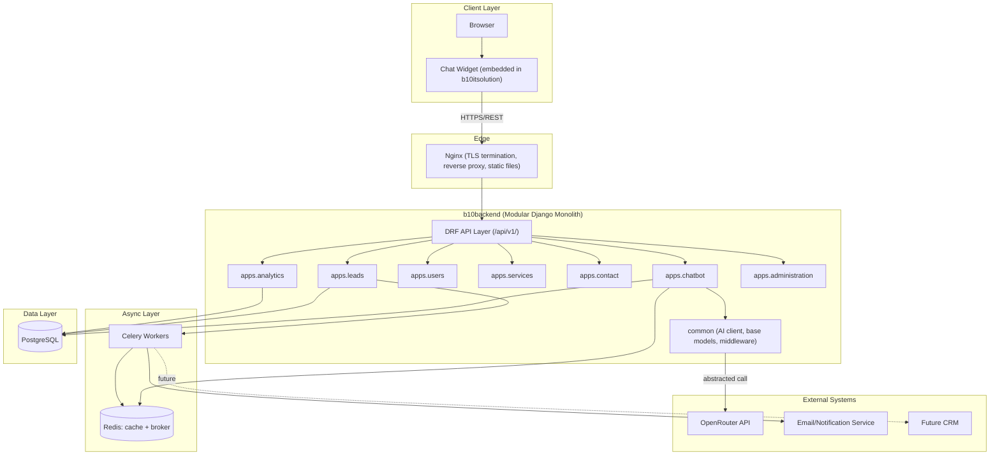

**Explanation:** All visitor interaction flows through the frontend widget, over HTTPS, through Nginx, into a single DRF API surface that routes into domain-owned Django apps. The chatbot module is the only one that talks to OpenRouter, and only through the shared `common` abstraction. Side effects (notifications, analytics events) are pushed to Celery so the synchronous chat request/response path stays fast.

---

# System Context Diagram

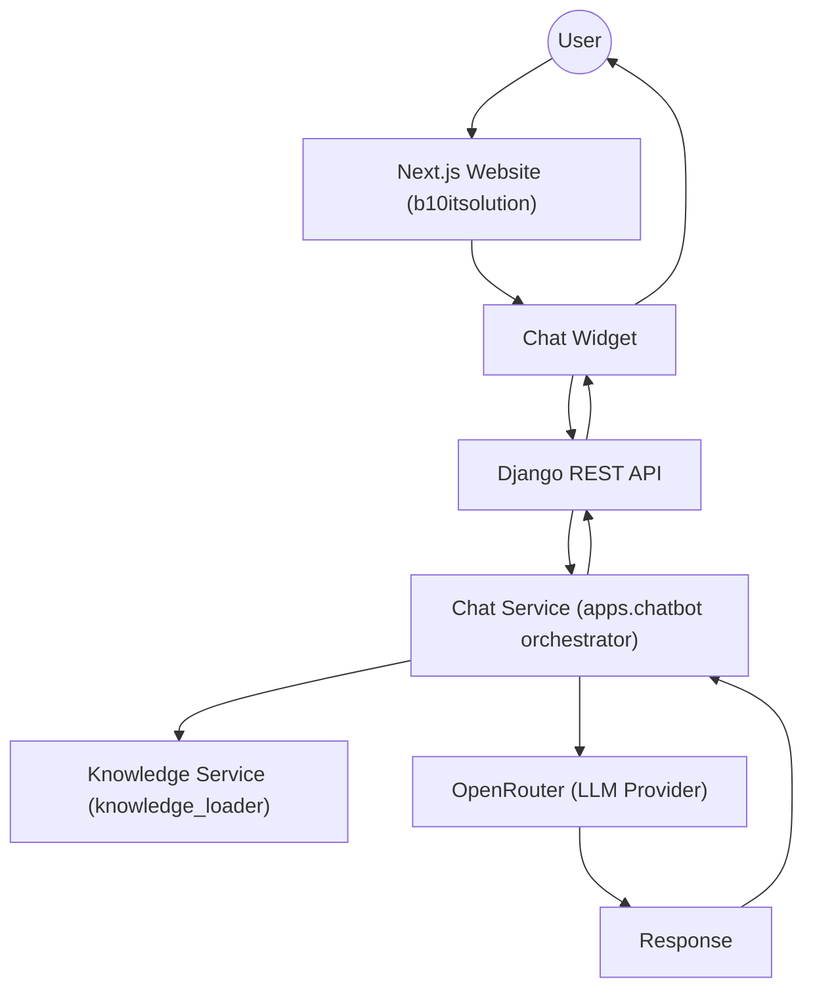

**Explanation:** This mirrors the mandated flow (User → Website → Widget → API → Chat Service → Knowledge Service → OpenRouter → Response). The Knowledge Service is consulted by the Chat Service before calling OpenRouter, supplying only the relevant, approved knowledge snippets needed for that turn (retrieval-scoped, not the full knowledge base). The response is returned back up the same chain to the user.

---

# Container Architecture

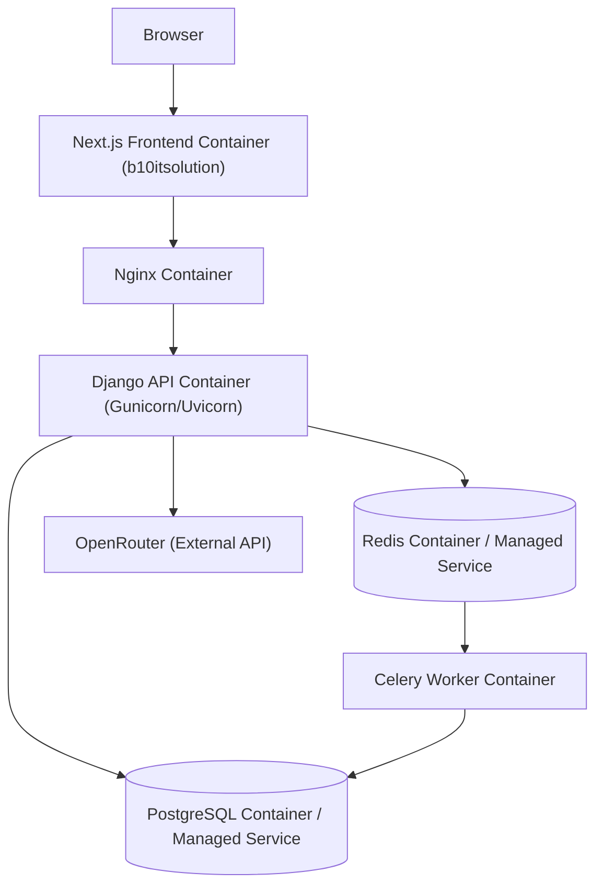

**Explanation:** This matches the mandated container flow (Browser → Next.js → Nginx → Django API → Redis → PostgreSQL → OpenRouter), with the Celery worker container added as a peer consumer of Redis (as broker) and PostgreSQL (for task-driven writes), since asynchronous processing is a first-class part of the container topology, not an afterthought.

| Container | Responsibility | Scaling Unit |
|---|---|---|
| Next.js Frontend | Renders website + chat widget | Scales independently via frontend hosting platform |
| Nginx | TLS termination, reverse proxy, static asset serving | Scales with load balancer or as a managed edge service |
| Django API | Serves all REST endpoints across all `apps/*` modules | Horizontally scaled, stateless |
| Redis | Cache + Celery broker + rate-limit counters | Vertically scaled or managed-service scaled |
| PostgreSQL | System of record for all domain data | Vertically scaled primary; read replicas in later phases |
| Celery Worker | Executes async tasks (notifications, analytics events, cost logging) | Horizontally scaled independently of API containers |
| OpenRouter | External LLM completion provider | Not controlled by us; mitigated via retry/fallback/circuit breaker |

---

# Component Architecture

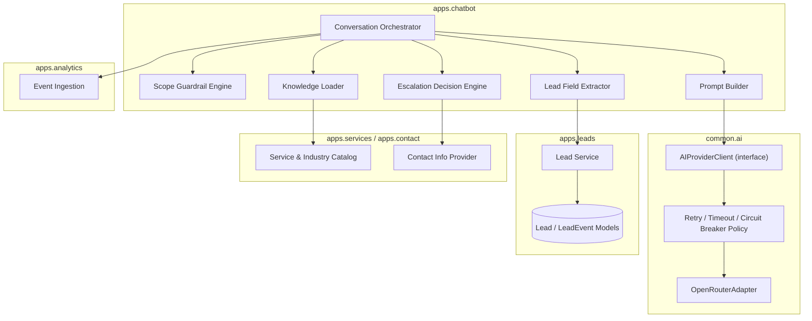

**Explanation:** The Conversation Orchestrator is the central coordinator of a single chat turn. It never calls OpenRouter directly — it delegates to `AIProviderClient`, which routes through a retry/circuit-breaker policy before reaching the `OpenRouterAdapter`. It never writes lead data directly — it delegates to `apps.leads`' `LeadService`. This keeps `apps.chatbot` focused purely on conversation orchestration and guardrails.

---

# Module Responsibilities

| Module | Responsibilities | Inputs | Outputs | Dependencies | Failure Scenarios | Scaling Considerations |
|---|---|---|---|---|---|---|
| `apps.chatbot` | Conversation orchestration, scope guardrails, prompt construction, response post-validation, escalation decisions | Visitor message, session context | Assistant response, lead-field signals, escalation signals | `common.ai`, `apps.leads`, `apps.services`, `apps.contact`, knowledge content | AI provider failure, guardrail false negative/positive, malformed input | Stateless; scales horizontally with API containers |
| `apps.leads` | Lead persistence, qualification status tracking, lead lifecycle events | Extracted lead fields from `apps.chatbot`, explicit contact-form submissions | Lead records, lead status changes, notification triggers | PostgreSQL, Celery (for notifications) | DB write failure, duplicate lead conflicts, notification task failure | Scales with API layer; DB write volume is low relative to read/chat volume |
| `apps.users` | Internal/admin user accounts and authentication (Phase 4+) | Admin credentials | Auth tokens/sessions | PostgreSQL | Auth failure, token expiry handling | Low volume; standard Django auth scaling |
| `apps.services` | Service and industry catalog, source of truth for offerings | Catalog CRUD (admin, future) | Structured service/industry data consumed by chatbot knowledge and website | PostgreSQL | Stale/incorrect catalog data | Read-heavy, cacheable |
| `apps.contact` | Static contact info, non-chat contact form submissions | Contact form submissions | Contact records, contact info API responses | PostgreSQL | Form spam/abuse | Low volume |
| `apps.analytics` | Event ingestion, funnel metrics, reporting | Events emitted by `apps.chatbot`/`apps.leads` via Celery | Aggregated metrics, dashboard data (future) | PostgreSQL, Celery | Event loss on Celery failure, aggregation errors | Write-heavy on events; may need dedicated queue/table partitioning at scale |
| `apps.administration` | Future admin dashboard APIs: content management, conversation review, RBAC | Admin actions | Content updates, moderation actions | `apps.users`, `apps.services`, `apps.chatbot` (read-only) | Unauthorized access if RBAC misconfigured | Low volume, internal-only traffic |
| `common.ai` | AI provider abstraction, retry/timeout/circuit-breaker policy | Prompt + parameters from `apps.chatbot` | Normalized `AIResponse` | OpenRouter API | Timeout, rate limit, malformed response, auth failure | Concurrency-bound by connection pool size; scales with API container count |
| `common` (shared) | Base models, middleware (request ID, rate limiting), permissions, pagination | N/A (infrastructure) | Shared utilities used by all apps | None (foundation layer) | Bugs here affect all modules — highest code-review scrutiny | N/A — imported, not deployed independently |

---

# Repository Architecture

```
b10backend/
├── backend/
│   ├── manage.py
│   ├── core/                     # settings, urls, wsgi/asgi, celery app
│   ├── apps/
│   │   ├── chatbot/
│   │   ├── leads/
│   │   ├── users/
│   │   ├── services/
│   │   ├── contact/
│   │   ├── analytics/
│   │   └── administration/
│   ├── common/                   # AI client, base models, middleware, permissions
│   ├── media/
│   └── static/
│
├── knowledge/
│   ├── company.json
│   ├── services.json
│   ├── industries.json
│   ├── technologies.json
│   ├── faq.json
│   ├── contact.json
│   └── prompts/                  # system prompt templates, versioned
│
├── docs/
│   ├── PRD.md
│   ├── TRD.md
│   ├── SYSTEM_ARCHITECTURE.md
│   └── adr/
│
├── requirements/
│   ├── base.txt
│   ├── local.txt
│   ├── staging.txt
│   └── production.txt
│
├── scripts/
├── deployments/
│   ├── docker/
│   └── ci/
│
└── tests/
    ├── integration/
    └── e2e/
```

**Design decision:** `knowledge/prompts/` is called out explicitly as its own directory — system prompt templates are versioned artifacts, reviewed like code, but kept separate from `apps/chatbot` source so prompt iteration doesn't require touching orchestration logic.

---

# Django Project Architecture

| Layer | Responsibility |
|---|---|
| `core/` | Project-wide settings (split per environment), root URL configuration, WSGI/ASGI entrypoints, Celery app bootstrap. |
| `apps/*` | Domain-bounded applications; each is independently testable and independently ownable by a team member. |
| `common/` | Infrastructure shared across domains: AI provider abstraction, base model classes (UUID PK, timestamps, soft delete), custom middleware, shared DRF permissions/pagination. |
| `knowledge/` | MVP-phase knowledge content, consumed exclusively through `apps.chatbot.services.knowledge_loader`. |

**Settings strategy:** `base.py` → environment-specific overrides (`local.py`, `staging.py`, `production.py`), selected via `DJANGO_SETTINGS_MODULE`. All secrets sourced from environment variables; no environment-specific values committed to source control.

---

# Chatbot Architecture

## Responsibilities, Inputs, Outputs

| Component | Responsibilities | Inputs | Outputs | Dependencies | Failure Scenarios | Scaling Considerations |
|---|---|---|---|---|---|---|
| Conversation Orchestrator | Coordinates a full chat turn end-to-end | Visitor message, session ID, conversation history | Final assistant response payload | ScopeGuard, KnowledgeLoader, PromptBuilder, AIClient, LeadExtractor, Escalation Engine | Any downstream component failure must resolve to a graceful fallback, never an unhandled exception | Stateless per request; scales with API container count |
| Scope Guardrail Engine | Pre-filters obviously off-topic input; post-validates AI output against scope rules | Raw message (pre) / AI response (post) | Allow/Deny decision + reason code | Lightweight classifier (rule-based or small model call) | False positive (blocks valid query) / false negative (allows off-topic) | Cheap, fast; can run inline without materially affecting latency |
| Knowledge Loader | Loads and caches company/service/industry/FAQ content | Query context (topic/intent) | Relevant knowledge snippets | `knowledge/*.json` (MVP) or DB (Phase 3+) | Stale cache, missing knowledge file | Cached in Redis; near-zero marginal cost per request |
| Prompt Builder | Assembles system prompt + retrieved knowledge + windowed history | Knowledge snippets, conversation history, guardrail instructions | Final prompt payload for AI call | Knowledge Loader, prompt templates in `knowledge/prompts/` | Prompt exceeding token budget | Prompt size capped via history windowing and retrieval scoping |
| Lead Field Extractor | Detects and extracts qualification fields from conversation | Conversation history/state | Structured field dict (name, email, industry, etc.) | None external (pure logic + optional lightweight LLM call) | Misextraction/false field values | Runs per-turn; lightweight |
| Escalation Decision Engine | Determines whether/how to escalate to a human | Conversation state, guardrail signals, explicit visitor requests | Escalation payload (contact options) or none | Contact Info Provider (`apps.contact`) | Missed escalation trigger | Rule-based; negligible cost |

## Guardrail Enforcement Flow

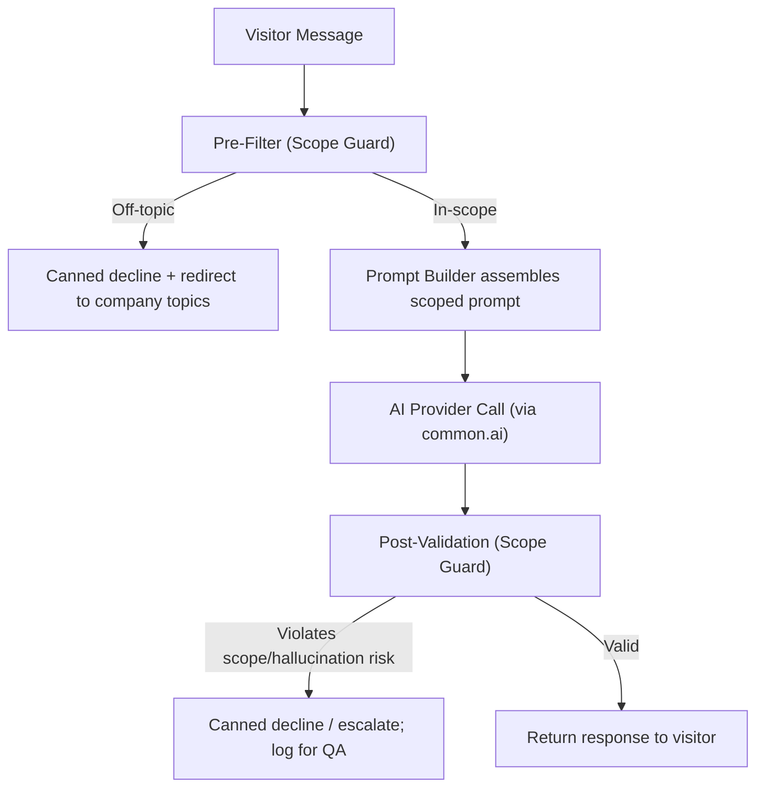

**Explanation:** Scope enforcement happens twice — before the AI call (cheap filtering, cost/latency savings, catches obvious off-topic input) and after the AI call (catches cases where the model itself drifts despite instructions). This defense-in-depth approach reflects the zero-tolerance guardrail requirement: prompting alone is not treated as sufficient.

---

# Knowledge Architecture

| Phase | Storage | Update Mechanism | Consumer Interface |
|---|---|---|---|
| Phase 1 (MVP) | `knowledge/*.json` static files | Code deploy (PR + release) | `knowledge_loader.get_company_info()`, `.get_services()`, `.get_industries()`, `.get_faq()`, `.get_contact_info()` |
| Phase 3 | PostgreSQL-backed `KnowledgeEntry`, `ServiceEntry`, `IndustryEntry`, `FAQEntry` models with versioning | Django admin / internal API, no deploy required | Same interface, DB-backed implementation |
| Phase 4 | Same DB models, exposed via `apps.administration` dashboard with draft/publish workflow | Non-technical content manager via dashboard UI | Same interface |

**Design decision:** The consumer interface in `apps.chatbot` never changes across phases — only the implementation behind `knowledge_loader` changes. This is the single most important seam for future extensibility of the knowledge system.

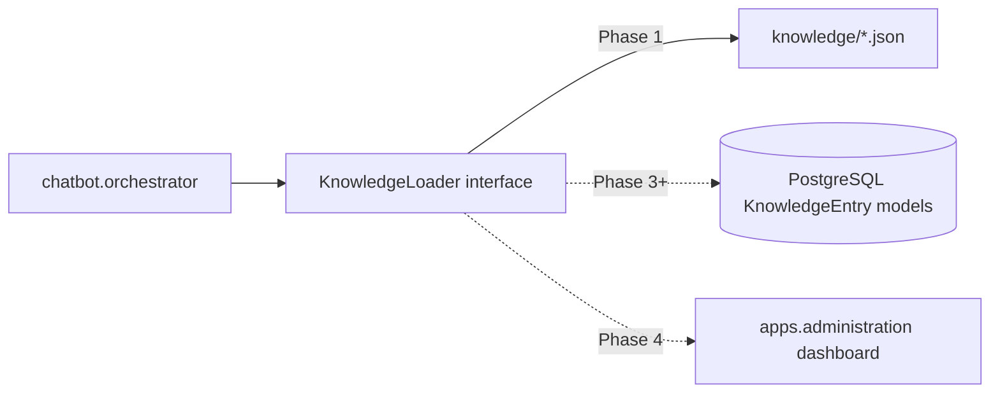

---

# Lead Management Architecture

| Component | Responsibilities | Inputs | Outputs | Dependencies | Failure Scenarios | Scaling Considerations |
|---|---|---|---|---|---|---|
| Lead Service | Upserts lead records, tracks qualification status, appends lead events | Extracted fields from `apps.chatbot`, direct contact form submissions | Lead record, status transitions | PostgreSQL | Write conflict on concurrent updates to same session's lead | Low write volume relative to chat traffic; standard DB scaling |
| Lead Model | Stores lead attributes (name, company, email, phone, industry, project type, budget, timeline, requirements, status) | N/A | Queryable lead records | PostgreSQL | Schema drift if fields change without migration discipline | Indexed on `status` and `email` for fast lookups |
| Lead Event Model | Append-only audit trail of field updates, escalation triggers, notification sends | Lead Service writes | Chronological event history per lead | PostgreSQL | Event volume growth over time | Indexed on `(lead_id, created_at)`; partition-candidate at high scale (Phase 5+) |
| Notification Task | Sends sales notification when lead reaches `qualified` status or escalation occurs | Lead ID / session ID | Email/notification delivery | Celery, Email/Notification Service | Delivery failure, service outage | Retried with backoff; dead-letter logged on exhaustion |

**Status lifecycle:** `partial` → `qualified` → (`escalated` and/or) → `converted` / `abandoned`. Transitions are recorded as `LEAD_EVENT` entries, not just overwritten fields, to preserve a full audit trail for future analytics and CRM sync.

---

# OpenRouter Integration Architecture

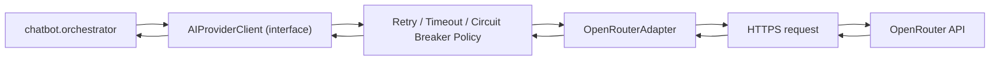

| Concern | Strategy |
|---|---|
| Model abstraction | `AIProviderClient` interface; no OpenRouter-specific types leak outside `common/ai/` |
| Model switching | Model ID is a config value (`OPENROUTER_MODEL`); fallback chain (`OPENROUTER_MODEL_FALLBACK_CHAIN`) tried in order on failure |
| Retry mechanism | Exponential backoff with jitter, max 2 retries, only on transient errors (timeout, 5xx, connection error) |
| Timeout mechanism | 8s timeout for standard completions; 3s for lightweight scope-classification calls |
| Cost monitoring | Token usage logged per call; aggregated via `apps.analytics`; alert thresholds on anomalous spend |
| Failure recovery | Circuit breaker short-circuits to fallback response during sustained provider degradation; periodic health probes for recovery |
| Vendor lock-in avoidance | Any provider implementing `AIProviderClient` (e.g., a future `AnthropicAdapter`) can replace `OpenRouterAdapter` via configuration, with zero changes to `apps.chatbot` |

---

# Future Administration Architecture

Reserved as `apps.administration`, activated in Phase 4. Planned responsibilities:

- Content management UI/API for `knowledge/` data (Phase 3 DB-backed models).
- Conversation review and QA tooling (view transcripts, flag guardrail violations).
- Lead pipeline visibility (read access into `apps.leads`).
- Role-based access control via `apps.users` (admin, content manager, sales viewer roles).

**Boundary rule:** `apps.administration` may read from other modules' service layers but must not own or duplicate their data models. It is a presentation/control-plane layer, not a data-owning module.

---

# Future Analytics Architecture

Reserved as `apps.analytics`, activated in Phase 5, but event emission begins in MVP so no retrofitting is required.

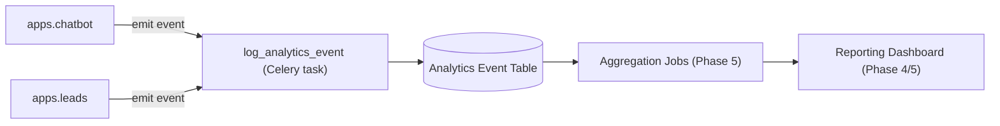

**Design decision:** Event emission is async (Celery) from day one so the synchronous chat path never depends on the analytics module. This also means Phase 5 can build aggregation and reporting purely on top of already-flowing historical event data.

---

# Request Lifecycle

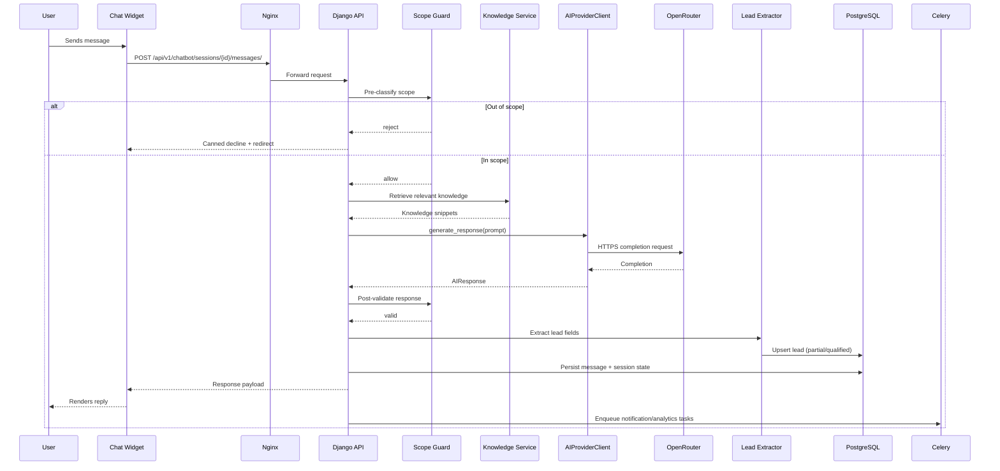

---

# Data Flow Diagrams

## Chat Message Data Flow

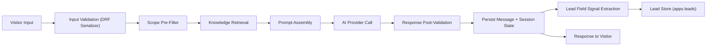

## Lead Data Flow

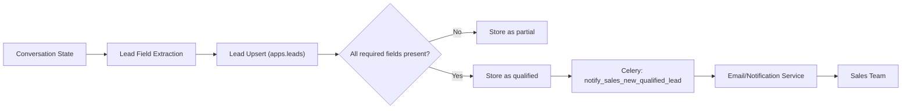

---

# Sequence Diagrams

## Chat Request Sequence

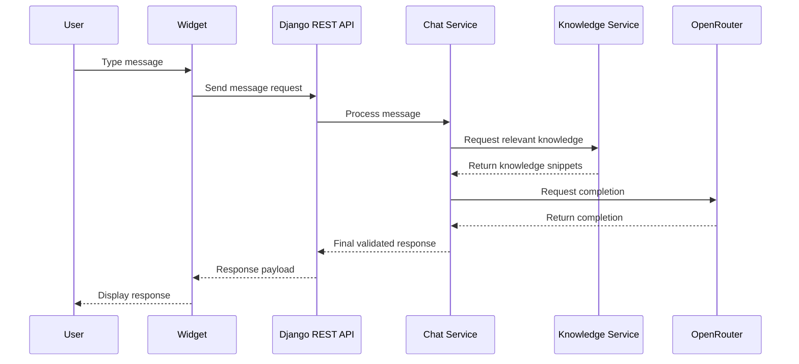

## Lead Capture Sequence

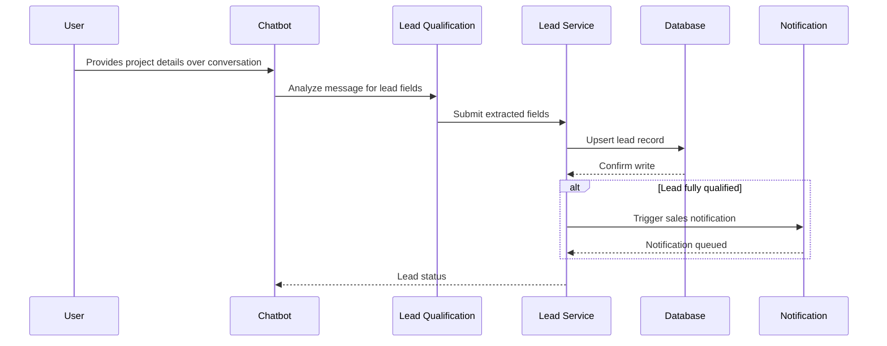

---

# Failure Flows

## OpenRouter Failure Handling

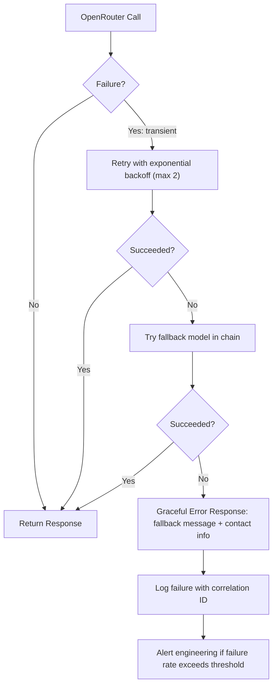

**Explanation:** This matches the mandated flow (OpenRouter Failure → Retry → Fallback → Graceful Error Response), extended with a fallback model chain step and explicit alerting, since silent degradation is treated as unacceptable for this product's reliability bar.

## Database Failure Handling

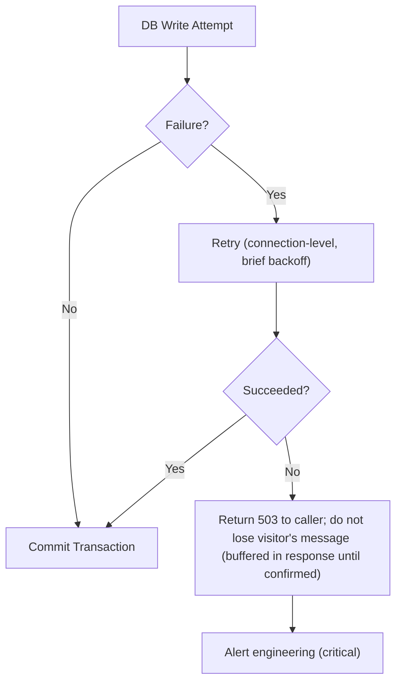

---

# Security Architecture

| Area | Control |
|---|---|
| API key management | Secrets in environment variables / managed secret store; never in code or logs |
| Prompt injection protection | Structural separation of system prompt and user input; user input never concatenated into instruction context; post-response validation catches successful injection attempts |
| Jailbreak prevention | Pre-filter + hardened system prompt + post-validation, defense-in-depth (see Chatbot Architecture) |
| Input validation | DRF serializers validate type, length, and format on every endpoint; message length capped |
| Rate limiting | Per-IP and per-session throttling on message and session-creation endpoints (Redis-backed) |
| Abuse prevention | Anomaly detection on session/message velocity; escalation to challenge mechanisms reserved as future hardening |
| Authentication | Anonymous, session-scoped tokens for visitors; Django/JWT auth with RBAC for internal admin users (Phase 4+) |
| Authorization | Module-level access boundaries enforced via DRF permissions; admin endpoints require role checks |
| CORS | Strict allow-list of known frontend origins; no wildcards in production |
| CSRF | Enabled for cookie-authenticated endpoints; token-based chatbot API uses verified equivalent protection |
| Database security | Least-privilege DB user, encrypted connections, no public exposure, automated backups |
| Dependency security | Automated vulnerability scanning in CI (e.g., Dependabot/pip-audit) |
| PII handling | No plaintext PII in general logs; redaction/masking applied; lead PII accessible only via authenticated `apps.leads` data path |

---

# Logging Architecture

- **Format:** Structured JSON logs across all services (Django app, Celery workers).
- **Correlation:** Every inbound request receives a `request_id`, propagated through logs, AI calls, and any Celery tasks triggered by that request, enabling full request tracing.
- **Levels:** `DEBUG` (local only) / `INFO` (lifecycle milestones) / `WARNING` (guardrail refusals, retries) / `ERROR` (unhandled failures, exhausted fallbacks) / `CRITICAL` (auth/config failures).
- **AI-specific fields logged per call:** model used, prompt tokens, completion tokens, latency, guardrail decision, fallback triggered (boolean).
- **PII discipline:** Name/email/phone are redacted or excluded from general logs; full lead content lives only in the `apps.leads` data store behind authenticated access.

---

# Monitoring Architecture

| Capability | Approach |
|---|---|
| Error monitoring | Centralized error tracking (e.g., Sentry) across Django and Celery, with request-context capture |
| Metrics | Request counts, latency histograms, error rates, AI call success/failure rates exported to a metrics backend |
| Health checks | `/api/v1/health/` verifies DB, Redis, and AI provider reachability; used for load balancer liveness/readiness |
| AI monitoring | Dedicated visibility into per-model request volume, latency percentiles, fallback trigger rate, guardrail refusal rate |
| Cost monitoring | Token usage aggregated daily/weekly per model, with alert thresholds for anomalous spend |
| Business monitoring | Conversation volume, qualification completion rate, escalation rate — surfaced to `apps.analytics` consumers |

---

# Deployment Architecture

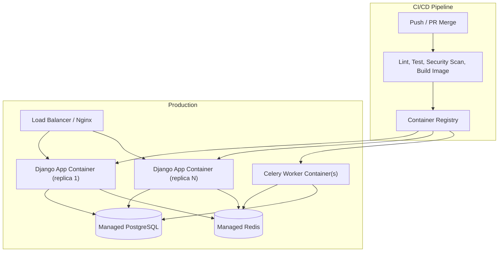

- Immutable image promotion: build once in CI, promote the same artifact through staging → production.
- Rolling deploys gated by `/api/v1/health/` checks — no traffic cutover to unhealthy containers.
- Database migrations run as an explicit CI/CD step preceding traffic cutover to new containers.

---

# Scaling Strategy

| Layer | Strategy |
|---|---|
| Django API containers | Stateless; horizontal scaling behind the load balancer as traffic grows |
| Celery workers | Scaled independently of API containers; separable queues (e.g., notifications vs. analytics) to isolate slow tasks |
| PostgreSQL | Single primary at MVP scale; read replicas introduced when analytics/reporting read load grows |
| Redis | Managed service scaling; primarily absorbs read pressure on catalog/knowledge data and Celery broker load |
| AI provider calls | Connection pooling/async HTTP client to prevent thread starvation under concurrent load; circuit breaker isolates provider degradation from cascading into the app layer |
| Knowledge retrieval | Cached in Redis; near-constant cost regardless of chat volume growth |

---

# High Availability Considerations

- Multiple Django API container replicas behind a load balancer eliminate single points of failure at the app layer.
- Managed PostgreSQL and Redis services provide built-in failover mechanisms (per provider SLAs).
- Circuit breaker and fallback-model chain reduce chatbot unavailability risk during partial OpenRouter degradation.
- Celery task retries with dead-letter logging prevent silent loss of notification/analytics side effects during transient worker or broker issues.
- Single-region deployment is the accepted MVP posture; multi-region HA is deferred (see Future Evolution Strategy).

---

# Disaster Recovery Considerations

| Risk | Mitigation |
|---|---|
| PostgreSQL data loss | Automated backups with point-in-time recovery; periodic restore testing |
| Redis data loss | No critical data stored in Redis; worst case is cache warm-up and in-flight task replay |
| OpenRouter outage | Retry, fallback model chain, circuit breaker, graceful degradation to contact-info message |
| Application container crash | Load balancer health checks + auto-restart via container orchestrator |
| Secret compromise | Managed secret store with rotation; immediate rotation + audit on suspected compromise |
| Full region outage | Out of scope for MVP; documented as a post-Phase-5 maturity item |

---

# Future Evolution Strategy

| Direction | Trigger | Architectural Readiness |
|---|---|---|
| Extract `apps.chatbot` into an independent service | Chat traffic scale significantly outpaces other modules | Module is already self-contained (models, services, tasks, tests); interfaces to `common.ai` and `apps.leads` are the only extraction seams to formalize |
| Introduce a vector database for knowledge retrieval | Knowledge base grows beyond effective keyword/structured retrieval | `knowledge_loader` interface is retrieval-agnostic; a vector-backed implementation can replace the file/DB-backed one without touching `apps.chatbot` orchestration |
| Multi-region deployment | Traffic/latency requirements demand geographic distribution | Stateless app layer and externalized state (Postgres/Redis) are prerequisites already in place; requires DB replication strategy and routing layer |
| Swap or add LLM providers | Cost, capability, or availability reasons | `AIProviderClient` interface isolates provider specifics to `common/ai/`; new adapter implementation is the only required change |
| CRM integration | Sales process matures beyond manual lead handling | `LEAD_EVENT` audit trail and Celery infrastructure already provide the integration point |
| Multi-language support | Business expands to non-English markets | `knowledge_loader` and `prompt_builder` can accept a locale parameter without restructuring |

---

# Architectural Decisions

## ADR-001: Modular Monolith over Microservices for MVP
**Decision:** Single Django deployable with strict internal module boundaries.
**Rationale:** Matches team size/velocity at this stage; boundaries are drawn to permit later extraction.
**Status:** Accepted.

## ADR-002: All AI Access via Provider Abstraction
**Decision:** `AIProviderClient` interface, initially implemented by `OpenRouterAdapter`.
**Rationale:** Prevents vendor lock-in; enables provider/model switching via configuration.
**Status:** Accepted.

## ADR-003: Knowledge Treated as Versioned Data, Not Hardcoded Logic
**Decision:** Company/service/industry/FAQ content lives outside `apps.chatbot` business logic, in `knowledge/` (MVP) migrating to DB-backed models (Phase 3+).
**Rationale:** Enables content updates without code deploys long-term; keeps orchestration logic stable across content churn.
**Status:** Accepted.

## ADR-004: Guardrails Enforced in Code, Not Prompt-Only
**Decision:** Deterministic pre-filter and post-response validation wrap every AI call, in addition to system-prompt instructions.
**Rationale:** The product's zero-tolerance scope policy cannot rely on prompt compliance alone.
**Status:** Accepted.

## ADR-005: Synchronous Chat Path, Asynchronous Side Effects
**Decision:** Visitor-facing request/response is fully synchronous; notifications and analytics events are deferred to Celery.
**Rationale:** Predictable latency for the user; side effects should never block or risk the primary interaction.
**Status:** Accepted.

## ADR-006: Append-Only Lead Event Log Alongside Mutable Lead Record
**Decision:** `LEAD_EVENT` records every state change; `LEAD` holds current state only.
**Rationale:** Preserves audit trail required for future analytics and CRM sync reliability.
**Status:** Accepted.

---

# Assumptions

- The frontend (`b10itsolution`) communicates with `b10backend` exclusively over versioned REST APIs.
- OpenRouter provides acceptable latency/uptime for a synchronous chat use case at current expected traffic levels.
- PostgreSQL and Redis are managed services in staging/production, not self-hosted alongside the application.
- A single-region deployment is acceptable through at least Phase 5.
- Knowledge content starts as static JSON and is expected to migrate to DB-backed storage by Phase 3.
- Traffic volume at MVP launch is startup/SME scale, not requiring day-one multi-region or read-replica infrastructure.

---

# Risks

| ID | Risk | Impact | Likelihood | Mitigation |
|---|---|---|---|---|
| AR-1 | OpenRouter outage or latency spike degrading chat availability | High | Medium | Retry, fallback model chain, circuit breaker, provider abstraction for emergency switch |
| AR-2 | Prompt injection/jailbreak bypassing scope guardrails | High | Medium | Defense-in-depth guardrail architecture, adversarial testing, QA review of flagged conversations |
| AR-3 | Module boundary erosion as new apps are added | Medium | Medium | Enforced module responsibility table, code review discipline, ADR process for boundary-crossing changes |
| AR-4 | Unbounded token/cost growth from long conversation histories | Medium | Medium | History windowing, retrieval-scoped prompting, cost monitoring/alerting |
| AR-5 | PII exposure via logs, cache, or misconfigured access | High | Low-Medium | PII redaction, least-privilege DB access, secret manager, security review |
| AR-6 | Celery backlog delaying lead notifications | Medium | Low | Queue depth monitoring, dedicated queues, retry/dead-letter handling |
| AR-7 | Knowledge content drift from real company offerings (static JSON phase) | Medium | Medium | Defined content review cadence pre-Phase 3 |
| AR-8 | Single-region deployment risk | Medium | Low | Documented as accepted MVP risk; revisited post-Phase 5 |

---

# Open Questions

| # | Question | Owner |
|---|---|---|
| 1 | Which OpenRouter model(s) are designated primary vs. fallback at launch? | Engineering / AI |
| 2 | What concurrent-session load should MVP infrastructure be sized for? | Product / Engineering |
| 3 | Which managed PostgreSQL/Redis providers will be used in staging and production? | DevOps |
| 4 | What email/notification service handles lead and escalation alerts pre-CRM integration? | Engineering / Sales |
| 5 | Is a vector database needed at launch, or does structured/keyword retrieval suffice through Phase 3? | Engineering / AI |
| 6 | What is the data retention policy for conversation transcripts, and does it differ by lead status? | Legal / Product |
| 7 | Will staging use a separate, spend-capped OpenRouter key to control testing cost? | Engineering / Finance |

---

# Appendix

## A. Future Architecture (Target State)

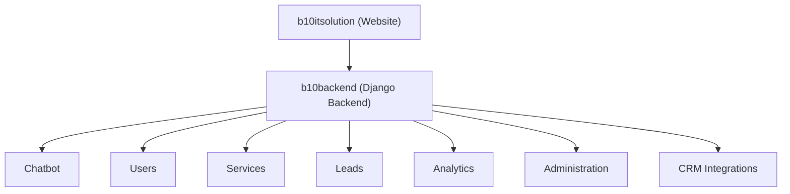

**Explanation:** This is the target-state module map referenced throughout this document. Every module described here already has a defined boundary, responsibility, and integration seam in the MVP architecture — Phases 2 through 6 activate and extend these modules rather than introducing structural change.

## B. Technology Stack Summary

| Layer | Technology |
|---|---|
| Frontend | Next.js, React, TypeScript, TailwindCSS |
| Backend Framework | Django, Django REST Framework |
| Database | PostgreSQL |
| Cache / Broker | Redis |
| Async Processing | Celery |
| Containerization | Docker |
| Reverse Proxy | Nginx |
| LLM Access | OpenRouter API |
| Optional Future | Vector Database, Object Storage, Message Queue, Monitoring Stack |

## C. Knowledge File Layout Reference

```
knowledge/
├── company.json
├── services.json
├── industries.json
├── technologies.json
├── faq.json
├── contact.json
└── prompts/
    ├── system_prompt_v1.md
    └── scope_classifier_prompt_v1.md
```

## D. Health Check Response (Illustrative)

```json
{
  "status": "ok",
  "checks": {
    "database": "ok",
    "redis": "ok",
    "ai_provider": "ok"
  },
  "timestamp": "2026-07-03T10:00:00Z"
}
```

---

*End of Document*
