# B10 AI Assistant — Technical Requirements Document

---

# Document Information

| Field | Value |
|---|---|
| Document Title | B10 AI Assistant — Technical Requirements Document |
| Project Name | B10 AI Assistant |
| Company | B10 IT Solution |
| Frontend Repository | `b10itsolution` (Next.js / React / TypeScript / TailwindCSS) |
| Backend Repository | `b10backend` (currently empty — this document defines its architecture) |
| Document Owner | Engineering |
| Document Status | Draft v1.0 |
| Intended Audience | Backend Engineers, AI Engineers, DevOps, Future Team Members, Technical Leadership |
| Companion Document | B10 AI Assistant — Product Requirements Document (PRD.md) |

---

# Executive Summary

This document specifies the technical architecture for the B10 AI Assistant backend, to be built inside the currently empty `b10backend` repository. The backend will be a **modular Django monolith** built with Django REST Framework, PostgreSQL, Redis, Celery, and Docker, serving both the AI chatbot and — over time — the main website backend, admin dashboard APIs, analytics APIs, and CRM integrations.

The chatbot is architected as an isolated Django app (`apps/chatbot`) with a clean separation between **business logic** (conversation orchestration, lead qualification, escalation rules) and **knowledge content** (company/service/industry/FAQ data stored as structured JSON, later migrating to a database-backed knowledge system in Phase 3). LLM access is routed through **OpenRouter** behind a provider-agnostic abstraction layer, so the underlying model or provider can change with minimal code impact.

This document defines system architecture, component boundaries, request lifecycles, data flow, security posture, observability, performance targets, and deployment strategy, with the explicit goal of avoiding architectural collisions as the repository grows beyond the chatbot into a full backend platform.

---

# System Objectives

| ID | Objective |
|---|---|
| SO-1 | Provide a reliable, low-latency API backend for the domain-restricted B10 AI Assistant. |
| SO-2 | House the chatbot as an isolated module within a shared backend that will eventually serve the full website and internal tools. |
| SO-3 | Abstract LLM provider access to avoid vendor lock-in to OpenRouter or any single model. |
| SO-4 | Enforce strict scope, safety, and guardrail behavior at the application layer, not only via prompting. |
| SO-5 | Capture and persist qualified lead data reliably, with a clear path to CRM integration. |
| SO-6 | Establish a foundation for future modules (leads, analytics, admin dashboard, CRM) without requiring rearchitecture. |
| SO-7 | Meet production-grade standards for security, observability, and scalability from day one, even at MVP scope. |

---

# Technical Goals

- Modular monolith over microservices for MVP: lower operational overhead, faster iteration, single deployable unit, with clear internal module boundaries that permit future extraction into services if needed.
- Clean separation of **knowledge** (data) from **behavior** (code) so non-engineers can eventually update chatbot knowledge (Phase 3/4) without code deployments.
- Provider-agnostic AI integration layer — no direct, scattered calls to OpenRouter from business logic.
- All conversation state, lead data, and logs persisted in PostgreSQL; Redis used for caching and Celery broker duties, not as a system of record.
- Async-first for anything that can be deferred (email notifications, analytics event processing, CRM sync in future phases) via Celery.
- Everything containerized (Docker) from day one; environment parity between local, staging, and production.
- Every external call (LLM, email, future CRM) wrapped with timeout, retry, and fallback handling — no unbounded blocking calls.

---

# Architecture Principles

1. **Isolation by domain, not by technical layer.** Each Django app under `apps/` owns a business domain (chatbot, leads, users, contact, services, analytics, administration) end-to-end (models, serializers, views, services), not split across cross-cutting technical folders.
2. **Knowledge/content separate from logic.** The chatbot's factual knowledge (company info, services, industries, FAQ) is data, versionable and editable independently of conversation orchestration code.
3. **Provider abstraction over direct SDK usage.** No app code calls the OpenRouter SDK/HTTP API directly — all calls go through an internal `AIProviderClient` interface.
4. **Fail safe, not silent.** Every external dependency failure (LLM timeout, DB hiccup, Redis outage) results in a defined fallback behavior, never an unhandled exception surfaced to the visitor.
5. **Guardrails are enforced in code, not just in prompts.** Scope restriction, PII field validation, and escalation triggers are implemented as deterministic logic layered around the LLM, not left entirely to model behavior.
6. **Everything is observable.** Every request, AI call, and guardrail decision is logged with a traceable correlation ID.
7. **Design for extraction.** Module boundaries are drawn so that, if scale eventually demands it, `chatbot` or `analytics` could be extracted into an independent service with minimal refactor.

---

# Assumptions

- The frontend (`b10itsolution`, Next.js) will consume the backend exclusively via REST APIs over HTTPS; no server-side rendering calls directly into Django internals.
- OpenRouter provides access to the selected LLM(s) with acceptable latency and uptime for a synchronous chat-response use case.
- Initial traffic volume is moderate (startup/SME scale); architecture should comfortably handle growth to mid-market scale without redesign.
- PostgreSQL and Redis will be hosted as managed services in production (e.g., managed Postgres, managed Redis) rather than self-managed on the same host as the application.
- A single Django monolith is acceptable for the foreseeable roadmap (through at least Phase 4–5); microservice extraction is a future option, not an MVP requirement.
- The knowledge base (company/services/industries/FAQ) will start as static JSON fixtures and migrate to database-backed, admin-editable content in Phase 3.

---

# Constraints

- The `b10backend` repository must be structured to eventually host the main website backend, admin dashboard, analytics, and CRM integration — the chatbot cannot be built as if it will be the only module forever.
- Must use Django + Django REST Framework, PostgreSQL, Redis, Celery, Docker, Nginx as specified.
- Must use OpenRouter as the LLM access layer, with an abstraction that limits vendor lock-in.
- No conversational data may be used to answer questions outside the approved knowledge domain, regardless of model capability.
- Must support containerized local development to match production environment.

---

# High Level Architecture

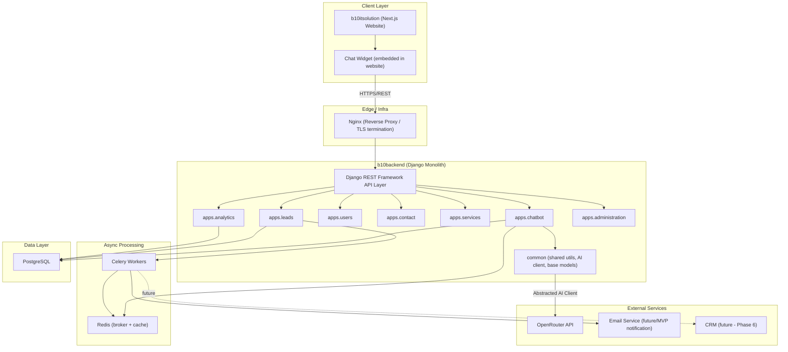

---

# System Context Diagram

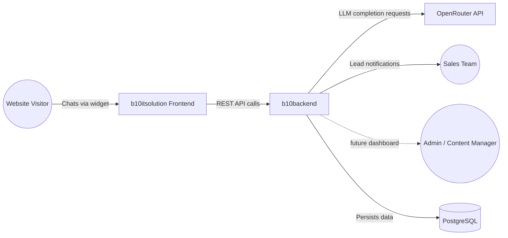

**Actors:**

| Actor | Interaction |
|---|---|
| Website Visitor | Interacts with chat widget on the public website |
| Sales Team | Receives qualified lead notifications; consumes leads (manually in MVP, via dashboard/CRM later) |
| Admin/Content Manager | Manages chatbot knowledge content (Phase 3+ via dashboard; manual JSON/DB updates in MVP) |
| OpenRouter | External LLM provider used for generating chatbot responses |

---

# Container Diagram

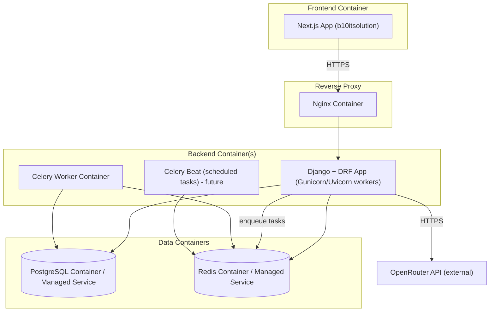

---

# Component Diagram

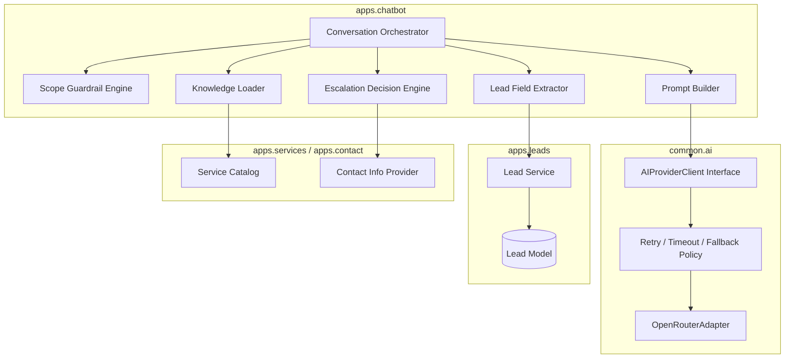

---

# Repository Architecture

```
b10backend/
├── backend/
│   ├── manage.py
│   ├── core/
│   │   ├── settings/
│   │   │   ├── base.py
│   │   │   ├── local.py
│   │   │   ├── staging.py
│   │   │   └── production.py
│   │   ├── urls.py
│   │   ├── wsgi.py
│   │   ├── asgi.py
│   │   └── celery.py
│   │
│   ├── apps/
│   │   ├── chatbot/
│   │   │   ├── models.py
│   │   │   ├── serializers.py
│   │   │   ├── views.py
│   │   │   ├── urls.py
│   │   │   ├── services/
│   │   │   │   ├── orchestrator.py
│   │   │   │   ├── scope_guard.py
│   │   │   │   ├── lead_extractor.py
│   │   │   │   ├── escalation.py
│   │   │   │   ├── prompt_builder.py
│   │   │   │   └── knowledge_loader.py
│   │   │   ├── tasks.py
│   │   │   ├── tests/
│   │   │   └── apps.py
│   │   │
│   │   ├── leads/
│   │   │   ├── models.py
│   │   │   ├── serializers.py
│   │   │   ├── views.py
│   │   │   ├── urls.py
│   │   │   ├── services/
│   │   │   ├── tasks.py
│   │   │   └── tests/
│   │   │
│   │   ├── users/
│   │   │   ├── models.py
│   │   │   ├── serializers.py
│   │   │   ├── views.py
│   │   │   └── urls.py
│   │   │
│   │   ├── contact/
│   │   │   ├── models.py
│   │   │   ├── views.py
│   │   │   └── urls.py
│   │   │
│   │   ├── services/
│   │   │   ├── models.py
│   │   │   ├── views.py
│   │   │   └── urls.py
│   │   │
│   │   ├── analytics/
│   │   │   ├── models.py
│   │   │   ├── services/
│   │   │   ├── views.py
│   │   │   └── urls.py
│   │   │
│   │   └── administration/
│   │       ├── models.py
│   │       ├── views.py
│   │       └── urls.py
│   │
│   ├── common/
│   │   ├── ai/
│   │   │   ├── client.py            # AIProviderClient interface
│   │   │   ├── openrouter_adapter.py
│   │   │   ├── retry_policy.py
│   │   │   └── exceptions.py
│   │   ├── models.py                # BaseModel (timestamps, UUID pk, soft delete)
│   │   ├── permissions.py
│   │   ├── pagination.py
│   │   ├── exceptions.py
│   │   ├── middleware/
│   │   │   ├── request_id.py
│   │   │   └── rate_limit.py
│   │   └── utils/
│   │
│   ├── media/
│   └── static/
│
├── knowledge/
│   ├── company.json
│   ├── services.json
│   ├── industries.json
│   ├── faq.json
│   ├── technologies.json
│   └── contact.json
│
├── docs/
│   ├── PRD.md
│   ├── TRD.md
│   └── adr/                          # Architectural Decision Records
│
├── requirements/
│   ├── base.txt
│   ├── local.txt
│   ├── staging.txt
│   └── production.txt
│
├── scripts/
│   ├── entrypoint.sh
│   ├── wait_for_db.sh
│   └── seed_knowledge.py
│
├── deployments/
│   ├── docker/
│   │   ├── Dockerfile
│   │   ├── docker-compose.yml
│   │   └── nginx/
│   │       └── nginx.conf
│   └── ci/
│       └── github-actions.yml
│
└── tests/
    ├── integration/
    └── e2e/
```

**Rationale:** `apps/chatbot` is fully self-contained (models, services, tasks, tests) so it can evolve, be load-tested, or even be extracted into a separate service later without untangling shared code. `common/ai` is the only place aware of OpenRouter specifics — all apps interact with AI capability through `AIProviderClient`, never the adapter directly.

---

# Django Project Architecture

| Layer | Responsibility |
|---|---|
| `core/` | Django project configuration: settings (split by environment), root URL conf, WSGI/ASGI entrypoints, Celery app definition. |
| `apps/*` | Domain-bounded Django apps. Each owns its models, serializers, views, URLs, internal services, and tests. |
| `common/` | Cross-cutting code shared across apps: AI provider abstraction, base models, custom middleware, shared permissions/pagination/exceptions. |
| `knowledge/` | MVP-phase static knowledge content (JSON) consumed by `apps.chatbot`. Migrates to DB-backed models in Phase 3, at which point this directory becomes seed/fixture data only. |
| `deployments/` | Docker, Nginx, and CI/CD configuration, kept out of application code. |

**Settings strategy:** `core/settings/base.py` holds shared settings; `local.py`, `staging.py`, `production.py` override/extend per environment via `DJANGO_SETTINGS_MODULE`. Secrets are never hardcoded in any settings file — all sourced from environment variables (see Configuration Management).

---

# Application Boundaries

| App | Owns | Must Not Do |
|---|---|---|
| `chatbot` | Conversation sessions, message history, scope guardrails, prompt construction, AI call orchestration, escalation decisions | Must not directly define lead data schema — delegates to `leads` |
| `leads` | Lead records, qualification status, field validation, lead lifecycle, notification triggers | Must not contain conversation/message logic |
| `users` | Internal/admin user accounts (for future dashboard), authentication | Must not manage chatbot visitor sessions (visitors are anonymous/session-based, not user accounts) |
| `contact` | Static contact information, contact form submissions (non-chatbot) | Must not duplicate lead qualification logic |
| `services` | Service and industry catalog data (source of truth referenced by chatbot knowledge and website) | Must not contain chatbot conversation logic |
| `analytics` | Event ingestion, funnel metrics, reporting endpoints | Must not directly mutate chatbot/lead state — read-oriented and event-consuming only |
| `administration` | Future admin dashboard APIs (content management, conversation review) | Must not become a dumping ground for unrelated logic — strictly admin-facing endpoints |
| `common` | Shared infrastructure code only | Must never contain business/domain logic specific to one app |

This boundary table is the primary defense against the "future collisions" risk called out in the project brief: any engineer adding functionality must place it according to domain ownership, not convenience.

---

# Chatbot Architecture

## Responsibilities

1. Company information assistance
2. Service recommendations
3. Industry recommendations
4. FAQ assistance
5. Lead qualification (delegates persistence to `apps.leads`)
6. Contact guidance (delegates static info to `apps.contact`)
7. Conversation restriction (scope guardrails)
8. Human escalation

## Internal Modules

| Module | Responsibility |
|---|---|
| `orchestrator.py` | Central coordinator for a single conversation turn: receives message, invokes scope guard, retrieves knowledge, builds prompt, calls AI client, post-processes response, triggers lead extraction/escalation as needed. |
| `scope_guard.py` | Deterministic pre- and post-checks: classifies whether a message is in-scope (keyword/embedding-based pre-filter + LLM classification), and validates that AI output does not violate guardrails before returning it to the client. |
| `knowledge_loader.py` | Loads and caches structured knowledge (company/services/industries/FAQ) from `knowledge/*.json` (MVP) or DB (Phase 3+); exposes a stable interface regardless of storage backend. |
| `prompt_builder.py` | Constructs the system + context prompt sent to the LLM, injecting only relevant, approved knowledge (retrieval-style, not the entire knowledge base every turn). |
| `lead_extractor.py` | Analyzes conversation state to detect and extract qualification fields (name, company, email, phone, industry, project type, budget, timeline, requirements) as they emerge in natural conversation. |
| `escalation.py` | Evaluates escalation triggers (explicit human request, low-confidence responses, repeated off-topic attempts, frustration signals) and returns the appropriate escalation payload. |

## Knowledge Isolation

Knowledge (`knowledge/*.json`) is treated as **data**, not code:

- `company.json` — company overview, mission, business model
- `services.json` — service catalog with descriptions, capabilities, example use cases
- `industries.json` — served industries with relevant positioning notes
- `faq.json` — approved question/answer pairs
- `technologies.json` — technology stack talking points (for capability questions)
- `contact.json` — official contact channels, scheduling link, escalation targets

`knowledge_loader.py` is the **only** module permitted to read these files directly. All other chatbot modules consume knowledge through its interface, which enables the Phase 3 migration to a DB-backed content system without touching orchestration logic.

## Scope Guardrail Strategy (Defense in Depth)

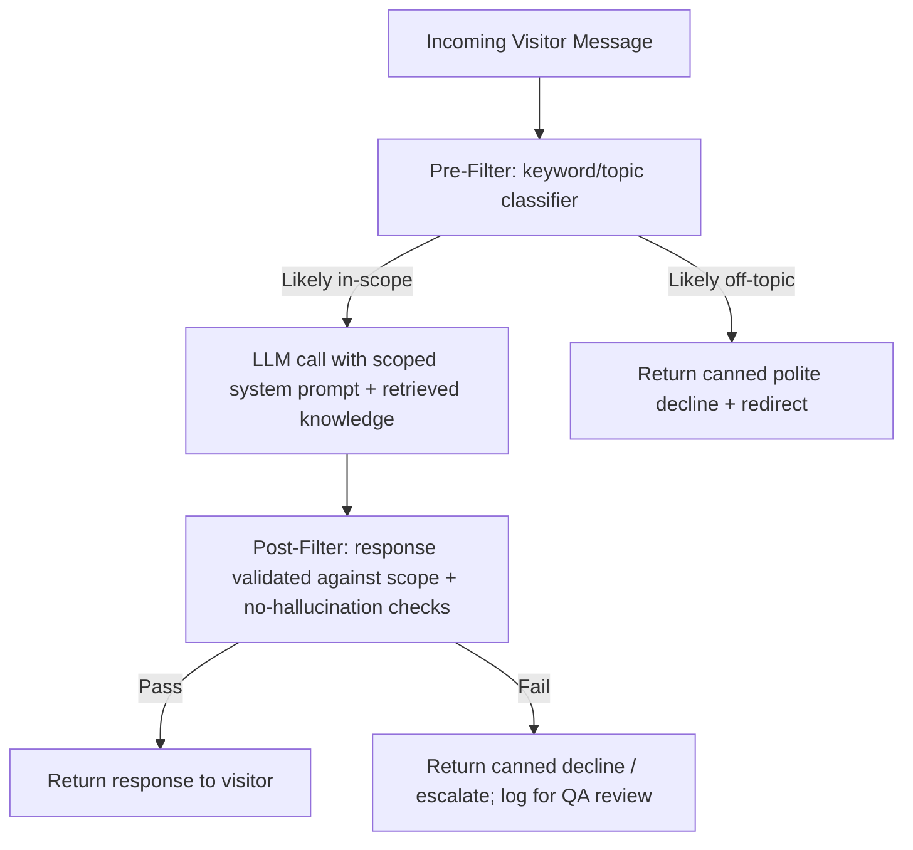

**Design decision:** Guardrails are never delegated solely to the system prompt. A lightweight pre-classification step filters obviously off-topic input before an LLM call is even made (saving cost/latency), and a post-response validation step catches cases where the LLM drifts despite instructions. This is a deliberate defense-in-depth choice given the product's zero-tolerance stance on scope violations.

---

# Knowledge Management Architecture

| Phase | Storage | Editability |
|---|---|---|
| Phase 1 (MVP) | Static JSON files in `knowledge/`, loaded at startup and cached in memory/Redis | Requires code deploy to change |
| Phase 3 | PostgreSQL-backed models (`KnowledgeEntry`, `ServiceEntry`, `IndustryEntry`, `FAQEntry`) with versioning fields | Editable via Django admin or internal API, no deploy required |
| Phase 4 | Exposed via `apps.administration` dashboard APIs with an approval workflow | Editable by non-technical content managers, with draft/publish states |

**Migration path:** `knowledge_loader.py`'s interface (`get_company_info()`, `get_services()`, `get_industries()`, `get_faq()`, `get_contact_info()`) remains stable across all phases; only its internal implementation changes from file-read to DB-query, insulating `apps.chatbot` business logic from the storage migration.

---

# OpenRouter Integration Architecture

## Design Goal
No component outside `common/ai/` may reference OpenRouter-specific request/response shapes, model identifiers, or SDK calls. All AI access happens through the `AIProviderClient` interface.

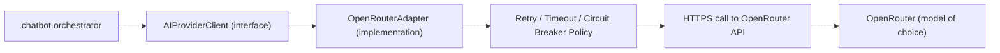

## `AIProviderClient` Interface (Conceptual)

```python
class AIProviderClient(Protocol):
    def generate_response(
        self,
        messages: list[Message],
        model: str,
        max_tokens: int,
        temperature: float,
        timeout: float,
    ) -> AIResponse:
        ...
```

Any future provider (direct Anthropic API, Azure OpenAI, self-hosted model) implements this same interface, allowing `orchestrator.py` to remain unchanged. Provider selection is controlled via configuration (`AI_PROVIDER=openrouter`), not code branching in business logic.

## Model Switching Strategy

- Model identifier is an environment/config value (`OPENROUTER_MODEL`), never hardcoded.
- A `MODEL_FALLBACK_CHAIN` config defines an ordered list of models to attempt if the primary model errors or times out (e.g., primary → secondary → tertiary), all still routed through OpenRouter.
- Model selection logic lives in `OpenRouterAdapter`, not in `apps.chatbot`.

## Timeout Strategy

| Call Type | Timeout |
|---|---|
| Standard chat completion | 8 seconds connect+read timeout |
| Scope classification (lightweight pre-filter, if LLM-based) | 3 seconds |

If a timeout occurs, the Retry Policy engages before falling back to a degraded response.

## Retry Strategy

- Exponential backoff with jitter: up to 2 retries for transient errors (5xx, timeout, connection errors).
- No retries on 4xx errors (invalid request) — these are logged and surfaced as application errors, not retried blindly.
- Circuit breaker: if failure rate over a rolling window exceeds a threshold, the adapter short-circuits to the fallback response immediately (avoiding cascading latency during provider outages) and periodically probes for recovery.

## Fallback Strategy

If all retries and fallback models are exhausted:
1. Return a graceful, pre-written fallback message directing the visitor to contact information.
2. Log the full failure context (correlation ID, model attempted, error) for observability.
3. Do not silently fail or return an empty response.

## Cost Considerations

- Token usage per request is logged (prompt tokens, completion tokens, estimated cost) for `apps.analytics` cost monitoring.
- `prompt_builder.py` uses retrieval-style knowledge injection (only relevant knowledge sections, not the full knowledge base) to minimize prompt token cost.
- Conversation history sent to the model is windowed/truncated (e.g., last N turns or summarized) rather than growing unbounded.
- Model tier selection (cheaper model for scope pre-classification, stronger model for the main conversational response) is a configurable cost/quality tradeoff.

## Error Handling Strategy

| Error Type | Handling |
|---|---|
| Timeout | Retry per policy, then fallback message |
| Rate limit (429) | Backoff and retry once; if persists, fallback message + alert |
| Invalid request (400) | Log as application bug (should not happen with validated inputs); fallback message |
| Auth error (401/403) | Immediate alert to engineering (API key issue); fallback message |
| Server error (5xx) | Retry per policy, then fallback message |
| Malformed/empty response | Treated as failure; fallback message; logged for QA |

---

# Request Lifecycle

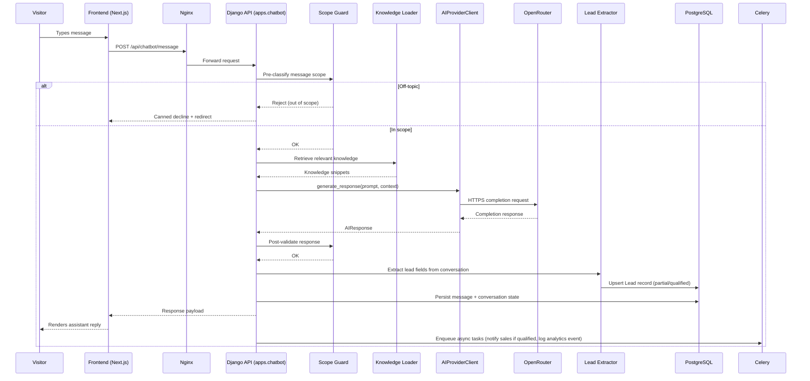

---

# Sequence Diagrams

## Escalation Flow

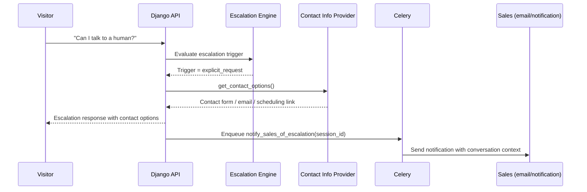

## Lead Qualification Completion Flow

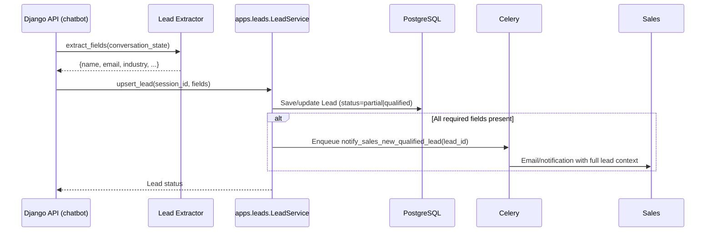

---

# API Architecture

## Design Principles
- RESTful resource-oriented endpoints under `/api/v1/`.
- Chatbot conversation is modeled as a **session** resource with **messages** as sub-resources, not a single stateless "ask" endpoint, to support conversation history and multi-turn context.
- All responses follow a consistent envelope: `{ "data": ..., "meta": ..., "error": null }`.

## Core Endpoints (MVP)

| Method | Endpoint | Purpose |
|---|---|---|
| POST | `/api/v1/chatbot/sessions/` | Create a new conversation session (called on widget load) |
| POST | `/api/v1/chatbot/sessions/{session_id}/messages/` | Send a visitor message, receive assistant response |
| GET | `/api/v1/chatbot/sessions/{session_id}/messages/` | Retrieve message history for the session (widget reload/reconnect) |
| GET | `/api/v1/services/` | List approved service catalog (also used by chatbot knowledge and website) |
| GET | `/api/v1/industries/` | List approved industry catalog |
| GET | `/api/v1/contact/info/` | Retrieve official contact/escalation info |
| POST | `/api/v1/leads/` | (Internal) Explicit lead submission fallback, e.g., non-chat contact form |
| GET | `/api/v1/health/` | Health check endpoint (see Observability) |

## Versioning
- URL-path versioning (`/api/v1/`) from day one, enabling non-breaking evolution as `apps.administration` and `apps.analytics` endpoints are added.

## Rate Limiting
See Security Requirements.

---

# Authentication and Authorization Strategy

| Consumer | Auth Mechanism |
|---|---|
| Public website visitor (chatbot widget) | Anonymous session-based access via a signed, short-lived session token issued on session creation (not tied to a user account) |
| Internal admin/dashboard users (Phase 4+) | Django session or JWT-based auth via `apps.users`, with role-based permissions (admin, content manager, sales viewer) |
| Service-to-service (future analytics/CRM jobs) | API key or mutual-auth scoped credentials, never shared with public-facing tokens |

- Visitor session tokens are opaque, stored in an HttpOnly cookie or returned to the frontend for header-based use, and scoped strictly to that conversation session (cannot access other sessions' data).
- No visitor authentication (login) is required or supported in MVP — this is intentional to keep friction low.
- Role-based access control (RBAC) is introduced with `apps.administration` in Phase 4; MVP has no authenticated internal users beyond superuser/Django admin for engineering.

---

# Database Requirements

## Core Entities (MVP)

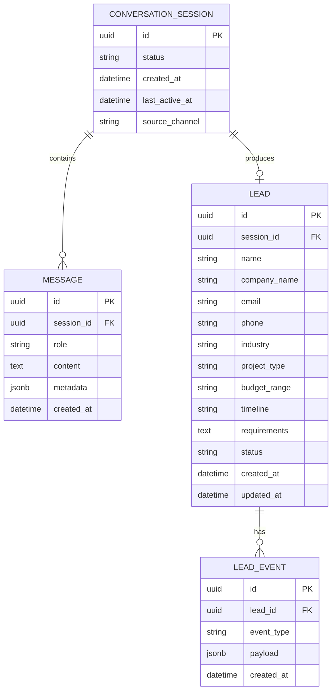

## Design Decisions

- All primary keys are UUIDs (not sequential integers) to avoid enumeration and to support eventual multi-service/data-sync scenarios.
- `MESSAGE.metadata` (JSONB) stores structured details per message: scope-guard decision, model used, token counts, latency — supporting observability without schema churn.
- `LEAD.status` enum: `partial`, `qualified`, `escalated`, `converted`, `abandoned`.
- `LEAD_EVENT` provides an append-only audit trail (field updates, escalation triggers, notification sends) separate from the mutable `LEAD` record — critical for Phase 5 analytics and Phase 6 CRM sync reliability.
- Soft deletes (`is_deleted`, `deleted_at`) on `common.BaseModel` for all domain models where data retention/audit matters.

## Indexing Strategy

| Table | Index | Reason |
|---|---|---|
| `message` | `(session_id, created_at)` | Fast retrieval of session message history in order |
| `lead` | `(status)` | Fast filtering of qualified leads for sales/notification queries |
| `lead` | `(email)` | Deduplication/lookup |
| `lead_event` | `(lead_id, created_at)` | Chronological event retrieval per lead |

## Migrations
- Standard Django migrations, one migration set per app, reviewed in PRs; no direct schema edits in production.

---

# Caching Strategy

| Cached Item | Store | TTL | Invalidation |
|---|---|---|---|
| Knowledge content (`company.json`, `services.json`, etc.) | Redis (or in-process memory with Redis pub/sub invalidation across workers) | Until explicitly invalidated | On knowledge file/DB update (Phase 3: on publish event) |
| Service/Industry catalog API responses | Redis | 5–15 minutes | Time-based; low churn data |
| Rate-limit counters | Redis | Rolling window (see Security) | N/A (self-expiring) |
| AI response caching for identical FAQ-style queries (optional optimization) | Redis | Short TTL (e.g., 1 hour) | Time-based; only for deterministic, non-personalized queries |

Conversation session state (messages, lead progress) is **not** cached as a source of truth — PostgreSQL remains authoritative; Redis is used only for ephemeral/session token lookups to reduce DB load on high-frequency reads.

---

# Asynchronous Processing Strategy

## Celery Use Cases (MVP)

| Task | Trigger | Notes |
|---|---|---|
| `notify_sales_new_qualified_lead` | Lead reaches `qualified` status | Sends email/notification with full lead context |
| `notify_sales_of_escalation` | Escalation triggered | Sends notification with conversation transcript link |
| `log_analytics_event` | Any trackable conversation event (message sent, refusal, escalation, qualification milestone) | Decouples analytics writes from the request/response critical path |
| `compute_token_cost` | After each AI call | Async cost logging, does not block response to visitor |

## Design Decisions
- The critical path (visitor sends message → receives AI response) is **fully synchronous** for latency predictability; only side effects (notifications, analytics, cost logging) are deferred to Celery.
- Celery broker: Redis (already required for caching, avoiding an additional infra dependency like RabbitMQ at MVP scale).
- Retry policy on Celery tasks: exponential backoff, max 3 attempts, dead-letter logging on final failure (visible in observability dashboards).
- Celery Beat (scheduled periodic tasks) is reserved for future phases (e.g., scheduled analytics rollups, CRM sync jobs) — not required for MVP.

---

# Configuration Management

- All configuration via environment variables, loaded through `django-environ` (or equivalent) into `core/settings/base.py` and environment-specific overrides.
- No secrets committed to the repository under any circumstance; `.env.example` documents required variables without values.
- Environment variables are validated at startup (fail-fast) — missing required config (e.g., `OPENROUTER_API_KEY`) prevents the application from starting rather than failing at first request.

## Key Configuration Variables (Representative)

```
DJANGO_SETTINGS_MODULE=core.settings.production
DJANGO_SECRET_KEY=
DJANGO_ALLOWED_HOSTS=
DATABASE_URL=
REDIS_URL=
CELERY_BROKER_URL=

AI_PROVIDER=openrouter
OPENROUTER_API_KEY=
OPENROUTER_BASE_URL=
OPENROUTER_MODEL=
OPENROUTER_MODEL_FALLBACK_CHAIN=
AI_REQUEST_TIMEOUT_SECONDS=8
AI_MAX_RETRIES=2

RATE_LIMIT_CHAT_PER_MINUTE=
CORS_ALLOWED_ORIGINS=
SENTRY_DSN=
LOG_LEVEL=
EMAIL_BACKEND_URL=
```

---

# Environment Management

| Environment | Purpose | Notes |
|---|---|---|
| Local | Developer machines | Docker Compose spins up Django, Postgres, Redis, Celery worker together; hot reload enabled |
| Staging | Pre-production validation, QA, guardrail testing | Mirrors production config; uses a separate OpenRouter key with usage caps |
| Production | Live traffic | Managed Postgres/Redis, autoscaled app containers behind Nginx, strict env var validation |

All three environments share the same Docker image build process (`deployments/docker/Dockerfile`), differing only via `DJANGO_SETTINGS_MODULE` and environment variables — ensuring environment parity.

---

# Logging Strategy

- **Structured logging** (JSON format) for all application logs, including a `request_id`/`correlation_id` propagated from the incoming HTTP request through to Celery tasks triggered by that request.
- Log levels: `DEBUG` (local only), `INFO` (request lifecycle milestones), `WARNING` (guardrail refusals, retries), `ERROR` (unhandled exceptions, AI failures after fallback), `CRITICAL` (auth/config failures).
- **PII handling in logs:** email/phone/name are never logged in plaintext in general application logs; where needed for debugging, they are redacted/masked. Full lead data is only accessible via the authenticated `leads` data store, not log aggregation tools.
- AI-specific logging: model used, prompt token count, completion token count, latency, and guardrail decision are logged per request (content of visitor messages may be logged for QA with appropriate retention/privacy controls, per the PRD's disclosure requirements).

---

# Monitoring and Observability

| Capability | Implementation Approach |
|---|---|
| Structured logging | JSON logs shipped to a log aggregation service (e.g., hosted logging platform) |
| Error monitoring | Sentry (or equivalent) integrated at the Django and Celery layers, capturing unhandled exceptions with request context |
| Request tracing | `request_id` middleware generates/propagates a correlation ID through logs, Celery tasks, and AI call metadata |
| Metrics collection | Application metrics (request counts, latency histograms, error rates, AI call success/failure rates) exported via a metrics endpoint (e.g., Prometheus-compatible) |
| Health checks | `/api/v1/health/` endpoint checks DB connectivity, Redis connectivity, and (lightweight) AI provider reachability; used by load balancer/orchestrator for liveness/readiness |
| Performance monitoring | APM integration (e.g., Sentry Performance or equivalent) tracking endpoint latency, DB query time, and external call time breakdowns |
| AI request monitoring | Dedicated dashboard/metrics for: request volume per model, latency percentiles, failure rate, fallback trigger rate, guardrail refusal rate |
| Cost monitoring | Token usage and estimated cost logged per request and aggregated daily/weekly via `apps.analytics`, with alerting thresholds for anomalous spend |

---

# Security Requirements

| Area | Requirement |
|---|---|
| **API key management** | OpenRouter and other third-party keys stored only in environment variables / secret manager (e.g., cloud provider secret store); never in code, logs, or version control. |
| **Environment variables** | `.env` files excluded via `.gitignore`; `.env.example` provided with placeholder keys only; production secrets injected via deployment platform's secret management, not baked into images. |
| **Prompt injection protection** | System prompt structurally separated from user input (no string concatenation that allows user text to masquerade as system instructions); user input is treated as untrusted data within a clearly delimited context; post-response scope validation (see Chatbot Architecture) catches injection attempts that succeed in altering behavior. |
| **Jailbreak prevention** | Layered defense: pre-classification filter, hardened system prompt with explicit refusal instructions, post-response guardrail validation, and logging of suspected jailbreak attempts for periodic prompt-hardening review. |
| **Input validation** | All API inputs validated via DRF serializers (type, length, format) before reaching business logic; message length capped to prevent abuse/cost exploitation. |
| **Rate limiting** | Per-IP and per-session rate limits on chat message endpoints (e.g., N messages/minute) enforced via Redis-backed middleware/DRF throttling classes; distinct, stricter limits on session-creation endpoint to prevent session-flooding abuse. |
| **Abuse prevention** | Anomaly detection on session creation volume and message patterns (e.g., scripted rapid-fire messages); CAPTCHA or equivalent challenge reserved as a future escalation if abuse patterns emerge. |
| **Logging** | See Logging Strategy — PII redaction, structured logs, no secrets in logs. |
| **Secret management** | Centralized secret manager in staging/production (cloud-native secret store); local development uses `.env` files excluded from version control. |
| **Dependency security** | Automated dependency vulnerability scanning (e.g., `pip-audit`/Dependabot) integrated into CI; regular dependency update cadence. |
| **CORS** | Strict `CORS_ALLOWED_ORIGINS` allow-list limited to the known frontend domain(s); no wildcard origins in production. |
| **CSRF** | CSRF protection enabled for any cookie-authenticated endpoints (admin/dashboard); chatbot API uses token-based session auth, exempted from Django CSRF only where token-based auth is verified to provide equivalent protection. |
| **Database security** | Least-privilege DB user for the application (no superuser), encrypted connections to managed Postgres, regular automated backups, no direct public internet exposure of the database. |

---

# Scalability Strategy

- **Stateless application layer:** Django app containers hold no local session state (session data lives in PostgreSQL/Redis), allowing horizontal scaling of app containers behind Nginx/load balancer without sticky sessions.
- **Database scaling:** Start with a single managed PostgreSQL instance sized for MVP load; read replicas considered when analytics/reporting read load grows (Phase 5), keeping write path on the primary.
- **Celery worker scaling:** Worker count scales independently of web app containers based on async task queue depth; separate queues (e.g., `notifications`, `analytics`) can be introduced to isolate slow tasks from fast ones.
- **AI call concurrency:** Connection pooling/async HTTP client for OpenRouter calls to avoid thread starvation under concurrent chat load; circuit breaker prevents cascading slowdowns during provider degradation.
- **Caching layer:** Redis absorbs read pressure on largely-static knowledge/catalog data, reducing DB load as traffic grows.
- **Horizontal scaling readiness:** Docker-based deployment allows straightforward addition of app container replicas; Nginx (or a cloud load balancer) distributes traffic.

---

# Deployment Architecture

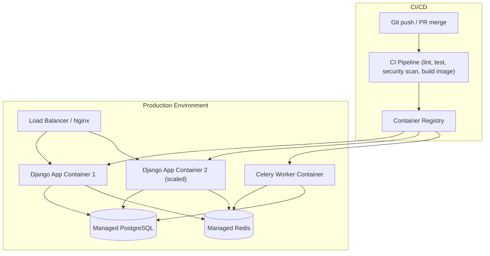

## Design Decisions
- Docker images built once in CI and promoted through staging → production (immutable artifact promotion, not rebuilding per environment).
- Nginx handles TLS termination, static file serving (in front of Django), and reverse proxying to app containers.
- Zero-downtime deploys via rolling container replacement (health check on `/api/v1/health/` gates traffic cutover).
- Database migrations run as a distinct CI/CD step before new application containers receive traffic.

---

# Disaster Recovery Considerations

| Risk | Mitigation |
|---|---|
| PostgreSQL data loss | Automated daily backups with point-in-time recovery via managed Postgres provider; backup restoration tested periodically. |
| Redis data loss | Redis used only for cache/broker/ephemeral data — no critical data loss risk; worst case is cache warm-up and in-flight async task replay. |
| OpenRouter provider outage | Fallback message strategy (see OpenRouter Integration Architecture); model fallback chain; provider abstraction allows emergency provider switch with config change, not code change. |
| Application container failure | Load balancer health checks route traffic away from unhealthy containers; orchestrator (e.g., ECS/Kubernetes/equivalent) auto-restarts failed containers. |
| Full region/infra outage | Out of scope for MVP; documented as a Phase 5+/production-maturity consideration (multi-region deployment, cross-region backups). |
| Secret/key compromise | Secrets stored in managed secret store with rotation capability; incident response includes immediate key rotation and audit log review. |

---

# Future Extensibility

| Future Capability | Architectural Hook Already in Place |
|---|---|
| Lead Management (Phase 2) | `apps.leads` already isolated with its own models/service layer; MVP chatbot writes directly into it. |
| Knowledge Management (Phase 3) | `knowledge_loader.py` interface abstracts storage backend; migration to DB-backed models requires no orchestrator changes. |
| Admin Dashboard (Phase 4) | `apps.administration` reserved as its own app boundary from day one; RBAC hooks planned in `apps.users`. |
| Analytics (Phase 5) | `apps.analytics` receives events via Celery tasks already emitted in MVP (`log_analytics_event`), so instrumentation doesn't need retrofitting. |
| CRM Integrations (Phase 6) | `LEAD_EVENT` audit trail and Celery task infrastructure provide a ready integration point for outbound sync without touching core lead logic. |
| Vector Database (if needed) | `knowledge_loader.py` and `prompt_builder.py` interfaces are retrieval-agnostic — a vector store could be introduced as an alternate knowledge backend without changing consumers. |
| Alternate LLM Provider | `AIProviderClient` interface isolates all provider-specific code to `common/ai/openrouter_adapter.py`; a new adapter implementing the same interface is the only required change. |
| Multi-language Support | `knowledge_loader.py` and `prompt_builder.py` can be extended to accept a locale parameter without restructuring the chatbot app. |

---

# Risks

| ID | Risk | Impact | Likelihood | Mitigation |
|---|---|---|---|---|
| TR-1 | OpenRouter latency/outage directly impacting chat availability | High | Medium | Retry/fallback/circuit breaker strategy; provider abstraction for emergency switch |
| TR-2 | Prompt injection bypassing scope guardrails | High (brand/trust) | Medium | Defense-in-depth guardrail architecture (pre-filter + post-validation), ongoing adversarial testing |
| TR-3 | Uncontrolled token/cost growth from unbounded conversation history | Medium | Medium | Conversation windowing/truncation, retrieval-style prompt building, cost monitoring/alerting |
| TR-4 | Module boundary erosion as new apps are added (future collisions) | Medium | Medium | Enforced application boundary table, code review discipline, ADRs for boundary-crossing decisions |
| TR-5 | PII exposure via logs or misconfigured caching | High (compliance) | Low-Medium | PII redaction in logs, least-privilege DB access, secret manager usage, security review |
| TR-6 | Celery queue backlog delaying lead notifications | Medium | Low | Queue depth monitoring/alerting, dedicated queues per task priority |
| TR-7 | Knowledge content drift from actual company offerings (MVP static JSON) | Medium | Medium | Defined content review cadence pre-Phase 3; ownership assigned in PRD |
| TR-8 | Single-region deployment risk | Medium | Low | Documented as accepted MVP risk; multi-region considered post-Phase 5 |

---

# Open Questions

| # | Question | Owner |
|---|---|---|
| 1 | Which specific OpenRouter model(s) will be used as primary and fallback? | Engineering / AI |
| 2 | What is the target concurrent-session load for MVP capacity planning? | Product / Engineering |
| 3 | Which managed Postgres/Redis providers will be used in staging/production? | DevOps / Engineering |
| 4 | What email service will handle lead/escalation notifications in MVP (before full CRM integration)? | Engineering / Sales |
| 5 | Is a vector database required for Phase 1, or does structured JSON retrieval suffice until Phase 3? | Engineering / AI |
| 6 | What is the expected conversation retention period, and does it differ for qualified vs. abandoned sessions? | Legal / Product |
| 7 | Will staging use a separate, rate-capped OpenRouter API key to control testing costs? | Engineering / Finance |

---

# Architectural Decisions

## ADR-001: Modular Django Monolith over Microservices for MVP
**Decision:** Build `b10backend` as a single Django deployable with strict internal app boundaries, not as separate microservices per domain.
**Rationale:** Startup-stage team size and velocity needs favor a monolith; module boundaries are designed to permit future extraction if scale demands it.
**Status:** Accepted.

## ADR-002: LLM Access via OpenRouter Behind a Provider Abstraction
**Decision:** All AI calls go through `AIProviderClient`, implemented initially by `OpenRouterAdapter`.
**Rationale:** Avoids vendor lock-in; enables model/provider switching via configuration rather than code changes.
**Status:** Accepted.

## ADR-003: Knowledge as Data, Not Code
**Decision:** Company/service/industry/FAQ content lives in structured JSON (MVP) migrating to DB-backed models (Phase 3), never hardcoded into prompt strings within business logic.
**Rationale:** Enables non-engineering content updates long-term and keeps orchestration logic stable across content changes.
**Status:** Accepted.

## ADR-004: Guardrails Enforced in Application Code, Not Prompt-Only
**Decision:** Implement deterministic pre-filter and post-response validation layers around every LLM call, in addition to system-prompt instructions.
**Rationale:** Prompt-only guardrails are insufficient given the product's zero-tolerance policy on scope violations and hallucination.
**Status:** Accepted.

## ADR-005: Synchronous Critical Path, Asynchronous Side Effects
**Decision:** The visitor-facing message/response cycle is fully synchronous; notifications, analytics, and cost logging are deferred to Celery.
**Rationale:** Predictable latency for the user-facing interaction; side effects should not block or risk the chat response.
**Status:** Accepted.

## ADR-006: UUID Primary Keys Across Domain Models
**Decision:** Use UUIDs rather than auto-incrementing integers for all domain model primary keys.
**Rationale:** Avoids enumeration, supports future distributed/service extraction and CRM sync scenarios without key collisions.
**Status:** Accepted.

---

# Appendix

## A. Technology Stack Summary

| Layer | Technology |
|---|---|
| Frontend | Next.js, React, TypeScript, TailwindCSS (existing, `b10itsolution`) |
| Backend Framework | Django, Django REST Framework |
| Database | PostgreSQL |
| Cache / Broker | Redis |
| Async Task Queue | Celery |
| Containerization | Docker |
| Reverse Proxy | Nginx |
| LLM Access | OpenRouter API |
| Future | Vector Database, Admin Dashboard, Analytics System, CRM Integrations, Email Service, Webhooks |

## B. Environment Variable Reference
See **Configuration Management** section for the representative variable list.

## C. Knowledge File Schema (Illustrative)

```json
// services.json
[
  {
    "id": "web-app-development",
    "name": "Web Application Development",
    "summary": "Custom web application design and development.",
    "related_industries": ["saas", "ecommerce", "enterprise"],
    "keywords": ["website", "web app", "web platform"]
  }
]
```

```json
// industries.json
[
  {
    "id": "healthtech",
    "name": "HealthTech",
    "positioning_notes": "Experience building patient- and provider-facing digital health tools.",
    "related_services": ["mobile-app-development", "custom-software-development"]
  }
]
```

## D. Health Check Response (Illustrative)

```json
{
  "status": "ok",
  "checks": {
    "database": "ok",
    "redis": "ok",
    "ai_provider": "ok"
  },
  "timestamp": "2026-07-03T10:00:00Z"
}
```

---

*End of Document*
